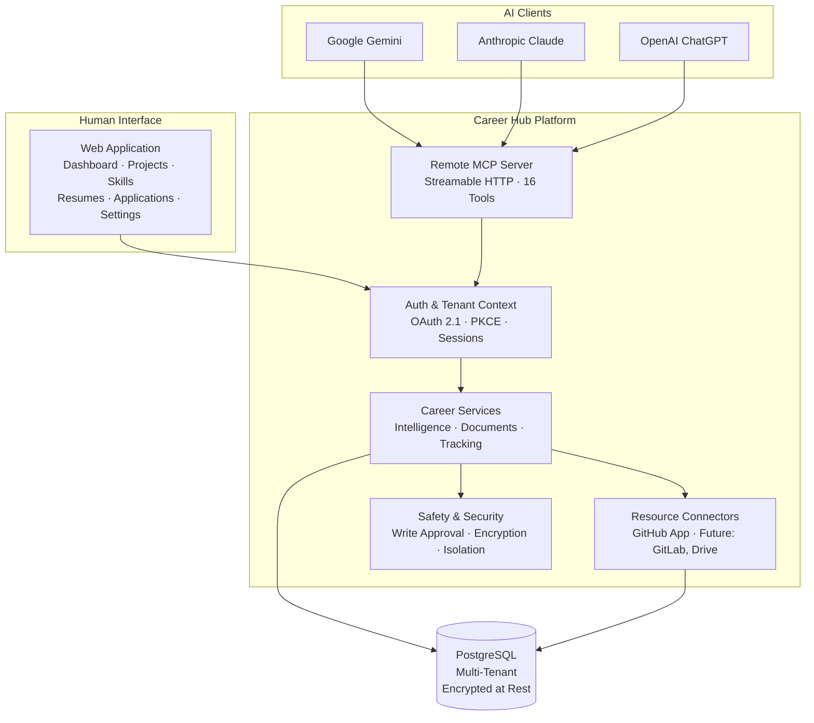

# Career Hub

**Evidence-backed AI career intelligence.**

[](https://nodejs.org)
[](https://www.postgresql.org)
[](https://modelcontextprotocol.io)
[](https://www.apache.org/licenses/LICENSE-2.0)
[](https://github.com/vishu1803/Ai-job-mcp/actions/workflows/ci.yml)

Career Hub connects a candidate's real engineering evidence — GitHub repositories, commit history, AST-parsed code, uploaded resumes — with job intelligence and AI assistants through a single multi-tenant platform.

Every career claim is grounded in verifiable source evidence. AI clients connect through the [Model Context Protocol (MCP)](https://modelcontextprotocol.io) and receive the same curated, evidence-backed data — whether that client is Google Gemini, Anthropic Claude, or OpenAI ChatGPT.

---

## Why Career Hub?

Traditional AI career tools generate resume content from self-reported claims, often hallucinating skills, inventing experience, or producing generic boilerplate that collapses under scrutiny.

Career Hub takes a different approach:

| Traditional AI Resume Tools | Career Hub |
| :--- | :--- |
| Generate from self-reported claims | Extract from verified source code |
| Skills are unsubstantiated keywords | Skills are backed by commit SHA, file path, and AST evidence |
| One AI provider, locked ecosystem | Any MCP-compatible AI client |
| Single-user local tools | Multi-tenant, isolated per-user workspaces |
| Auto-generated content, no approval | Human-in-the-loop approval for all write operations |

The core differentiator is the **truth model** — every skill, project, and career assertion is classified:

```
VERIFIED   — AST-parsed from repository code, pinned to commit SHA
INFERRED   — Derived from related verified evidence (e.g., Next.js → React)
CLAIMED    — Self-reported from uploaded resume, tagged [Unverified User Claim]
UNKNOWN    — Insufficient evidence to classify
```

Resume claims are never automatically promoted to verified status. Repository-verified skills are never downgraded.

---

## Core Capabilities

### 🔍 Candidate Intelligence
- **GitHub Evidence Ingestion** — Connects via GitHub App with fine-grained read-only permissions. Parses `package.json`, `requirements.txt`, `go.mod`, `Cargo.toml`, directory trees, and commit history.
- **Project Discovery** — Maps repositories to projects with linked evidence items, file paths, line ranges, and sanitized code excerpts.
- **Verified Skills** — Normalizes 60+ technology aliases across 7 categories into a canonical taxonomy with confidence scoring.
- **Zero-Hallucination Integrity** — Every career assertion passes through integrity gates that reject unsubstantiated claims.

### 📄 Career Documents
- **Source Resume Upload** — Upload PDF, DOCX, or plain text resumes. Source files are encrypted at rest with AES-256-GCM.
- **Claim Separation** — Parsed resume content is classified as `CLAIMED` with explicit `[Unverified User Claim]` tagging. Claims are never auto-verified.
- **Tailored Resumes** — Generate job-specific resume versions grounded in verified evidence with ATS keyword alignment.
- **Cover Letters** — Evidence-backed narrative generation with configurable tone and citation modes.
- **Portfolio Recommendations** — Select and highlight 1–5 projects demonstrating the strongest signal for a target role.

### 📊 Job Intelligence
- **Job Description Parsing** — Extracts requirements, preferred skills, experience levels, and domain context from job descriptions.
- **Evidence Matching** — Maps candidate evidence against job requirements, producing categorized evaluations: `MATCHED`, `PARTIAL`, `MISSING`, `UNKNOWN`.
- **ATS Fit Scoring** — Composite 100-point score across 7 dimensions with safety gates for missing critical skills.
- **Skill Gap Analysis** — Prioritized gaps classified as `CRITICAL`, `HIGH`, `MEDIUM`, `LOW` with actionable remediation guidance.

### 📋 Application Tracking
- **Application Lifecycle** — Create, update, and track job applications through stage transitions.
- **Interview Pipeline** — Add stages, record outcomes, and attach feedback.
- **Document Snapshots** — Freeze tailored resume/cover letter versions as immutable application artifacts.

### 🤖 AI Integration
- **Remote MCP Server** — 16 tools exposed via Streamable HTTP (`POST /mcp`) adhering to MCP 2026-07-28 specification.
- **Provider Neutral** — Google Gemini, Anthropic Claude, and OpenAI ChatGPT connect to the same career intelligence through standard MCP.
- **MCP Apps** — Interactive Job Fit Radar visualization delivered as sandboxed HTML5 via `ui://` resource protocol.

### 🔒 Safe GitHub Automation
- **Two-Phase Approval** — AI proposes changes → human reviews diff → explicit confirmation → Draft PR on isolated `feat/career-hub-*` branch.
- **Protected Branches** — Direct pushes to `main` are blocked. CI/CD workflow modifications are rejected.
- **Cryptographic Tickets** — HMAC-SHA256 signed approval tickets with 15-minute TTL prevent replay and tampering.

---

## How It Works

```
GitHub Repositories                   Uploaded Resume
        │                                    │
        ▼                                    ▼
  AST Parsing &                      Section Parsing &
  Evidence Extraction                Claim Extraction
        │                                    │
        ▼                                    ▼
   VERIFIED Skills                    CLAIMED Assertions
   (commit-pinned)               [Unverified User Claim]
        │                                    │
        └──────────────┬─────────────────────┘
                       ▼
              Candidate Profile
           (facts + claims, separated)
                       │
          ┌────────────┼────────────┐
          ▼            ▼            ▼
     Job Fit       Tailored     Application
     Analysis      Documents    Tracking
          │            │            │
          └────────────┴────────────┘
                       │
              ┌────────┴────────┐
              ▼                 ▼
         Web App           Remote MCP
        (Human UI)       (AI Clients)
```

---

## Architecture



AI clients do not receive direct database access, direct GitHub API access, or write authority without human approval.

---

## MCP Integration

Career Hub exposes **16 tools** via a standards-compliant remote MCP server (`POST /mcp`) using Streamable HTTP transport.

### Career Read
| Tool | Description |
| :--- | :--- |
| `get_candidate_profile` | Retrieve candidate profile with projects, skills, and evidence summary |
| `list_verified_skills` | List skills verified through code analysis with confidence scores |
| `inspect_project_evidence` | Inspect commit-pinned evidence items with file paths and code excerpts |
| `analyze_job_fit` | Compute evidence-based job fit score with skill gap analysis |

### Career Artifacts
| Tool | Description |
| :--- | :--- |
| `generate_tailored_resume` | Generate a job-targeted resume grounded in verified evidence |
| `draft_cover_letter` | Draft an evidence-backed cover letter with configurable tone |
| `recommend_portfolio_projects` | Select optimal projects to showcase for a target role |

### Career Write
| Tool | Description |
| :--- | :--- |
| `propose_project_improvement` | Propose code improvements with diff preview (requires approval) |
| `confirm_and_create_pr` | Execute approved changes as a Draft PR on an isolated branch |

### Career Tracking
| Tool | Description |
| :--- | :--- |
| `track_job_application` | Create a new application record with job details |
| `list_active_applications` | List applications with filtering and pagination |
| `get_job_application` | Get detailed application information |
| `update_application_status` | Transition application status with notes |
| `add_application_stage` | Add an interview stage to an application |
| `update_application_stage_outcome` | Record stage outcome and feedback |
| `attach_application_document` | Attach tailored document snapshot to an application |

### MCP Apps

The `analyze_job_fit` tool returns an optional `_meta.ui` reference to an interactive **Job Fit Radar** — a sandboxed HTML5 SVG visualization with a 6-axis radar chart and ATS score gauge. The radar app is read-only, uses zero external CDN dependencies, and has no direct database or GitHub access.

---

## Supported AI Clients

| AI Client | Auth Method | Integration Status |
| :--- | :--- | :--- |
| **Google Gemini** | Personal MCP API Token (`Bearer mcp_live_*`) | Verified Live |
| **Anthropic Claude** | OAuth 2.1 + PKCE S256 (Custom Connector) | Verified Hermetically |
| **OpenAI ChatGPT** | OAuth 2.1 + PKCE S256 (Custom GPT Actions) | Verified Hermetically |

> **Note:** Claude and ChatGPT integrations have been verified through automated protocol testing against the OAuth 2.1 and MCP specification. Live hosted access requires a public HTTPS domain, which is planned for Phase 14 (Public Staging Deployment).

OAuth 2.1 discovery endpoints:
- `GET /.well-known/oauth-authorization-server` (RFC 8414)
- `GET /.well-known/oauth-protected-resource` (RFC 9728)

---

## Resume Workflow

```
Upload source resume (PDF / DOCX / TXT)
            │
            ▼
   AES-256-GCM encrypted storage
   (immutable source preserved)
            │
            ▼
   Section parsing & secret scrubbing
            │
            ▼
   CLAIMED assertions created
   [Unverified User Claim]
            │
            ▼
   User review & approval
            │
            ▼
   Base resume promotion
   (VERIFIED skills NOT downgraded)
            │
            ▼
   Tailored application versions
   (immutable document snapshots)
```

Uploaded resume claims are **not** automatically repository-verified. The truth model maintains strict separation between AST-verified evidence and user-submitted claims.

---

## Security & Multi-Tenancy

- **Server-Derived Identity** — Tenant and user context is resolved from authenticated sessions, never from client-supplied parameters.
- **Default-Deny Isolation** — Cross-tenant lookups return `404 Not Found`, not `403 Forbidden`, to prevent information leakage.
- **AES-256-GCM Encryption** — GitHub tokens, resume source files, and sensitive metadata encrypted at rest with authenticated encryption.
- **OAuth 2.1 with PKCE** — Authorization Code Flow with S256 code challenge for all external AI client connections.
- **CSRF Protection** — Anti-forgery tokens on all state-mutating web operations.
- **Secret Scrubbing** — API keys, passwords, and tokens are automatically redacted from parsed code, logs, and audit records.
- **Human-Approved Writes** — GitHub modifications require two-phase ticket approval with HMAC-SHA256 signatures and 15-minute TTL.
- **GDPR Hard Delete** — Complete account deletion with cascade purge of all tenant data, preserving other tenants and shared taxonomy.

---

## Product Tour

Career Hub includes a full web application with the following views:

| Page | Route | Description |
| :--- | :--- | :--- |
| **Dashboard** | `/dashboard` | Profile completeness, verified skills cloud, project summaries, application pipeline |
| **Projects** | `/projects` | Portfolio explorer with deep evidence inspection per project |
| **Skills** | `/skills` | Verified skills taxonomy grouped by category with confidence scores |
| **Sources** | `/sources` | Connected GitHub App status, indexed repositories, disconnect controls |
| **Resumes** | `/resumes` | Upload, parse, review, approve, and manage resume versions |
| **Applications** | `/dashboard#applications` | Job application pipeline with stage tracking |
| **AI Connect** | `/connect` | Claude, ChatGPT, and Gemini connection guides with personal token management |
| **MCP Docs** | `/docs/mcp` | Public interactive documentation for all 16 MCP tools |
| **Settings** | `/settings` | Account privacy, data sovereignty, and GDPR deletion controls |

---

## Quick Start

### Prerequisites

- **Node.js** 20+ (tested on v24)
- **PostgreSQL** 16+ (local instance or managed service like [Aiven](https://aiven.io))
- **GitHub App** configured with `contents:read` and `metadata:read` permissions

### Setup

```bash
# Clone the repository
git clone https://github.com/vishu1803/Ai-job-mcp.git
cd Ai-job-mcp

# Install dependencies
npm install

# Create environment configuration
cp .env.example .env
# Edit .env with your database URL, encryption keys, and GitHub App credentials

# Run database migrations
npm run db:migrate

# Start the development server
npm run dev
```

The application starts at `http://localhost:3000`.

### Environment Configuration

Key variables in `.env` (see `.env.example` for complete reference):

| Variable | Purpose |
| :--- | :--- |
| `DATABASE_URL` | PostgreSQL connection string |
| `ENCRYPTION_MASTER_KEY` | 64-hex AES-256 master key for credential encryption |
| `AUTH_SECRET` | Session cookie signing secret |
| `GITHUB_CLIENT_ID` / `GITHUB_CLIENT_SECRET` | GitHub OAuth for user login |
| `GITHUB_APP_ID` / `GITHUB_APP_PRIVATE_KEY` | GitHub App for repository access |
| `GITHUB_WEBHOOK_SECRET` | HMAC-SHA256 webhook signature verification |

> ⚠️ Never commit `.env` files or real credentials. Generate keys with `node -e "console.log(require('crypto').randomBytes(32).toString('hex'))"`.

---

## Verification

```bash
# Run full test suite (unit + integration)
npm test

# Unit tests only
npm run test:unit

# Integration tests only (requires PostgreSQL)
npm run test:integration

# Linting
npm run lint

# Format check
npm run format:check

# Database schema validation
npm run db:check
```

### Current Test Evidence

| Metric | Value |
| :--- | :--- |
| Unit Tests | 1,154 passing across 295 suites |
| Integration Tests | 50+ suites including isolated E2E |
| ESLint | 0 errors, 0 warnings |
| Prettier | 100% compliant |
| Drizzle Schema | In sync |

The project includes a comprehensive isolated E2E test suite (`tests/integration/end-to-end-p13-006.test.js`) that provisions 5 independent synthetic users in an ephemeral database, executes a deterministic 24-step user journey, validates adversarial cross-tenant IDOR attacks, verifies the resume truth model, and confirms GDPR Article 17 hard deletion cascades — all without touching the main database.

---

## Local vs. Public Deployment

| Capability | Local Development | Public Staging (Phase 14) |
| :--- | :--- | :--- |
| Web application | ✅ `localhost:3000` | Requires persistent HTTPS domain |
| MCP server | ✅ `localhost:3000/mcp` | Requires public endpoint |
| Gemini integration | ✅ Personal token auth | ✅ Same mechanism |
| Claude / ChatGPT | ⚠️ Requires tunnel (`cloudflared`) | ✅ Native OAuth 2.1 |
| GitHub OAuth callback | ⚠️ Requires tunnel for callback | ✅ Stable callback URL |
| GitHub webhooks | ⚠️ Requires tunnel for ingress | ✅ Persistent endpoint |
| MCP Registry publication | ❌ Requires public HTTPS | ✅ DNS TXT verification |

---

## Project Status

| Phase | Status | Tasks |
| :--- | :--- | :--- |
| **Phase 0** — Research & Architecture | ✅ Complete | 4/4 |
| **Phase 1** — Platform Foundation | ✅ Complete | 6/6 |
| **Phase 2** — Authentication & Connections | ✅ Complete | 6/6 |
| **Phase 3** — GitHub App Integration | ✅ Complete | 6/6 |
| **Phase 4** — Candidate Data Model | ✅ Complete | 6/6 |
| **Phase 5** — Career Intelligence Engine | ✅ Complete | 6/6 |
| **Phase 6** — Resume & Portfolio Adaptation | ✅ Complete | 5/5 |
| **Phase 7** — Remote MCP Server | ✅ Complete | 6/6 |
| **Phase 8** — Gemini Integration | ✅ Complete | 6/6 |
| **Phase 9** — GitHub Write Workflows | ✅ Complete | 6/6 |
| **Phase 10** — Claude Integration | ✅ Complete | 4/4 |
| **Phase 11** — ChatGPT Integration | ✅ Complete | 4/4 |
| **Phase 12** — Application Tracking | ✅ Complete | 5/5 |
| **Phase 13** — Multi-User Beta | ✅ Complete | 5/5 |
| **Phase 13.5** — Product Experience & MCP Apps | ✅ Complete | 6/6 |
| **Phase 14** — Security Hardening & Staging | 🔜 Next | 0/6 |
| **Phase 15** — Advanced Automation | 📋 Planned | 0/4 |
| | **Total** | **81/91 (89%)** |

See [`project.md`](project.md) for the complete execution ledger with verification evidence.

---

## Roadmap

### Now — Phase 14: Security Hardening & Production Readiness
- Automated security scanning and dependency audit
- Penetration testing (IDOR, SQL injection, SSRF, CSRF)
- Rate limiting and DDoS defense
- Production staging deployment with persistent custom domain
- Production readiness audit

### Next — Phase 15: Advanced Automation & Future Connectors
- GitLab resource connector
- Cloud document connectors (Google Drive, OneDrive, Notion)
- Continuous background repository sync and skill drift detection
- Interview intelligence assistant

---

## Architecture Documentation

| Document | Description |
| :--- | :--- |
| [`docs/architecture.md`](docs/architecture.md) | System architecture overview |
| [`docs/security.md`](docs/security.md) | Security architecture and threat model |
| [`docs/data-model.md`](docs/data-model.md) | Database schema and data model |
| [`docs/mcp-server-architecture.md`](docs/mcp-server-architecture.md) | MCP server design and tool catalog |
| [`docs/claude-custom-connector-guide.md`](docs/claude-custom-connector-guide.md) | Claude custom connector setup |
| [`docs/chatgpt-custom-connector-guide.md`](docs/chatgpt-custom-connector-guide.md) | ChatGPT custom connector setup |
| [`docs/mcp-registry-readiness-checklist.md`](docs/mcp-registry-readiness-checklist.md) | Official MCP Registry readiness |
| [`docs/source-resume-document-architecture.md`](docs/source-resume-document-architecture.md) | Resume ingestion and document pipeline |
| [`docs/job-application-tracking-architecture.md`](docs/job-application-tracking-architecture.md) | Application tracking system design |
| [`docs/staging-deployment-runbook.md`](docs/staging-deployment-runbook.md) | Staging deployment operations |
| [`docs/user-guide.md`](docs/user-guide.md) | End-user guide |
| [`docs/onboarding-walkthrough.md`](docs/onboarding-walkthrough.md) | Onboarding flow walkthrough |
| [`docs/decisions.md`](docs/decisions.md) | Architecture Decision Records (ADR-001 to ADR-069+) |
| [`goal.md`](goal.md) | Project mission and strategic direction |
| [`project.md`](project.md) | Living execution tracker with verification evidence |

---

## Tech Stack

| Layer | Technology |
| :--- | :--- |
| Runtime | Node.js 20+ (native ESM) |
| Framework | Fastify 5 |
| Database | PostgreSQL 16+ with Drizzle ORM |
| Validation | Zod (runtime schema enforcement) |
| MCP | `@modelcontextprotocol/server` v2 (2026-07-28 spec) |
| Encryption | AES-256-GCM (native `node:crypto`) |
| Auth | OAuth 2.1 + PKCE S256, server-side sessions |
| GitHub | GitHub App (fine-grained, short-lived tokens) |
| AI | Google Gemini (`@google/genai`), Claude, ChatGPT via MCP |
| CI | GitHub Actions (PostgreSQL 17 service container) |
| Linting | ESLint 9 + Prettier |

---

## Contributing

Contributions are welcome. The project follows strict architectural guidelines defined in [`AGENTS.md`](AGENTS.md) and [`goal.md`](goal.md).

Before contributing:

1. Read `AGENTS.md` for operating protocol
2. Read `goal.md` for project boundaries
3. Read `project.md` for current execution state
4. Ensure `npm test`, `npm run lint`, and `npm run format:check` pass
5. Do not commit secrets or credentials

---

## License

This project is licensed under the [Apache License 2.0](https://www.apache.org/licenses/LICENSE-2.0) as declared in `package.json`.
