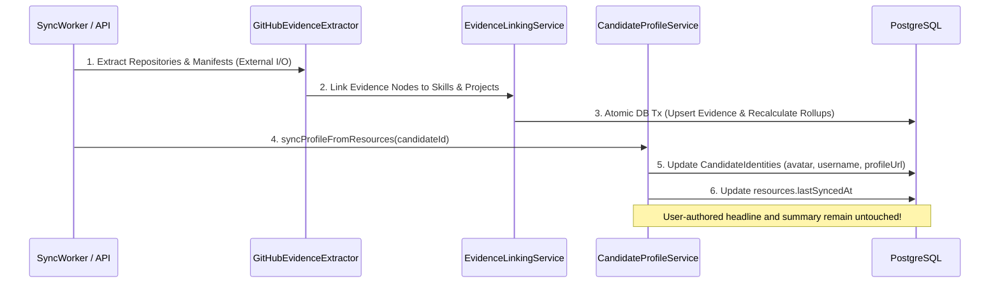

# Architecture Specification: Candidate Profile Service & Claim Integrity (ARCH-010)

* **Document ID**: `ARCH-010`
* **Related Task**: `P4-005A` (Architecture Review) -> `P4-005` (Implementation)
* **Status**: `APPROVED`
* **Date**: `2026-08-22`
* **Authors**: Core Architecture Agent & Security Team

---

## 1. Executive Summary & Objective

The **Candidate Profile Service** is the authoritative domain lifecycle and aggregation service for professional candidate personas within the Antigravity Career MCP Platform. It unifies verified external identities, connected resources, domain project initiatives, verified skill assertions, and explicit user claims into a single coherent, multi-tenant candidate profile view.

```mermaid
graph TD
    A[Authenticated Context: TenantId + UserId + RBAC] --> B[CandidateProfileService]
    B --> C[Candidate Root Record]
    B --> D[Candidate Identities: GitHub, LinkedIn]
    B --> E[Resource Catalog: Clean Summaries]
    B --> F[Projects: Multi-Resource Initiatives]
    B --> G[Skills: Verified & Inferred Rollups]
    B --> H[User Claims: Explicit [Unverified User Claim]]
```

### Strategic Principles:
1. **Verifiable Truth vs. Unverified Claims**: Rigorously separates machine-verified evidence from self-asserted user claims. Manual claims are visibly tagged as `[Unverified User Claim]` and cannot attain `VERIFIED` status without cryptographic evidence.
2. **Zero Profile Overwrite**: Resource synchronization (e.g. GitHub App sync) updates resource catalogs and skill evidence graphs, but **never** overwrites explicit user-authored profile narratives (headline, summary, custom bio).
3. **Multi-Tenant Sovereign Isolation**: Access is strictly scoped to the authenticated tenant context; cross-tenant profile lookups fail closed with `404 Not Found`.
4. **Credential Redaction & PII Minimization**: Resource summaries are scrubbed of encrypted tokens, installation keys, and private secrets before serialization.
5. **Decoupled Candidate Identity**: The Candidate career persona is decoupled from the platform authentication User entity, supporting agency workflows, multi-persona candidates, and organizational recruiting.

---

## 2. Verified Facts vs. Manual User Claims

The platform categorizes all candidate profile assertions into two distinct classes:

```
+-------------------------------------------------------------+
|                      VERIFIED FACTS                         |
|  (Derived from EvidenceItem nodes pinned to source code)    |
+-------------------------------------------------------------+
| • Provenance: VERIFIED (conf >= 0.75) or INFERRED (< 0.75)  |
| • Backed by immutable EvidenceId + commitSha + filePath     |
| • Rollup score computed via asymptotic formula              |
| • Serialized with primaryEvidence anchor reference          |
+-------------------------------------------------------------+
                              vs
+-------------------------------------------------------------+
|                     MANUAL USER CLAIMS                      |
|  (Entered directly by the candidate without repository proof)|
+-------------------------------------------------------------+
| • Provenance: CLAIMED                                       |
| • Confidence Score: 0.00 (evidenceCount: 0)                 |
| • Display Label: [Unverified User Claim]                    |
| • primaryEvidenceId: NULL                                   |
| • Cannot lower or overwrite existing verified scores        |
+-------------------------------------------------------------+
```

### Transition Invariants:
1. **Claim Elevation**: When an extractor subsequently discovers repository evidence for a `CLAIMED` skill, the status automatically elevates `CLAIMED -> VERIFIED` (or `INFERRED`), and `confidenceScore` is recalculated.
2. **Monotonic Score Protection**: Adding a manual claim for an already-verified skill can never downgrade its confidence score or change its `VERIFIED` status.

---

## 3. Candidate Profile Root & Field Ownership

| Profile Field | Source & Ownership | Synchronization Behavior |
| :--- | :--- | :--- |
| `id` | System (`UUIDv4`) | Immutable database primary key. |
| `displayName` | User Editable (defaults to GitHub name on first link) | Protected against automatic background sync overwrites. |
| `headline` | User Editable | Protected; never overwritten by GitHub/LinkedIn sync. |
| `summary` | User Editable | Protected; never overwritten by background sync. |
| `canonicalEmail` | User Editable (defaults to user/identity email) | Protected; updated only via explicit profile settings. |
| `profileMetadata` | System & User Partitioned (`userCustom`, `systemInferred`) | Namespaced JSONB object preventing property collisions. |
| `status` | System Managed (`ACTIVE`, `ARCHIVED`, `SUSPENDED`) | Controlled via explicit lifecycle CRUD methods. |

---

## 4. Resource Synchronization Flow

Profile synchronization coordinates external connector data acquisition with domain profile updates:



---

## 5. Candidate Identity vs. Application User

* **`User` Entity**: Authenticated platform operator (`users` table) tied to sessions, passwords, OAuth tokens, and tenant roles (`OWNER`, `MEMBER`, `READONLY`).
* **`Candidate` Entity**: Domain career persona (`candidates` table) representing the professional profile.
* **`CandidateIdentity` Entity**: External provider link (`provider`, `externalAccountId`, `externalUsername`, `avatarUrl`, `verified`).

### Identity Conflict & Anti-Collision Invariants:
1. `candidate_identities` enforces unique constraint on `(tenant_id, provider, external_account_id)`.
2. Candidates are **NEVER** merged automatically across different accounts based on fuzzy username, display name, or unverified email matching.
3. Linking an identity already attached to another candidate in the same tenant throws `ConflictError` (409).

---

## 6. Resource Catalog & Project Decoupling

### 6.1 Clean Resource Summaries
The candidate profile exposes connected resources without sensitive attributes:
```json
{
  "id": "556e6240-03c2-4d46-bf62-0c8d7cf9cb35",
  "provider": "GITHUB_APP",
  "resourceType": "REPOSITORY",
  "name": "ai-career-hub",
  "displayName": "vishu1803/ai-career-hub",
  "url": "https://github.com/vishu1803/ai-career-hub",
  "isPrivate": false,
  "status": "ACTIVE",
  "lastSyncedAt": "2026-08-22T08:00:14.000Z"
}
```
* **Strict Blacklist**: `encryptedCredentials`, `installationId`, `keyVersion`, OAuth tokens, and internal error payloads are **NEVER** returned.

### 6.2 Projects Decoupled from Repositories
* $1\text{ Project} \ne 1\text{ Repository}$. A project (e.g. *E-Commerce Microservices Platform*) can link multiple repositories (frontend, backend, infra) via `project_resources`.
* Exposes project metadata, linked resource count, and attached `EvidenceRef` items.

---

## 7. Role-Based Access Control (RBAC) & Tenant Boundaries

| Role | Read Profile & Evidence | Edit Profile Narrative | Add Manual Claims | Sync from Resources | Archive / Delete Candidate |
| :--- | :---: | :---: | :---: | :---: | :---: |
| **`OWNER`** | ✅ | ✅ (Any in tenant) | ✅ | ✅ | ✅ |
| **`MEMBER`** | ✅ | ✅ (Self-linked only) | ✅ (Self-linked) | ✅ (Self-linked) | ❌ (Forbidden 403) |
| **`READONLY`**| ✅ | ❌ (Forbidden 403) | ❌ (Forbidden 403) | ❌ (Forbidden 403) | ❌ (Forbidden 403) |

* **Tenant Boundary Guard**: All queries must filter by `tenant_id = context.tenantId`. Cross-tenant candidate ID lookups throw `NotFoundError` (404 default-deny).

---

## 8. CRUD Interface & Service Boundary

```javascript
class CandidateProfileService {
  // Read Operations
  async getProfile(context, candidateId);
  async listCandidates(context, options);
  
  // Lifecycle & Mutations
  async createCandidate(context, input);
  async updateProfile(context, candidateId, patch);
  async addSkillClaim(context, candidateId, { skillSlug, claimNote });
  async removeSkillClaim(context, candidateId, skillId);
  async archiveCandidate(context, candidateId);
  async restoreCandidate(context, candidateId);
  
  // Resource & Identity Sync
  async syncProfileFromResources(context, candidateId);
}
```

---

## 9. Serialization & `CandidateProfileView` Schema

```json
{
  "candidate": {
    "id": "10a2b51b-09bf-4090-8040-1f60ebeb89c9",
    "displayName": "Alex River",
    "headline": "Staff Systems & Cloud Architect",
    "summary": "Building resilient multi-cloud platforms and AI-agent infrastructure.",
    "canonicalEmail": "alex@example.com",
    "status": "ACTIVE",
    "createdAt": "2026-08-20T12:00:00.000Z",
    "updatedAt": "2026-08-22T08:00:00.000Z"
  },
  "identities": [
    {
      "id": "7c9e6679-7425-40de-944b-e07fc1f90ae7",
      "provider": "GITHUB_APP",
      "externalUsername": "alexriver",
      "profileUrl": "https://github.com/alexriver",
      "avatarUrl": "https://avatars.githubusercontent.com/u/1001",
      "verified": true
    }
  ],
  "resources": [
    {
      "id": "556e6240-03c2-4d46-bf62-0c8d7cf9cb35",
      "provider": "GITHUB_APP",
      "name": "career-agent",
      "displayName": "alexriver/career-agent",
      "url": "https://github.com/alexriver/career-agent",
      "isPrivate": false,
      "status": "ACTIVE",
      "lastSyncedAt": "2026-08-22T08:00:14.000Z"
    }
  ],
  "projects": [
    {
      "id": "42ab5bf3-8599-4a9d-824e-b10d010cbb9f",
      "name": "Universal MCP Platform",
      "slug": "universal-mcp-platform",
      "headline": "High-throughput Streamable HTTP MCP server",
      "summary": "Engineered multi-tenant MCP gateway supporting Gemini, Claude, and ChatGPT.",
      "role": "Principal Architect",
      "isHighlighted": true,
      "linkedResourceCount": 1
    }
  ],
  "skills": [
    {
      "skillId": "86bc49e7-1c96-4f91-a4d0-70fe527d70f6",
      "slug": "fastify",
      "name": "Fastify",
      "category": "FRAMEWORK",
      "provenanceStatus": "VERIFIED",
      "confidenceScore": 0.90,
      "evidenceCount": 2,
      "primaryEvidence": {
        "evidenceId": "1de5606b-0b16-42dc-8bae-c6663a94e509",
        "evidenceType": "PACKAGE_MANIFEST_DEPENDENCY",
        "sourceProvider": "GITHUB_APP",
        "resourceId": "556e6240-03c2-4d46-bf62-0c8d7cf9cb35",
        "filePath": "package.json",
        "commitSha": "5017539ddb5d8d616b5fbfa2682dba7d4910b039",
        "confidenceScore": 1.0
      },
      "lastObservedAt": "2026-08-22T08:00:14.000Z"
    },
    {
      "skillId": "a9cc3c57-b75a-4c29-a291-b9fdbbb17b3b",
      "slug": "kubernetes",
      "name": "Kubernetes",
      "category": "CLOUD_DEVOPS",
      "provenanceStatus": "CLAIMED",
      "confidenceScore": 0.0,
      "evidenceCount": 0,
      "primaryEvidence": null,
      "isUserClaim": true,
      "claimLabel": "[Unverified User Claim]"
    }
  ]
}
```

---

## 10. Deletion & Retention Semantics

1. **Archive Candidate**: Sets `status = 'ARCHIVED'`. Profile is excluded from active matching and MCP tool queries but retains all evidence and skill associations intact.
2. **Restore Candidate**: Resets `status = 'ACTIVE'`.
3. **Delete Candidate**: Purges candidate row, cascading all `candidate_identities`, `candidate_skills`, `projects`, and `evidence_items`.
4. **Remove External Identity**: Removes `candidate_identities` link. Historical evidence and verified skills derived from past scans remain preserved in `evidence_items`.

---

## 11. Testing Strategy for `P4-005` Implementation

1. **Unit Tests (`tests/unit/candidate-profile-service.test.js`)**:
   - Verified evidence vs `[Unverified User Claim]` labeling and precedence.
   - Profile narrative immutability during background resource sync.
   - Resource credential and secret stripping.
   - Skill and project view assembly with lightweight `EvidenceRef` mapping.
   - RBAC permission matrix checks (`OWNER` vs `MEMBER` vs `READONLY`).
2. **Live Integration Tests (`tests/integration/candidate-profile-service.test.js`)**:
   - Candidate CRUD lifecycle and archiving against live PostgreSQL.
   - Manual claim creation and subsequent elevation upon repository evidence link.
   - Cross-tenant 404 default-deny isolation.
   - Multi-resource project aggregation.
   - Full profile synchronization from real GitHub App resource connections.

---

## 12. Architectural Conclusion & Approval Recommendation

`ARCH-010` establishes a secure, multi-tenant candidate profile architecture that enforces rigorous separation between cryptographic evidence and self-asserted claims, preserves user narrative sovereignty, and strictly eliminates credential leakage.

**Status**: **`P4-005A APPROVED`**.
