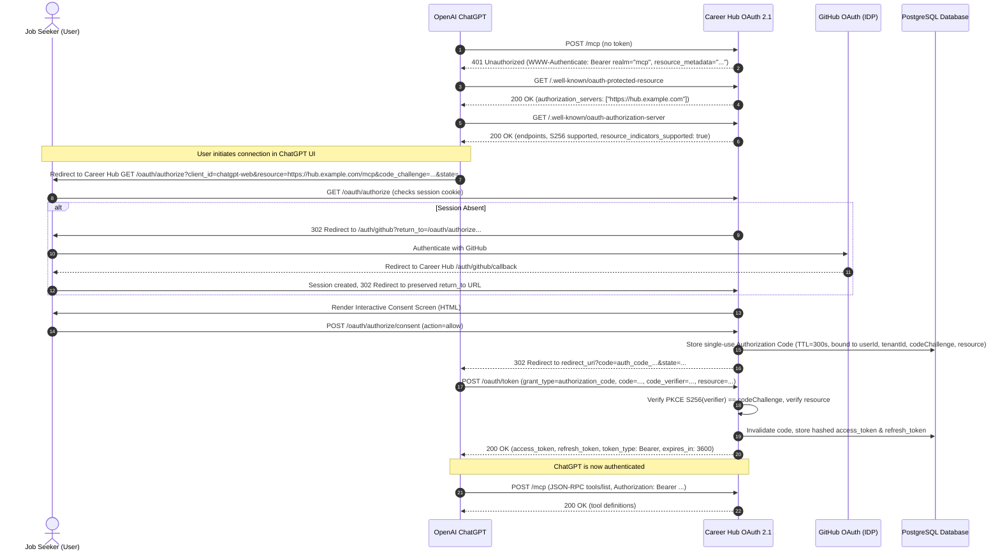

# ARCH-040: ChatGPT Remote MCP Custom Connector & OAuth 2.1 Integration Architecture Specification

**Status**: IMPLEMENTED & VERIFIED (Task P11-001 & P11-001A)  
**Security Level**: Critical Public Perimeter & OAuth 2.1 Authorization Boundary  
**Target AI Client**: OpenAI ChatGPT (ChatGPT Web, ChatGPT Desktop, Developer Mode, ChatGPT Custom Actions)  
**Governing Standards**: Model Context Protocol (MCP) Streamable HTTP Spec 2026-07-28, RFC 6749, RFC 7636, RFC 8414, RFC 8707 (Resource Indicators for OAuth 2.0), RFC 9700 (OAuth 2.1 / BCP), RFC 9728 (Protected Resource Metadata), RFC 8252 (OAuth 2.0 for Native Apps)  
**Governing ADR**: ADR-061 (`docs/decisions.md`)  

---

## 1. Executive Summary & Strategic Context

In Phases 7 through 10, Career Hub established a provider-neutral Remote Model Context Protocol (MCP) server supporting:
1. **Candidate Read Tools**: `get_candidate_profile`, `list_verified_skills`, `inspect_project_evidence`, `analyze_job_fit`.
2. **Application Artifact Tools**: `generate_tailored_resume`, `draft_cover_letter`, `recommend_portfolio_projects`.
3. **Approved GitHub Write Tools**: `propose_project_improvement`, `confirm_and_create_pr` with diff previews, test execution reporting, cryptographic patch fingerprinting, and centralized safety gating.
4. **Target 1 (Google Gemini)**: Direct MCP adapter & Vertex AI adapter verified.
5. **Target 2 (Anthropic Claude)**: Remote MCP custom connector via OAuth 2.1 + PKCE S256 + RFC 8707 Resource Indicators verified.

**Phase 11 (Task P11-001 & P11-001A)** defines and implements the architectural, security, and external integration boundary for connecting **OpenAI ChatGPT** as the third major target AI client to the existing Remote MCP server over **Public HTTPS** using **OAuth 2.1 + RFC 8707 Resource Indicators**.

```
+--------------------------------------------------------------------------------------------------+
|                                   CHATGPT MCP INTEGRATION TOPOLOGY                               |
+--------------------------------------------------------------------------------------------------+
|                                                                                                  |
|   +--------------------------+              +------------------------------------------------+   |
|   |   OpenAI ChatGPT         |              |   Career Hub Public Perimeter (HTTPS)          |   |
|   |   - ChatGPT Web (App)    |              |   - TLS 1.2+ Termination                       |   |
|   |   - ChatGPT Desktop      |              |   - Origin Header Validation (Anti-Rebinding)  |   |
|   |   - Developer Mode /     |              |   - Rate Limiter & DDoS Mitigation             |   |
|   |     Custom Actions       |              |                                                |   |
|   +-------------+------------+              +-----------------------+------------------------+   |
|                 |                                                   |                            |
|                 | 1. Discovery (401 + RFC 9728 Metadata)            |                            |
|                 +-------------------------------------------------->|                            |
|                 |                                                   |                            |
|                 | 2. OAuth 2.1 + RFC 8707 (resource param) Flow     |                            |
|                 +-------------------------------------------------->|                            |
|                 |    GET  /oauth/authorize?resource=...             |                            |
|                 |    POST /oauth/token     (resource binding)       |                            |
|                 |                                                   v                            |
|                 | 3. Streamable HTTP JSON-RPC (Bearer Token)   +----+------------------------+   |
|                 +--------------------------------------------->|   OAuth 2.1 Auth Middleware |   |
|                                                                +--------------+--------------+   |
|                                                                               |                  |
|                                                                               v                  |
|                                                                +--------------+--------------+   |
|                                                                | Immutable McpRequestContext |   |
|                                                                | (tenantId, userId, scopes)  |   |
|                                                                +--------------+--------------+   |
|                                                                               |                  |
|                                                                               v                  |
|                                                                +--------------+--------------+   |
|                                                                | Career Hub MCP Tools        |   |
|                                                                | - Read & Artifact Tools     |   |
|                                                                | - Approved Write Tools      |   |
|                                                                +--------------+--------------+   |
|                                                                               |                  |
|                                                                               v                  |
|                                                                +--------------+--------------+   |
|                                                                | GitHubWriteSafetyService    |   |
|                                                                | & Approval State Machine    |   |
|                                                                +-----------------------------+   |
+--------------------------------------------------------------------------------------------------+
```

---

## 2. Core Architectural Decisions

### 2.1 Provider-Neutral Architecture (Zero Business Logic Mutation)
- The MCP layer, domain services, career intelligence engine, and GitHub safety kernel remain 100% provider-neutral.
- ChatGPT connects strictly as an **external MCP client** via standardized Streamable HTTP JSON-RPC.
- Zero modifications to AI provider adapters (`GeminiProviderAdapter`, `GeminiVertexAdapter`); ChatGPT is an external consuming client, not an internal AI backend.

### 2.2 OAuth 2.1 Facade in Front of Unified Security Layer
- We reuse the **OAuth 2.1 Authorization Server Facade** built into Career Hub that operates alongside the existing personal API token (`mcp_token_*`) system.
- **Dual Ingestion**:
  1. **Personal API Tokens** (`mcp_live_*`, `mcp_test_*`): Used by local scripts and developers.
  2. **OAuth 2.1 Bearer Tokens** (JWTs / Opaque Access Tokens): Used by ChatGPT, Claude, and third-party remote clients.
- Both paths converge into the exact same immutable, frozen `McpRequestContext` (`{ tenantId, userId, role, tokenScopes, authMethod, clientInfo }`).

### 2.3 Strict Authorization Code Flow with PKCE (RFC 7636 / RFC 9700)
- Mandatory `code_challenge_method=S256`. Plain text PKCE (`method=plain`) is strictly rejected.
- Implicit grants (`response_type=token`) and Resource Owner Password Credentials (ROPC) are permanently disabled.
- Authorization codes are single-use, cryptographically random (256-bit entropy), bound to the client ID, tenant ID, user ID, redirect URI, resource indicator, and code challenge, with a maximum TTL of 5 minutes (300 seconds).

### 2.4 RFC 8707 Resource Indicators for OAuth 2.0 / MCP Compatibility
- Official MCP authorization specification requires RFC 8707 Resource Indicators to bind tokens and authorization requests to the specific MCP endpoint:
  1. ChatGPT transmits `resource=https://<public-mcp-host>/mcp` on `GET /oauth/authorize`.
  2. Server canonicalizes and validates `resource` against configured MCP resource URL (`getExpectedResourceUrl()`), rejecting mismatches with standard RFC 8707 error code `invalid_target` (HTTP 400).
  3. Single-use authorization codes are cryptographically and relationally bound to the canonical `resource` column in `oauth_authorization_codes`.
  4. Token exchange (`POST /oauth/token`) verifies `resource` parameter equality with authorization code binding and stores bound `resource` in `oauth_tokens`.
  5. `authenticateMcpRequest()` verifies that incoming OAuth Bearer access tokens are bound to the current MCP server audience/resource.

### 2.5 Protected Resource & Authorization Server Metadata Discovery
- When an unauthenticated client connects to `POST /mcp`, the server returns `401 Unauthorized` with:
  ```http
  WWW-Authenticate: Bearer realm="mcp", resource_metadata="https://api.careerhub.example.com/.well-known/oauth-protected-resource"
  ```
- Exposes standard discovery documents:
  1. `/.well-known/oauth-protected-resource` (RFC 9728) with `resource` indicator.
  2. `/.well-known/oauth-authorization-server` (RFC 8414) with `resource_indicators_supported: true`.
  3. `/.well-known/jwks.json` (RFC 7517).

---

## 3. OpenAI ChatGPT Client Requirements & Protocol Matrix

| Parameter | ChatGPT Web (Custom Actions / Developer Mode) | ChatGPT Desktop (Native App) | ChatGPT Enterprise / Team |
| :--- | :--- | :--- | :--- |
| **Transport** | Streamable HTTP (`POST /mcp`, `GET /mcp`) | Streamable HTTP / Stdio Proxy | Streamable HTTP (`POST /mcp`, `GET /mcp`) |
| **Auth Type** | OAuth 2.1 Authorization Code + PKCE | OAuth 2.1 Authorization Code + PKCE | OAuth 2.1 Authorization Code + PKCE |
| **PKCE Challenge** | `S256` Mandatory | `S256` Mandatory | `S256` Mandatory |
| **Redirect URI** | `https://chatgpt.com/api/mcp/oauth_callback`, `https://chat.openai.com/api/mcp/oauth_callback` | `http://localhost:<port>/callback` | `https://chatgpt.com/api/mcp/oauth_callback` |
| **Redirect Matching** | Strict String Equality | Loopback Port-Agnostic (RFC 8252) | Strict String Equality |
| **Client Type** | Public Client (`client_id: chatgpt-web`) | Public Client (`client_id: chatgpt-desktop`) | Public Client (`client_id: chatgpt-web`) |
| **Client Secret** | None (PKCE S256 protected) | None (PKCE S256 protected) | None (PKCE S256 protected) |
| **Token Transport** | `Authorization: Bearer <token>` | `Authorization: Bearer <token>` | `Authorization: Bearer <token>` |
| **Query Token** | Prohibited (400 Bad Request) | Prohibited (400 Bad Request) | Prohibited (400 Bad Request) |

---

## 4. End-to-End OAuth 2.1 Flow for ChatGPT



---

## 5. Security Threat Modeling & Mitigations (T-01 to T-16)

| Threat ID | Threat Description | Severity | Mitigation Strategy |
| :--- | :--- | :--- | :--- |
| **T-01** | OAuth Code Interception | High | Mandatory PKCE `S256` ensures attacker cannot exchange stolen auth code without high-entropy `code_verifier`. |
| **T-02** | Open Redirect Vulnerability | Critical | Strict redirect URI validation against pre-configured public client whitelist; open-redirect checks on `returnTo`. |
| **T-03** | Token Theft via URL Query Params | High | MCP endpoint strictly rejects `?token=...` query parameters with `400 QUERY_TOKEN_PROHIBITED`. |
| **T-04** | Cross-Tenant Data Access (IDOR) | Critical | Access tokens bind `tenantId` & `userId`. All MCP database queries enforce `tenantId` scoping, returning 404 default-deny. |
| **T-05** | Refresh Token Replay / Theft | Critical | Refresh Token Rotation (RTR) invalidates the entire token family immediately upon detecting a reused refresh token. |
| **T-06** | Scope Escalation via ChatGPT Payload | High | Role ceiling clamping caps issued token scopes to the user's database role (`READONLY` -> `career:read` only). |
| **T-07** | Write Action Approval Bypass | Critical | ChatGPT cannot execute write actions without an approved `ActionApprovalTicket`; `confirm_and_create_pr` requires human review stopping protocol. |
| **T-08** | Plain PKCE Downgrade | High | Server rejects `code_challenge_method=plain` with `400 INVALID_PKCE_METHOD`. |
| **T-09** | CSRF in Authorization Flow | High | Mandatory `state` parameter verification and encrypted HMAC transit cookies. |
| **T-10** | Stolen Access Token Replay | High | Short-lived access tokens (1 hour TTL) stored as SHA-256 hashes in PostgreSQL; instant revocation via `POST /oauth/revoke`. |
| **T-11** | DNS Rebinding & Host Header Injection | High | Origin header validation (`ALLOWED_ORIGINS`) and TLS termination. |
| **T-12** | Resource Indicator Spoofing (RFC 8707) | High | Exact canonical match against server's configured MCP resource URL; mismatches rejected with `invalid_target`. |
| **T-13** | AI Self-Approval Write Loop | Critical | Stopping protocol instructions in `propose_project_improvement` mandate human review; AI cannot forge human authorization. |
| **T-14** | Database Pool Leak / Resource Exhaustion | Medium | Clean try/finally pool drain patterns enforced across all endpoints, verified by `test:db-lifecycle-check`. |
| **T-15** | Prompt Injection via Repository Code | High | `SecretScrubber` and XML sandboxing sanitize candidate repo content before passing to AI clients. |
| **T-16** | Untrusted Localhost Redirect Spoofing | Medium | Loopback redirect matching (RFC 8252) requires host to be `localhost` or `127.0.0.1` and scheme `http`. |

---

## 6. Verification and Acceptance Criteria

1. **RFC 9728 & RFC 8414 Discovery**: Verified unauthenticated 401 returns RFC 9728 `WWW-Authenticate` header and standard metadata JSON endpoints.
2. **Pre-configured Client Registration**: `chatgpt-web` and `chatgpt-desktop` validate redirect URIs, scopes, and public client properties.
3. **PKCE S256 Authorization Code Flow**: Full authorization code minting, PKCE verification, single-use enforcement, and token issuance.
4. **RFC 8707 Resource Indicators**: Tested `resource` parameter canonicalization and mismatch rejection (`invalid_target`).
5. **Streamable HTTP JSON-RPC 2.0**: All 9 tools (`tools/list` and `tools/call`) execute successfully over ChatGPT OAuth Bearer tokens.
6. **Multi-Tenant Sovereign 404 Isolation**: Tenant B ChatGPT token cannot access Tenant A candidates or repositories.
7. **Write Safety & Stopping Protocol**: Write operations adhere to two-phase commit, stopping protocols, and default branch protection.
8. **Teardown & Lifecycle**: 0 database connection pool leaks and 100% test pass rate.
