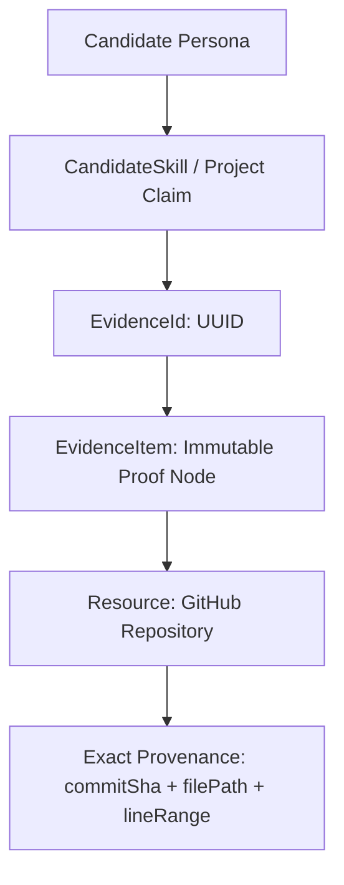
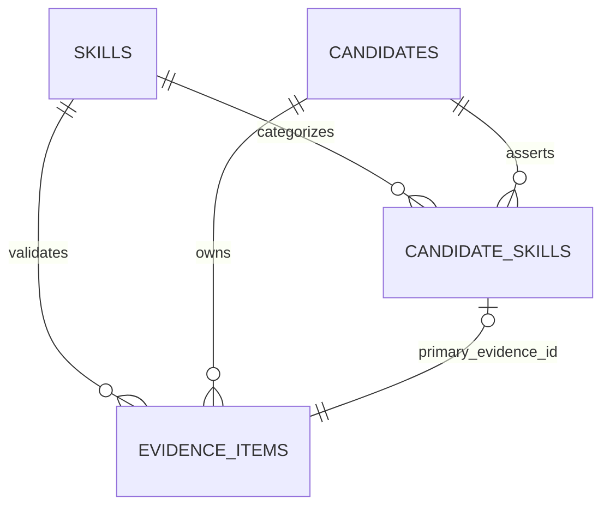
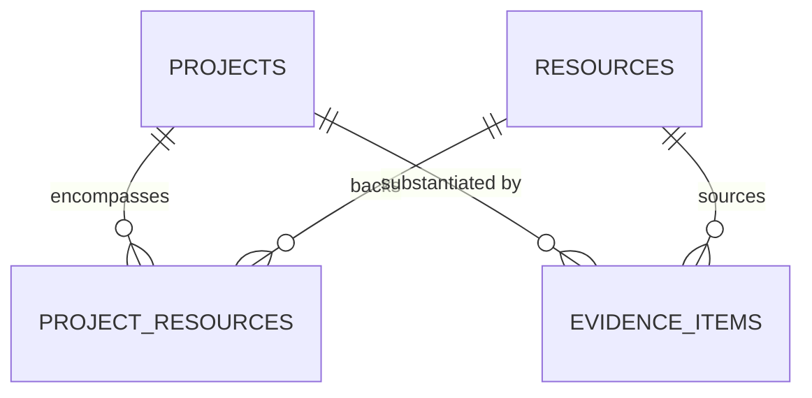
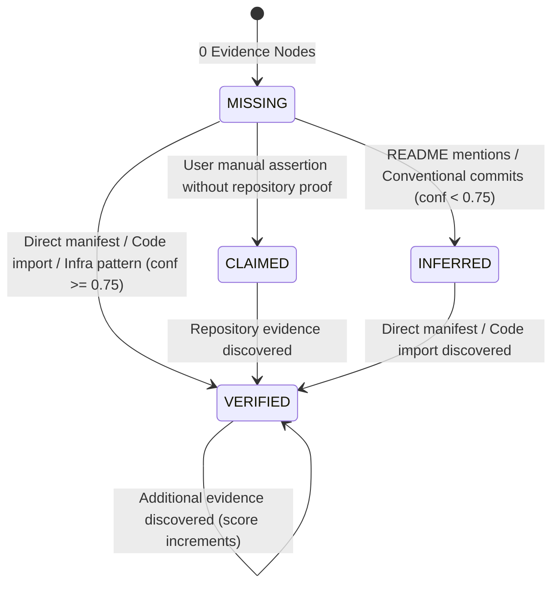
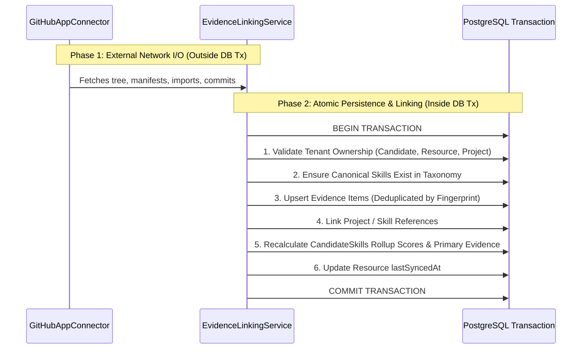

# Architecture Specification: Evidence Linking & Provenance Integrity Engine (ARCH-009)

* **Document ID**: `ARCH-009`
* **Related Task**: `P4-004A` (Architecture Review) -> `P4-004` (Implementation)
* **Status**: `APPROVED`
* **Date**: `2026-08-22`
* **Authors**: Core Architecture Agent & Security Team

---

## 1. Executive Summary & Objective

The **Evidence Linking Engine** is the core provenance authority of the Antigravity Career MCP Platform. It establishes an immutable, cryptographic chain of custody connecting high-level candidate claims (skills, project achievements, experience narratives) to concrete source repository artifacts:



### Strategic Objectives:
1. **Zero-Hallucination Integrity**: Every skill score, portfolio highlight, and resume bullet generated by the platform or exposed via MCP must link to a valid, immutable `EvidenceId`.
2. **Strict Multi-Tenant Isolation**: Evidence items and links must never cross tenant boundaries; cross-tenant references fail closed with `404 Not Found`.
3. **Cryptographic Provenance**: Every piece of code or configuration evidence is pinned to an immutable 40-character hexadecimal commit SHA.
4. **Deterministic Deduplication**: Ingestion deduplication is decoupled from domain entity identity via SHA-256 fingerprinting.
5. **Data Minimization & Redaction**: Zero full repository source code is persisted; excerpts are capped at $\le 1024$ characters with mandatory secret scrubbing.

---

## 2. Evidence Identity & Provenance Invariants

### 2.1 Canonical Identity (`EvidenceId`)
* **Primary Key**: `evidence_items.id` (`UUIDv4`).
* **Canonical Role**: Serves as the universal, immutable `EvidenceId` referenced across all platform APIs, MCP tools, database foreign keys, and AI-generated artifact citations (e.g. `[Evidence: 3fa85f64-5717-4562-b3fc-2c963f66afa6]`).
* **No Dual Identities**: We explicitly reject creating synthetic prefixed identifiers (e.g. `ev_gh_...`) or compound key strings. The database UUID is the sole identity.

### 2.2 Deduplication Fingerprint vs EvidenceId
A strict distinction is maintained between the entity identity and its deduplication hash:

| Property | `EvidenceId` (`evidence_items.id`) | `Fingerprint` (`metadata.fingerprint`) |
| :--- | :--- | :--- |
| **Type** | UUIDv4 | 64-character lowercase SHA-256 hex string |
| **Purpose** | Relational identity & citation identifier | Ingestion deduplication & idempotency hash |
| **Scope** | Global primary key in `evidence_items` | Stored in `metadata.fingerprint` |
| **Generation** | `defaultRandom()` upon first insert | `computeEvidenceFingerprint(...)` at extraction |
| **API Exposure** | Publicly returned as `evidenceId` | Internal ingestion metadata |

$$\text{Fingerprint} = \text{SHA256}(\text{tenantId} : \text{candidateId} : \text{resourceId} : \text{skillSlug} : \text{evidenceType} : \text{filePath} : \text{commitSha})$$

---

## 3. Immutability & Mutation Rules

To guarantee verifiable integrity for career intelligence and external AI clients, strict immutability boundaries are enforced on `evidence_items`:

```
+-------------------------------------------------------------+
|                      IMMUTABLE FIELDS                       |
|  (Set at extraction time; NEVER altered by linking/updates) |
+-------------------------------------------------------------+
| • id (EvidenceId)                                           |
| • tenantId                                                  |
| • candidateId                                               |
| • resourceId                                                |
| • sourceProvider (e.g. GITHUB_APP)                          |
| • evidenceType (e.g. PACKAGE_MANIFEST_DEPENDENCY)           |
| • sourceLocation (filePath, commitSha, lineRange)           |
| • excerpt (sanitized proof snapshot)                        |
| • metadata.fingerprint (deterministic content hash)         |
+-------------------------------------------------------------+
                              |
                              v
+-------------------------------------------------------------+
|                   MUTABLE / LINKABLE FIELDS                 |
|  (Updated during linking or idempotent re-extraction)       |
+-------------------------------------------------------------+
| • skillId (FK to canonical taxonomy skill)                  |
| • projectId (FK to domain project)                          |
| • confidenceScore (monotonically adjusted: MAX(old, new))   |
| • detectedAt (refreshed on re-observation)                  |
| • metadata (safe non-provenance operational attributes)     |
+-------------------------------------------------------------+
```

> [!IMPORTANT]
> **Excerpt and Provenance Immutability**: The `EvidenceLinkingEngine` must **NEVER** rewrite `excerpt`, `filePath`, or `commitSha`. Sanitization belongs strictly to extraction.

---

## 4. Skill Linking & Rollup Architecture

### 4.1 Schema Representation
* `candidate_skills` represents the candidate's aggregated mastery of a canonical `Skill`.
* `candidate_skills.primary_evidence_id` holds the UUID of the strongest, highest-confidence `EvidenceItem`.
* `evidence_items.skill_id` creates a direct foreign key from every supporting evidence node to the global canonical `skills` table.



### 4.2 Querying Skill Evidence
All evidence supporting a candidate's skill is queryable in $O(1)$ via the existing index `idx_evidence_items_tenant_skill`:
```sql
SELECT * FROM evidence_items
WHERE tenant_id = :tenantId
  AND candidate_id = :candidateId
  AND skill_id = :skillId
ORDER BY confidence_score DESC, detected_at DESC;
```

### 4.3 Why a Separate Join Table is Rejected
We evaluated whether to introduce a `candidate_skill_evidence` join table:
* **Decision**: **REJECTED**.
* **Rationale**: `evidence_items` already contains `tenant_id`, `candidate_id`, and `skill_id`. Adding an intermediate join table creates redundant write overhead and duplicate sources of truth. `primary_evidence_id` on `candidate_skills` + `skill_id` on `evidence_items` is the most compact, reliable, and performant design.

---

## 5. Project Linking Architecture

### 5.1 Schema Representation
* A `Project` represents a curated professional initiative ($1\text{ Project} \ne 1\text{ Repository}$).
* `project_resources` links projects to underlying repositories ($M : N$).
* `evidence_items.project_id` (nullable UUID) directly associates an evidence node to a specific project ($1 : N$).



### 5.2 Project Evidence Association Rules
1. **Automatic Association**: When evidence is extracted from a `resource_id` linked to a `project_id` via `project_resources`, the linker sets `evidence_items.project_id`.
2. **Explicit Association**: Candidates or career intelligence services can attach architectural evidence (e.g. Dockerfiles, README design specs, directory structures) directly to a `Project`.
3. **Querying Project Evidence**:
   ```sql
   SELECT * FROM evidence_items
   WHERE tenant_id = :tenantId
     AND candidate_id = :candidateId
     AND project_id = :projectId;
   ```

---

## 6. Multi-Tenant Security & Default-Deny Boundary

Every linking operation enforced by `EvidenceLinker` must validate strict tenant equality across all participating entities before executing database writes:

$$\text{EvidenceItem.tenantId} == \text{Candidate.tenantId} == \text{Resource.tenantId} == \text{Project.tenantId}$$

```mermaid
graph LR
    subgraph Tenant A Boundary
        CA[Candidate A]
        RA[Resource A]
        EA[EvidenceItem A]
    end
    subgraph Tenant B Boundary
        CB[Candidate B]
        RB[Resource B]
        EB[EvidenceItem B]
    end
    CA -.->|LINK ALLOWED| EA
    CA == X ==x|404 NOT FOUND (DEFAULT DENY)| EB
```

* **Cross-Tenant Default-Deny**: Any attempt to link evidence across tenant boundaries (e.g. attaching Tenant B's evidence to Tenant A's candidate) immediately throws `NotFoundError` (404) to prevent cross-tenant resource enumeration.

---

## 7. Resource Provenance & Commit Pinning

### 7.1 Minimum Provenance Requirements by Evidence Type

| Evidence Type | Minimum Provenance Fields |
| :--- | :--- |
| `PACKAGE_MANIFEST_DEPENDENCY` | `filePath` (`package.json`, `go.mod`, etc.) + `commitSha` |
| `CODE_IMPORT_USAGE` | `filePath` + `lineRange` (`{start, end}`) + `commitSha` |
| `FILE_PATTERN_MATCH` | `filePath` (`Dockerfile`, `drizzle.config.js`) + `commitSha` |
| `DIRECTORY_STRUCTURE` | `filePath` (`src/connectors/`) + `commitSha` |
| `README_SPECIFICATION` | `filePath` (`README.md`) + `commitSha` |
| `COMMIT_CONTRIBUTION` | `filePath` (`git-commit`) + `commitSha` (40-char SHA) |

### 7.2 Strict Commit Pinning Rule
* **Commit SHA Mandatory**: Provenance must always be pinned to an immutable 40-character hexadecimal Git commit SHA (e.g. `5017539ddb5d8d616b5fbfa2682dba7d4910b039`).
* **Branch Names Prohibited**: Dynamic branch names (`main`, `master`, `HEAD`, `latest`) are strictly forbidden as persistent provenance values. The extractor resolves `HEAD` to its concrete commit SHA before persisting.

---

## 8. Stale & Superseded Evidence Semantics

When repositories evolve over time (dependencies removed, files refactored, commits rebased):
1. **Historical Evidence Preservation**: Historical evidence is **NEVER** automatically deleted. Provenance remains historically factual (the candidate implemented that feature at commit `X`).
2. **Freshness Tracking**:
   - `detectedAt`: Timestamp of the latest scan that confirmed the evidence item's active presence.
   - `lastObservedAt` on `candidate_skills`: Indicates the most recent date any supporting evidence was detected.
3. **Rollup Weighting**: Career matching algorithms prioritize active evidence (`detectedAt` within 90 days) over archived/historical evidence without destroying historical provenance.

---

## 9. Confidence Propagation & Provenance Status

### 9.1 Rollup Formula
When multiple evidence items substantiate a skill, confidence is aggregated using the approved asymptotic formula:

$$\text{RollupScore} = \min\left(1.0, \max_{i}(\text{conf}_i) \times (0.8 + 0.05 \times \min(4, \text{count}))\right)$$

### 9.2 Provenance Status State Machine



* **Monotonic Scoring**: A new lower-confidence observation (e.g. README mention with 0.60) will **never** downgrade an established `VERIFIED` status (1.00) or reduce `confidenceScore`.

---

## 10. API Representation: Full Node vs Lightweight Ref

To prevent bandwidth bloat across MCP tools and REST endpoints, the platform standardizes on two response shapes:

### 10.1 Lightweight `EvidenceRef` (Embedded in Profiles, Summaries, MCP Responses)
```json
{
  "evidenceId": "1de5606b-0b16-42dc-8bae-c6663a94e509",
  "evidenceType": "PACKAGE_MANIFEST_DEPENDENCY",
  "sourceProvider": "GITHUB_APP",
  "resourceId": "556e6240-03c2-4d46-bf62-0c8d7cf9cb35",
  "filePath": "package.json",
  "commitSha": "5017539ddb5d8d616b5fbfa2682dba7d4910b039",
  "confidenceScore": 1.0,
  "provenanceStatus": "VERIFIED"
}
```

### 10.2 Full `EvidenceNode` (Retrieved via Detailed Inspection `GET /evidence/:id`)
```json
{
  "evidenceId": "1de5606b-0b16-42dc-8bae-c6663a94e509",
  "tenantId": "24d53f53-780e-4431-b065-32180c354175",
  "candidateId": "10a2b51b-09bf-4090-8040-1f60ebeb89c9",
  "resourceId": "556e6240-03c2-4d46-bf62-0c8d7cf9cb35",
  "projectId": "7c9e6679-7425-40de-944b-e07fc1f90ae7",
  "skillId": "86bc49e7-1c96-4f91-a4d0-70fe527d70f6",
  "evidenceType": "PACKAGE_MANIFEST_DEPENDENCY",
  "sourceProvider": "GITHUB_APP",
  "sourceLocation": {
    "filePath": "package.json",
    "commitSha": "5017539ddb5d8d616b5fbfa2682dba7d4910b039",
    "lineRange": { "start": 14, "end": 14 }
  },
  "excerpt": "\"fastify\": \"^5.2.0\"",
  "confidenceScore": 1.0,
  "detectedAt": "2026-08-22T08:00:14.000Z",
  "metadata": {
    "versionConstraint": "^5.2.0",
    "isDev": false,
    "fingerprint": "b73a216..."
  }
}
```

---

## 11. Transaction Boundary & Atomicity

Evidence linking operates strictly downstream from external network calls:



* **Zero Partial Linkage**: If any constraint fails (e.g. cross-tenant ID, invalid foreign key), the entire transaction rolls back cleanly.

---

## 12. Deletion & Retention Semantics

| Action | Affected Entity | Behavior on `EvidenceItems` & `CandidateSkills` | Rationale |
| :--- | :--- | :--- | :--- |
| **Delete Candidate** | `candidates` | Cascade deletion of all `evidence_items` and `candidate_skills` | Sovereign tenant data removal upon candidate GDPR/account purge. |
| **Disconnect Resource** | `resource_connections` | Retain `resources`, `evidence_items`, and `candidate_skills` (`connection_id` set to NULL) | Historical evidence remains valid even if GitHub App installation is temporarily unlinked. |
| **Delete Resource** | `resources` | Cascade deletion of associated `evidence_items` | Explicit deletion of a resource purges evidence derived from that resource. |
| **Delete Project** | `projects` | `evidence_items.project_id` set to NULL (`ON DELETE SET NULL`) | Evidence remains linked to candidate and skills; only project association is unlinked. |
| **Delete Global Skill** | `skills` | Blocked by `ON DELETE RESTRICT` | Prevents accidental destruction of canonical taxonomy referenced by active candidate evidence. |

---

## 13. Indexing & Query Optimization

The existing PostgreSQL schema in `src/db/schema.js` provides comprehensive compound indexes supporting all evidence query vectors:

1. `idx_evidence_items_tenant_id`: `(tenant_id)`
2. `idx_evidence_items_tenant_candidate`: `(tenant_id, candidate_id)`
3. `idx_evidence_items_tenant_resource`: `(tenant_id, resource_id)`
4. `idx_evidence_items_tenant_project`: `(tenant_id, project_id)`
5. `idx_evidence_items_tenant_skill`: `(tenant_id, skill_id)`
6. `idx_candidate_skills_tenant_candidate`: `(tenant_id, candidate_id)`
7. `idx_candidate_skills_tenant_skill`: `(tenant_id, skill_id)`

No speculative indexes or database migrations are required for P4-004.

---

## 14. Testing Strategy for `P4-004` Implementation

The subsequent implementation task (`P4-004`) must verify:

1. **Evidence Linking Mechanics**:
   - Primary evidence selection assigns the highest-confidence `EvidenceItem` UUID to `candidate_skills.primary_evidence_id`.
   - Associating multiple evidence items to a `Project` links `project_id` across all relevant evidence nodes.
2. **Idempotency & Re-linking**:
   - Repeated linking runs produce 0 duplicate links and preserve existing `EvidenceId` values.
3. **Cross-Tenant Boundary Rejection**:
   - Attempting to link Tenant A evidence to Tenant B candidate/project throws `NotFoundError` (404 default-deny).
4. **Monotonic Confidence Invariance**:
   - Weaker subsequent observations do not lower established skill rollup scores or downgrade `VERIFIED` status.
5. **Atomic Rollback**:
   - Injected database errors trigger complete rollback with zero orphaned evidence or partially updated rollups.
6. **Deletion Cascades**:
   - Candidate deletion cascades evidence; project deletion sets `project_id` to NULL without destroying evidence nodes.

---

## 15. Architectural Conclusion & Approval Recommendation

`ARCH-009` establishes a mathematically sound, tamper-resistant evidence linking architecture that satisfies all security and provenance invariants of `goal.md` without modifying the live database schema.

**Status**: **`P4-004A APPROVED`**.
