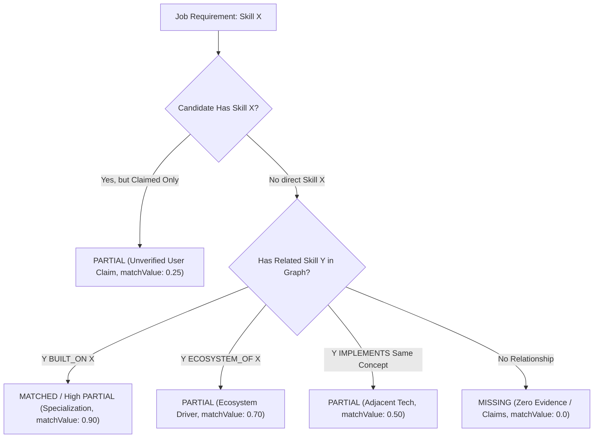

# ARCH-013: Evidence Matching & Gap Analysis Engine Architecture

**Document ID**: `ARCH-013`  
**Related ADR**: `ADR-033` (`docs/decisions.md`)  
**Status**: `APPROVED`  
**Phase**: Phase 5 (P5-003A)  
**Author**: Antigravity DeepMind Team  
**Date**: 2026-08-22  

---

## 1. Executive Summary & Objective

The **Evidence Matching & Gap Analysis Engine** is the deterministic analytical core of Phase 5. It evaluates structured, normalized job requirements (`JobRequirement`) against candidate profiles (`CandidateProfileView`, `CandidateSkill`, `Project`, `EvidenceItem`) with cryptographic evidence traceability and zero hallucinations.

```
+---------------------------------------------------------------------------------------------------+
|                                      INPUT: EVALUATION CONTEXT                                     |
|    - JobDescription & JobRequirements (Extracted & Normalized via P5-001)                         |
|    - CandidateProfileView (Aggregated via P4-005 CandidateProfileService)                         |
|    - CandidateSkills (VERIFIED, INFERRED, CLAIMED) + EvidenceItems (Pinned to Commits)            |
|    - Canonical Skill Taxonomy Graph (P5-002: BUILT_ON, ECOSYSTEM_OF, IMPLEMENTS)                  |
+-------------------------------------------------+-------------------------------------------------+
                                                  |
                                                  v
+---------------------------------------------------------------------------------------------------+
|                        1. DETERMINISTIC REQUIREMENT CLASSIFICATION & DISPATCH                     |
|   - SKILL Requirements: Taxonomy Hash Lookup & Graph Adjacency Evaluation                         |
|   - EXPERIENCE Requirements: Observed Commit Duration vs Explicit Work History Matching          |
|   - EDUCATION Requirements: Degree Level & Field of Study Matching                                |
|   - LOCATION Requirements: Workplace Type & Geographic Constraint Matching                        |
|   - DOMAIN Requirements: Project Category & Architecture Vertical Matching                        |
|   - SUBJECTIVE / SOFT SKILLS: Routed to UNKNOWN (Cannot be Mechanically Inferred)                 |
+-------------------------------------------------+-------------------------------------------------+
                                                  |
                                                  v
+---------------------------------------------------------------------------------------------------+
|                        2. STATUS DETERMINATION & EVIDENCE PROVENANCE GATING                       |
|   - MATCHED: Verified Code Evidence (>= 0.85 conf) or Validated Explicit Qualification           |
|   - PARTIAL: Unverified User Claim ([Unverified User Claim]) | Adjacent Taxonomy Relation         |
|   - MISSING: Mechanically Evaluable & Zero Qualifying Evidence or Claims                          |
|   - UNKNOWN: Subjective Soft Skill or Missing Profile Field (Zero False Absences)                 |
+-------------------------------------------------+-------------------------------------------------+
                                                  |
                                                  v
+---------------------------------------------------------------------------------------------------+
|                        3. ACTIONABLE SKILL GAP ANALYSIS & EXPLANATIONS                            |
|   - Prioritization: CRITICAL (Req Missing) | HIGH (Req Claimed/Pref Missing) | MED/LOW (Optional) |
|   - Severity: EXPLICITLY_MISSING vs UNVERIFIED_CLAIM vs INSUFFICIENT_EVIDENCE                     |
|   - Verifiable Match Explanation & Primary Evidence Selection (max 3 EvidenceRefs per Match)      |
+-------------------------------------------------+-------------------------------------------------+
                                                  |
                                                  v
+---------------------------------------------------------------------------------------------------+
|                                 OUTPUT: CANDIDATE MATCH ANALYSIS                                  |
|         CandidateMatchAnalysis (Tenant-Scoped, Sanitized, Deterministic, Zero Secrets)            |
+---------------------------------------------------------------------------------------------------+
```

---

## 2. Canonical Match Statuses

The matching engine enforces four mutually exclusive, canonical statuses:

| Status | Definition | Minimum Qualification Threshold | Example |
| :--- | :--- | :--- | :--- |
| **`MATCHED`** | Requirement is fully satisfied with verifiable technical proof or explicit factual qualification. | `CandidateSkill.provenanceStatus === 'VERIFIED'` with $\ge 1$ qualifying code `EvidenceItem`, OR candidate skill built on/specializing requested skill. | Job requires `PostgreSQL`; candidate has verified `pg` dependency in `package.json` with active queries. |
| **`PARTIAL`** | Requirement is partially satisfied via unverified self-claim, adjacent technology, or partial tenure. | `CandidateSkill.provenanceStatus === 'CLAIMED'` (`[Unverified User Claim]`), OR adjacent relationship (`BUILT_ON`, `ECOSYSTEM_OF`, `IMPLEMENTS`), OR tenure $< \text{minYears}$. | Job requires `React`; candidate has unverified manual claim or demonstrates `Next.js` without raw React proof. |
| **`MISSING`** | Requirement is mechanically evaluable, but candidate possesses zero evidence and zero claims. | Mechanically evaluable requirement + 0 candidate skills + 0 claims + candidate has active profile data. | Job requires `Kubernetes`; candidate profile has zero K8s manifests, zero code imports, and zero claims. |
| **`UNKNOWN`** | Requirement is subjective, non-technical, or candidate profile simply lacks data without proving absence. | Subjective wording (communication, culture, leadership) OR omitted profile field (unstated degree). | Job requires "Exceptional leadership under pressure"; unstated candidate graduation degree. |

---

## 3. Strict Evidence Verification Thresholds (`MATCHED`)

A technical skill requirement is marked `MATCHED` **if and only if** all of the following conditions are met:
1. **Taxonomy Alignment**: `JobRequirement.skillSlug` resolves to the same canonical slug as `CandidateSkill.skillSlug` via `SkillTaxonomyEngine.normalizeSkill()`, OR satisfies an approved specialization relationship.
2. **Provenance Status**: `CandidateSkill.provenanceStatus` is `VERIFIED` (or high-confidence `INFERRED` with score $\ge 0.85$).
3. **Qualifying Evidence Presence**: At least one qualifying `EvidenceItem` is linked with valid cryptographic provenance:
   - `PACKAGE_MANIFEST_DEPENDENCY` (e.g. `package.json`, `go.mod`, `Cargo.toml`, `requirements.txt`)
   - `CODE_IMPORT` (e.g. `import express from 'express'`, `import asyncpg`)
   - `CODE_USAGE` (e.g. AST call expression / class instantiation)
   - `CONFIG_SYNTAX_DECLARATION` (e.g. `Dockerfile`, `github-actions.yml`)

> [!CAUTION]
> **Strict Anti-Fabrication Rule**: A README keyword mention (`README_MENTION`) or self-asserted user claim (`isUserClaim: true`) **NEVER** elevates a requirement to `MATCHED` on its own.

---

## 4. Deterministic `PARTIAL` Evaluation Rules

`PARTIAL` is not an ambiguous catch-all; it is assigned only when specific partial conditions are satisfied:



1. **Unverified User Claim (`UNVERIFIED_CLAIM`)**:
   - Candidate has self-claimed the skill (`provenanceStatus === 'CLAIMED'`), but no connected repository contains supporting code or manifest proof.
   - Match value: $0.25$, Confidence: $0.50$. Labeled explicitly as `[Unverified User Claim]`.
2. **Adjacent / Related Technology (`ADJACENT_TECHNOLOGY`)**:
   - Evaluated via `SkillTaxonomyEngine.getRelationships(slug)`.
3. **Partial Experience Tenure (`INSUFFICIENT_TENURE`)**:
   - Candidate demonstrates verified code activity, but observed tenure spans less than the required minimum years (e.g. 2 years observed vs 4 years requested).
4. **Weak / Low-Confidence Evidence (`LOW_CONFIDENCE_EVIDENCE`)**:
   - Technical evidence exists but confidence score is in the range $[0.50, 0.85)$ (e.g. single unconfirmed import or ambiguous helper usage).

---

## 5. Taxonomy Relationship Evaluation Matrix

The engine leverages `ARCH-012` directional graph edges to evaluate transferable technical skills:

| Relationship Type | Job Requires | Candidate Has | Match Verdict | Match Multiplier ($W_{\text{rel}}$) | Match Explanation Rule |
| :--- | :--- | :--- | :--- | :---: | :--- |
| **`BUILT_ON` (Child $\rightarrow$ Parent)** | `JavaScript` | `TypeScript` | **`MATCHED`** | $0.95$ | TypeScript is built on and supersets JavaScript. |
| **`BUILT_ON` (Parent $\rightarrow$ Child)** | `React` | `Next.js` | **`MATCHED`** | $0.90$ | Next.js is built on React; full React capability demonstrated. |
| **`BUILT_ON` (Framework $\rightarrow$ Runtime)** | `Node.js` | `Fastify` | **`MATCHED`** | $0.85$ | Fastify is built on Node.js runtime. |
| **`ECOSYSTEM_OF`** | `PostgreSQL` | `Drizzle ORM` | **`PARTIAL`** | $0.75$ | Drizzle ORM indicates active PostgreSQL ecosystem usage. |
| **`ECOSYSTEM_OF`** | `AWS` | `Boto3` | **`PARTIAL`** | $0.80$ | Boto3 SDK demonstrates programmatic AWS cloud usage. |
| **`IMPLEMENTS`** | `PostgreSQL` | `MySQL` | **`PARTIAL`** | $0.50$ | Both implement relational SQL databases; transferable architecture. |
| **`PARENT_OF`** | `Relational Database`| `PostgreSQL` | **`MATCHED`** | $1.00$ | PostgreSQL is a direct implementation of Relational Database. |

---

## 6. Non-Skill Requirement Matching Protocols

### 6.1 Experience Matching Protocol
* **Principle**: Observed GitHub repository commit timestamps establish **technical code activity duration**, but **MUST NOT** be automatically conflated with formal corporate employment tenure.
* **Evaluation Matrix**:
  - `MATCHED`: Candidate profile contains explicit work history/resume entries spanning $\ge \text{minYears}$ in relevant roles.
  - `PARTIAL`: Candidate profile work history spans $< \text{minYears}$, OR repository commit history demonstrates technical activity covering the duration without corporate verification.
  - `UNKNOWN`: Candidate profile does not provide work history records. The engine **never** outputs `MISSING` merely because a GitHub profile lacks employment dates.

### 6.2 Education Matching Protocol
* **Degree Hierarchy**: `HIGH_SCHOOL` ($1$) $<$ `ASSOCIATES` ($2$) $<$ `BACHELORS` ($3$) $<$ `MASTERS` ($4$) $<$ `DOCTORATE` ($5$).
* **Evaluation Matrix**:
  - `MATCHED`: Candidate degree level $\ge$ requirement degree level AND field of study aligns (e.g., Computer Science, Electrical Engineering).
  - `PARTIAL`: Candidate possesses equivalent related degree level (e.g. Mathematics for CS role).
  - `UNKNOWN`: Candidate profile has no education section. Absence of evidence is **not** evidence of absence.

### 6.3 Location & Workplace Matching Protocol
* **Workplace Types**: `REMOTE`, `HYBRID`, `ON_SITE`.
* **Evaluation Matrix**:
  - `MATCHED`: Job is `REMOTE` AND candidate accepts remote work; OR candidate city/country matches job on-site location.
  - `PARTIAL`: Job is `HYBRID` in candidate's metropolitan region.
  - `MISSING`: Job is strict `ON_SITE` in a location where candidate does not reside and cannot relocate.
  - `UNKNOWN`: Candidate location is unstated.

### 6.4 Domain & Industry Matching Protocol
* **Principle**: Domain requirements (e.g. "Fintech", "Healthcare HIPAA", "High-Throughput Streaming") are evaluated against **curated project domains** and **repository architectures**, never from a single package dependency.
* **Evaluation Matrix**:
  - `MATCHED`: Candidate has $\ge 1$ verified `Project` with matching domain tags (e.g. project classified as `FINTECH` with transaction handling).
  - `PARTIAL`: Candidate has self-claimed domain experience or repository topics align.
  - `MISSING`: No project or profile alignment.
  - `UNKNOWN`: Subjective domain culture requirements.

---

## 7. Decoupled Match Confidence Computation

Match confidence $C_{\text{match}} \in [0.0, 1.0]$ is computed deterministically for each requirement without conflation with overall candidate scoring:

$$C_{\text{match}} = \begin{cases}
C_{\text{req}} \times C_{\text{cand\_skill}} \times C_{\text{primary\_evid}} & \text{for Direct Exact Verified Match} \\
C_{\text{req}} \times C_{\text{cand\_skill}} \times W_{\text{rel}} & \text{for Relationship-Based Match} \\
0.50 \times C_{\text{req}} & \text{for Unverified User Claim} \\
0.0 & \text{for Missing / Unknown}
\end{cases}$$

Where:
- $C_{\text{req}}$: Requirement extraction confidence ($\ge 0.80$).
- $C_{\text{cand\_skill}}$: Candidate skill confidence ($\ge 0.85$ for `VERIFIED`).
- $C_{\text{primary\_evid}}$: Primary evidence confidence node score ($\ge 0.80$).
- $W_{\text{rel}}$: Taxonomy relationship multiplier ($0.50 - 0.95$).

---

## 8. Evidence Selection & Verifiable Match Explanations

### 8.1 Primary & Secondary Evidence Selection
For every `MATCHED` or `PARTIAL` requirement, the engine selects up to **3** `EvidenceRef` objects, ordered by evidentiary strength:
1. `PACKAGE_MANIFEST_DEPENDENCY` (Production runtime manifest)
2. `CODE_IMPORT` (Direct module imports)
3. `CODE_USAGE` (AST call sites & class implementations)
4. `CONFIG_SYNTAX_DECLARATION` (CI/CD workflows, Dockerfiles)
5. `README_MENTION` (Contextual documentation)

### 8.2 Standardized Match Explanation Templates
All explanations are structured, objective, and evidence-backed:
- **Exact Verified Match**:  
  `"MATCHED: PostgreSQL is verified in production manifest 'package.json' (commit 4f8a12e) with 4 supporting code usages in repository 'Ai-job-mcp'."`
- **Relationship Match**:  
  `"MATCHED: Candidate demonstrates Next.js in repository 'frontend-app', which is built on required skill React."`
- **Unverified User Claim**:  
  `"PARTIAL: Candidate self-claims AWS experience ([Unverified User Claim]), but no verified code or manifest evidence was discovered in connected repositories."`
- **Missing Required Skill**:  
  `"MISSING: Candidate possesses zero verified evidence or claims for required technical skill 'Kubernetes'."`
- **Subjective Requirement**:  
  `"UNKNOWN: Requirement 'Demonstrated cross-functional leadership' is a subjective qualitative qualification that cannot be mechanically verified from code repositories."`

---

## 9. Prioritized Skill Gap Analysis

Every requirement that is not `MATCHED` generates a structured `SkillGap` object:

```
+---------------------------------------------------------------------------------------------------+
|                                      SKILL GAP TAXONOMY MATRIX                                    |
+-------------------+--------------------+------------------------+---------------------------------+
| Requirement Tier  | Candidate Status   | Gap Priority           | Gap Severity                    |
+-------------------+--------------------+------------------------+---------------------------------+
| REQUIRED          | MISSING            | CRITICAL (Must-Have)   | EXPLICITLY_MISSING              |
| REQUIRED          | CLAIMED (No Proof) | HIGH (Must Verify)     | UNVERIFIED_CLAIM                |
| PREFERRED (W>=0.5)| MISSING            | HIGH (Advantageous)    | EXPLICITLY_MISSING              |
| PREFERRED (W<0.5) | MISSING            | MEDIUM (Standard)      | EXPLICITLY_MISSING              |
| OPTIONAL / BONUS  | MISSING            | LOW (Bonus Gap)        | EXPLICITLY_MISSING              |
| ANY TECHNICAL     | LOW CONFIDENCE     | MEDIUM                 | INSUFFICIENT_EVIDENCE           |
+-------------------+--------------------+------------------------+---------------------------------+
```

### 9.1 Skill Gap Fields
* `requirementId` (`UUIDv4`): ID of the failed or partial job requirement.
* `skillSlug` (`String`): Canonical skill slug.
* `skillName` (`String`): Official display name.
* `category` (`SkillCategoryEnum`): Skill domain.
* `priority` (`Enum`): `CRITICAL`, `HIGH`, `MEDIUM`, `LOW`.
* `severity` (`Enum`): `EXPLICITLY_MISSING`, `UNVERIFIED_CLAIM`, `INSUFFICIENT_EVIDENCE`, `PARTIAL_TENURE`.
* `status` (`Enum`): `MISSING` or `PARTIAL`.
* `reason` (`String`): Concise factual explanation.
* `recommendation` (`String`): Actionable suggestion (e.g. *"Connect a repository containing Dockerfile configurations or upload verified deployment evidence."*).

---

## 10. Multi-Tenant Sovereign Isolation

1. **Strict Context Scoping**: Every match execution accepts an immutable `ConnectorContext` or `RequestContext` containing `context.tenantId`.
2. **Hermetic Data Retrieval**:
   - `JobDescription` retrieved where `tenant_id === context.tenantId`.
   - `CandidateProfileView` retrieved via `CandidateProfileService` where `tenant_id === context.tenantId`.
   - All `EvidenceItem` and `Project` records verified against `tenant_id === context.tenantId`.
3. **Cross-Tenant Default-Deny**: If `jobDescriptionId` or `candidateId` belongs to another tenant, the engine immediately throws `NotFoundError` (404) to avoid leaking existence.
4. **Zero Cross-Tenant Leakage**: Match analysis payloads are stripped of foreign identifiers, tokens, and unmasked secrets.

---

## 11. Core Domain Schema Contracts (Target Definitions)

```javascript
// CandidateRequirementMatchSchema
export const CandidateRequirementMatchSchema = z.object({
  requirementId: z.string().uuid(),
  category: RequirementCategoryEnum,
  importance: ImportanceEnum,
  skillSlug: SafeSlugSchema.nullable().optional(),
  extractedValue: z.string().max(255),
  matchStatus: z.enum(['MATCHED', 'PARTIAL', 'MISSING', 'UNKNOWN']),
  matchConfidence: z.number().min(0.0).max(1.0),
  isUserClaim: z.boolean().default(false),
  claimLabel: z.string().nullable().optional(),
  matchedSkillSlug: SafeSlugSchema.nullable().optional(),
  relationshipType: z.enum(['EXACT', 'BUILT_ON', 'ECOSYSTEM_OF', 'IMPLEMENTS', 'PARENT_OF', 'NONE']).default('NONE'),
  primaryEvidence: EvidenceRefSchema.nullable().optional(),
  supportingEvidence: z.array(EvidenceRefSchema).max(3).default([]),
  explanation: z.string().max(1000),
});

// SkillGapSchema
export const SkillGapSchema = z.object({
  requirementId: z.string().uuid(),
  skillSlug: SafeSlugSchema,
  skillName: z.string().max(100),
  category: SkillCategoryEnum,
  priority: z.enum(['CRITICAL', 'HIGH', 'MEDIUM', 'LOW']),
  severity: z.enum(['EXPLICITLY_MISSING', 'UNVERIFIED_CLAIM', 'INSUFFICIENT_EVIDENCE', 'PARTIAL_TENURE']),
  status: z.enum(['MISSING', 'PARTIAL']),
  reason: z.string().max(500),
  recommendation: z.string().max(500),
});

// CandidateMatchAnalysisSchema
export const CandidateMatchAnalysisSchema = z.object({
  jobDescriptionId: z.string().uuid(),
  candidateId: z.string().uuid(),
  tenantId: z.string().uuid(),
  summary: z.object({
    totalRequirements: z.number().int().nonnegative(),
    matchedCount: z.number().int().nonnegative(),
    partialCount: z.number().int().nonnegative(),
    missingCount: z.number().int().nonnegative(),
    unknownCount: z.number().int().nonnegative(),
    criticalGapsCount: z.number().int().nonnegative(),
    highGapsCount: z.number().int().nonnegative(),
  }),
  matches: z.array(CandidateRequirementMatchSchema),
  gaps: z.array(SkillGapSchema),
  analyzedAt: z.string().datetime(),
});
```

---

## 12. Persistence Strategy & Performance Bounds

### 12.1 Ephemeral On-Demand Computation
In Phase 5, matching analysis is **purely computational and executed on-demand in memory**. 
* No new database tables or migrations are required for P5-003.
* Match results are deterministically reproducible from the underlying `JobDescription` and `CandidateProfile` state.
* Caching or persistence tables (`candidate_job_matches`) are deferred to Phase 7/12 when remote MCP and application tracking require state retention.

### 12.2 $O(N)$ Performance Guarantees
* Candidate skills and evidence references are pre-indexed into memory maps (`Map<skillSlug, CandidateSkill>`) upon profile loading.
* Requirement evaluation scales strictly linearly: $\mathcal{O}(|\text{Requirements}|)$ with microsecond evaluation time.
* Worst-case complexity with taxonomy traversal: $\mathcal{O}(|\text{Requirements}| \times \text{MaxRelationships})$ where $\text{MaxRelationships} \le 10$.

---

## 13. LLM Boundary & Integrity Defense

1. **Prohibited LLM Actions**: LLMs are strictly forbidden from deciding match status (`MATCHED`, `PARTIAL`, `MISSING`, `UNKNOWN`), computing match confidence, or overriding gap severity.
2. **Optional Post-Evaluation LLM Role**: An optional LLM adapter may only rephrase deterministic `explanation` strings into stylized resume narratives in Phase 6, strictly adhering to the deterministic verdict.

---

## 14. Verification & Testing Strategy for P5-003

The implementation of P5-003 will be validated against:
1. **Direct Exact Skill Matches**: Verifying `MATCHED` for canonical skill matches with verified evidence.
2. **Alias Normalization Matching**: Verifying `Postgres` requirement matches `postgresql` evidence.
3. **Taxonomy Relationship Traversals**: Verifying `Next.js` $\rightarrow$ `React` (`BUILT_ON`) produces `MATCHED`/`PARTIAL`.
4. **Claim Precedence Tests**: Verifying manual claims yield `PARTIAL` with `[Unverified User Claim]`, never `MATCHED`.
5. **Non-Technical & Subjective Routing**: Verifying soft skills route to `UNKNOWN` with zero false `MISSING` verdicts.
6. **Experience & Education Bounds**: Verifying missing candidate profile fields produce `UNKNOWN` instead of false negative `MISSING`.
7. **Skill Gap Prioritization**: Verifying missing required skills produce `CRITICAL` gaps and missing preferred produce `HIGH`/`MEDIUM`.
8. **Multi-Tenant 404 Isolation**: Verifying cross-tenant matching fails closed with `404 NotFoundError`.
9. **Determinism Verification**: Verifying 1,000 identical consecutive runs produce bit-for-bit identical JSON payloads.

---

## 15. Architecture Decision & Approval Recommendation

The proposed design satisfies all project principles from `goal.md` and `AGENTS.md`:
- **Provider-Neutral**: Decoupled from AI clients and runtime LLMs.
- **Evidence-Based**: Zero hallucinations, strict fact vs claim separation.
- **Explainable & Auditable**: Transparent reasoning with commit-pinned evidence pointers.
- **Multi-Tenant Secure**: Enforces sovereign isolation with 404 default-deny.

**Recommendation**: **APPROVE P5-003A**. Proceed to P5-003 implementation upon user approval.
