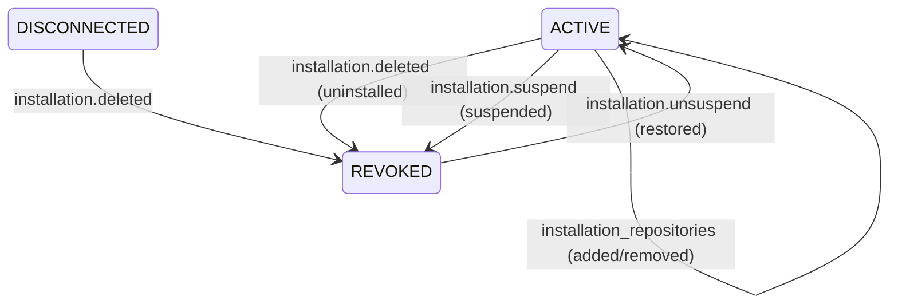

# GitHub App Webhook Architecture Review & Specification (Task P3-003A)

**Document Version**: `1.0.0`  
**Status**: `APPROVED / ARCHITECTURAL BASELINE`  
**Date**: `2026-08-21`  
**Phase**: `Phase 3 — Task P3-003A`  
**Governing Documents**: [`AGENTS.md`](file:///C:/Users/VISHW/OneDrive/Desktop/Ai-career-agent/AGENTS.md), [`goal.md`](file:///C:/Users/VISHW/OneDrive/Desktop/Ai-career-agent/goal.md), [`project.md`](file:///C:/Users/VISHW/OneDrive/Desktop/Ai-career-agent/project.md), [`docs/security.md`](file:///C:/Users/VISHW/OneDrive/Desktop/Ai-career-agent/docs/security.md), [`docs/architecture.md`](file:///C:/Users/VISHW/OneDrive/Desktop/Ai-career-agent/docs/architecture.md), [`docs/github-app-auth-architecture-review.md`](file:///C:/Users/VISHW/OneDrive/Desktop/Ai-career-agent/docs/github-app-auth-architecture-review.md), [`docs/github-app-installation-linking-review.md`](file:///C:/Users/VISHW/OneDrive/Desktop/Ai-career-agent/docs/github-app-installation-linking-review.md), [`docs/resource-connections-schema-review.md`](file:///C:/Users/VISHW/OneDrive/Desktop/Ai-career-agent/docs/resource-connections-schema-review.md), [`docs/resource-connector-architecture.md`](file:///C:/Users/VISHW/OneDrive/Desktop/Ai-career-agent/docs/resource-connector-architecture.md), [`docs/resource-connection-api-review.md`](file:///C:/Users/VISHW/OneDrive/Desktop/Ai-career-agent/docs/resource-connection-api-review.md), [`docs/authentication-architecture.md`](file:///C:/Users/VISHW/OneDrive/Desktop/Ai-career-agent/docs/authentication-architecture.md), [`docs/decisions.md`](file:///C:/Users/VISHW/OneDrive/Desktop/Ai-career-agent/docs/decisions.md) (ADR-004, ADR-006, ADR-016, ADR-018, ADR-019, ADR-020, ADR-021, ADR-022).

---

## 1. Executive Summary & Purpose

In **Phase 3 (Task P3-003)**, Antigravity Career Hub implements the **GitHub Webhook Subsystem**. This subsystem enables the platform to react reactively, securely, and in real time to external GitHub state changes (such as App installation changes, suspensions, deletions, and repository permission changes) without relying on expensive, rate-limited polling loops.

### Core Objectives:
1. **Authoritative State Synchronization**: Maintain 100% database consistency in `resource_connections` when users install, suspend, unsuspend, or uninstall the GitHub App directly on GitHub.
2. **Repository Access Tracking**: React to repository additions and removals, updating workspace connection metadata and token scopes.
3. **Partitioned In-Memory Token Cache Invalidation**: Immediately evict cached `ghs_*` installation tokens upon suspension, uninstallation, or repository scope contraction to prevent stale or unauthorized API calls.
4. **Cryptographic Ingress Protection**: Validate `X-Hub-Signature-256` HMAC-SHA256 signatures against raw request body bytes before parsing JSON to completely reject forged requests.
5. **Strict Multi-Tenant Isolation**: Authoritatively resolve tenant ownership strictly via database mapping (`installation.id` -> `resource_connections.tenant_id`). Never trust client-supplied tenant identifiers.
6. **Idempotency & Replay Resilience**: Guarantee safe, duplicate-immune processing using `X-GitHub-Delivery` tracking and monotonic state transitions.
7. **Asynchronous Execution Boundary**: Keep the webhook ingress HTTP handler fast (<200ms) by decoupling lightweight state mutations from heavy repository scanning (Phase 4+).

---

## 2. GitHub Webhook Event Classification Matrix

To adhere to the principle of least privilege and prevent unnecessary processing overhead, the platform subscribes only to required events.

| Event Name | Event Actions | Classification | Architectural Justification & Purpose |
| :--- | :--- | :--- | :--- |
| **`installation`** | `created` | **REQUIRED NOW** | Handles out-of-band installations. When installed directly on GitHub, logs pending link event. |
| **`installation`** | `deleted` | **REQUIRED NOW** | Transitions connection to `REVOKED`, evicts cached tokens, purges access. |
| **`installation`** | `suspend` | **REQUIRED NOW** | Transitions connection to `REVOKED` / `ERROR`, evicts cached tokens. |
| **`installation`** | `unsuspend` | **REQUIRED NOW** | Restores connection status to `ACTIVE` upon un-suspension. |
| **`installation`** | `new_permissions_accepted` | **USEFUL LATER** | Updates `scopes` array and metadata when user approves new permission tiers. |
| **`installation_repositories`** | `added` | **REQUIRED NOW** | Updates `repositorySelection` metadata; clears token cache for repo discovery. |
| **`installation_repositories`** | `removed` | **REQUIRED NOW** | Updates `repositorySelection` metadata; immediately evicts tokens for removed repos. |
| **`push`** | `push` | **USEFUL LATER (Phase 4/5)** | Triggers incremental candidate evidence re-indexing when code is pushed to default branch. Deferred from Phase 3. |
| **`repository`** | `renamed`, `archived`, `deleted`, `publicized`, `privatized` | **USEFUL LATER (Phase 4)** | Synchronizes repository name/visibility state in child `repositories` table. |
| **`pull_request`** | `opened`, `closed`, `synchronize` | **DEFERRED (Phase 9)** | Monitors human-in-the-loop candidate PR enhancement workflows. Not needed for read-only ingestion. |
| **`repository_vulnerability_alert`** | *All* | **DEFERRED (Phase 15)** | Advanced security analysis and dependency scanning. |
| **`star`, `fork`, `issues`, `watch`** | *All* | **DEFERRED / OUT OF SCOPE** | Irrelevant to candidate skill extraction and career evidence modeling. |

---

## 3. Webhook Ingress Endpoint Design (`POST /webhooks/github`)

```
GitHub Platform               Fastify Gateway                  Webhook Service             PostgreSQL / Cache
     │                               │                                │                            │
     │ 1. POST /webhooks/github      │                                │                            │
     │    Headers: X-Hub-Sig, Event  │                                │                            │
     ├──────────────────────────────►│                                │                            │
     │                               │ 2. Verify raw body HMAC-SHA256 │                            │
     │                               │    (Timing-safe compare)       │                            │
     │                               │ 3. Check X-GitHub-Delivery     │                            │
     │                               │    Idempotency Cache           │                            │
     │                               ├───────────────────────────────►│                            │
     │                               │                                │ 4. Resolve tenant via      │
     │                               │                                │    installation_id         │
     │                               │                                ├───────────────────────────►│
     │                               │                                │ 5. Mutate status & evict   │
     │                               │                                │    token cache             │
     │                               │                                ├───────────────────────────►│
     │                               │ 6. 200 OK / 202 Accepted       │                            │
     │◄──────────────────────────────┼────────────────────────────────┤                            │
```

### 3.1. Route Specification
* **HTTP Method**: `POST`
* **Route Path**: `/webhooks/github` (Standard root-level webhook ingress)
* **Content-Type**: `application/json` (Payload formatted as JSON)
* **Headers Inspected**:
  * `X-Hub-Signature-256`: Hex-encoded HMAC-SHA256 signature (`sha256=<64_hex_chars>`).
  * `X-GitHub-Event`: Event name (e.g. `installation`, `installation_repositories`, `ping`).
  * `X-GitHub-Delivery`: Unique GUID identifying this delivery attempt (`uuid`).
  * `X-GitHub-Hook-ID`: GitHub internal webhook configuration ID.

### 3.2. Independence from User Session Authentication
* **No `req.auth` Dependency**: GitHub webhook calls are automated machine-to-machine requests. GitHub does not possess workspace user session cookies (`career_hub_session`) or Bearer tokens.
* **Independent Cryptographic Gateway**: Authentication is achieved exclusively via HMAC-SHA256 signature verification using the shared `GITHUB_WEBHOOK_SECRET`.
* **Zero Session Pollution**: Webhook routes run under a dedicated `verifyWebhookSignature` pre-handler hook rather than the user `authenticate` middleware.

---

## 4. Cryptographic Signature Validation (`X-Hub-Signature-256`)

Signature validation is the primary ingress security barrier. Any request failing signature verification is immediately rejected with `401 Unauthorized` before payload parsing or business logic execution.

### 4.1. Verification Algorithm
1. **Raw Body Capture**: The server MUST capture the exact raw request body Buffer prior to JSON deserialization.
   > [!IMPORTANT]
   > Computing HMAC over re-serialized JSON (e.g. `JSON.stringify(req.body)`) is strictly prohibited. JSON re-serialization alters whitespace, key ordering, and Unicode escapes, producing false signature rejections or timing vulnerabilities.
2. **Signature Parsing**: Extract the hex digest from `X-Hub-Signature-256`:
   ```javascript
   const header = req.headers['x-hub-signature-256'];
   if (!header || !header.startsWith('sha256=')) {
     throw new AuthenticationError('Missing or malformed webhook signature', 'MISSING_WEBHOOK_SIGNATURE');
   }
   const providedSignatureHex = header.slice(7);
   ```
3. **HMAC-SHA256 Computation**:
   ```javascript
   const expectedSignatureHex = crypto
     .createHmac('sha256', config.GITHUB_WEBHOOK_SECRET)
     .update(rawBodyBuffer)
     .digest('hex');
   ```
4. **Timing-Safe Comparison**:
   ```javascript
   const expectedBuf = Buffer.from(expectedSignatureHex, 'utf8');
   const providedBuf = Buffer.from(providedSignatureHex, 'utf8');

   if (expectedBuf.length !== providedBuf.length || !crypto.timingSafeEqual(expectedBuf, providedBuf)) {
     throw new AuthenticationError('Invalid webhook signature', 'INVALID_WEBHOOK_SIGNATURE');
   }
   ```

### 4.2. Rejection Rules
* Missing `X-Hub-Signature-256` header -> **`401 Unauthorized` (`MISSING_WEBHOOK_SIGNATURE`)**
* Malformed signature format (not starting with `sha256=` or invalid hex length) -> **`401 Unauthorized` (`INVALID_WEBHOOK_SIGNATURE`)**
* Signature mismatch -> **`401 Unauthorized` (`INVALID_WEBHOOK_SIGNATURE`)**
* Unconfigured server secret (`GITHUB_WEBHOOK_SECRET` empty) -> **`500 Internal Server Error` (`MISSING_WEBHOOK_SECRET`)**

---

## 5. Webhook Secret Management

* **Environment Variable**: `GITHUB_WEBHOOK_SECRET` (aliased to `GITHUB_APP_WEBHOOK_SECRET` if configured).
* **Storage Invariants**:
  * Stored strictly in environment configuration or cloud secrets managers (Azure Key Vault, AWS Secrets Manager).
  * **NEVER** stored in PostgreSQL database tables.
  * **NEVER** committed to Git or hardcoded in source files.
  * **NEVER** returned in API responses, error objects, or client payloads.
* **Log Redaction**: Centralized Pino logger redacts `GITHUB_WEBHOOK_SECRET` across all structured logging streams.
* **Placeholder in `.env.example`**: Documented as `GITHUB_WEBHOOK_SECRET=your_github_webhook_secret_here`.

---

## 6. Event Delivery Trust & Tenant Ownership Resolution

GitHub webhook payloads originate outside the platform's trusted boundary. The platform must never trust internal entity identifiers from GitHub.

```
┌─────────────────────────────────────────────────────────────────────────────┐
│ 1. Untrusted GitHub Webhook Payload                                         │
│    - `installation.id` (Numeric, e.g. 155430459)                            │
│    - `action` ('deleted', 'suspend', 'added')                               │
│    - `repositories_added` / `repositories_removed`                          │
│    - (Contains ZERO knowledge of internal tenantId or userId)               │
└──────────────────────────────────────┬──────────────────────────────────────┘
                                       │
                                       ▼ (Authoritative Database Lookup)
┌─────────────────────────────────────────────────────────────────────────────┐
│ 2. Authoritative Database Tenant Resolution (`resource_connections`)        │
│    `SELECT id, tenant_id, status FROM resource_connections`                 │
│    `WHERE provider = 'GITHUB_APP' AND installation_id = :installation_id`   │
└──────────────────────────────────────┬──────────────────────────────────────┘
                                       │
                                       ▼ (Strictly Tenant-Scoped Operations)
┌─────────────────────────────────────────────────────────────────────────────┐
│ 3. Isolated Tenant Execution Context                                        │
│    - Mutate connection record strictly where `tenant_id = :resolvedTenantId`│
│    - Invalidate in-memory token cache for `(resolvedTenantId, installation)`│
│    - Record audit log bound strictly to `:resolvedTenantId`                 │
└─────────────────────────────────────────────────────────────────────────────┘
```

### Invariants:
1. **Authoritative Resolution**: `installation.id` is looked up in `resource_connections` where `provider = 'GITHUB_APP'`.
2. **Strict Multi-Tenant Scoping**: Once `tenant_id` is resolved, all downstream mutations, cache evictions, and audit records are bound strictly to that `tenant_id`.
3. **Unlinked Installation Handling**: If a validly signed webhook arrives for an `installation.id` not present in `resource_connections` (e.g. app installed on GitHub without workspace linking yet):
   * Return `200 OK` (acknowledge delivery).
   * Emit structured audit log: `github.webhook.unlinked_installation`.
   * Perform zero database mutations.

---

## 7. Installation Lifecycle Event Handling

Webhook events map onto the established `resource_connection_status` lifecycle state machine:



### 7.1. `installation.deleted` (GitHub App Uninstalled)
* **Trigger**: User uninstalls the GitHub App via GitHub settings.
* **Database Action**:
  * Update `resource_connections` where `installation_id = :id`:
    * `status = 'REVOKED'`
    * `last_error_code = 'APP_UNINSTALLED'`
    * `last_error_at = NOW()`
    * `updated_at = NOW()`
* **Token Cache Action**: Call `tokenCache.evict(tenantId, installationId)` to purge all cached installation access tokens.
* **Audit Record**: `github.installation.deleted` (`{ tenantId, installationId, accountLogin }`).

### 7.2. `installation.suspend` (GitHub App Suspended)
* **Trigger**: User suspends the GitHub App on GitHub.
* **Database Action**:
  * Update `resource_connections`:
    * `status = 'REVOKED'`
    * `last_error_code = 'INSTALLATION_SUSPENDED'`
    * `last_error_at = NOW()`
    * `updated_at = NOW()`
* **Token Cache Action**: Call `tokenCache.evict(tenantId, installationId)`.
* **Audit Record**: `github.installation.suspended` (`{ tenantId, installationId, suspendedAt }`).

### 7.3. `installation.unsuspend` (GitHub App Reactivated)
* **Trigger**: User un-suspends the GitHub App on GitHub.
* **Database Action**:
  * Update `resource_connections`:
    * `status = 'ACTIVE'`
    * `last_error_code = null`
    * `last_error_at = null`
    * `last_validated_at = NOW()`
    * `updated_at = NOW()`
* **Audit Record**: `github.installation.unsuspended` (`{ tenantId, installationId }`).

### 7.4. `installation.created` (Out-of-Band Installation)
* **Trigger**: User installs the GitHub App directly from GitHub Marketplace or the App listing page.
* **Action**: If a matching connection exists (unlikely during fresh install), ensure status is `ACTIVE`. Otherwise, record `github.webhook.installation_pending_link` acknowledging that user must complete workspace linking.

---

## 8. Installation Repository Events Handling

### 8.1. `installation_repositories.added`
* **Trigger**: User grants the GitHub App access to additional repositories.
* **Database Action**:
  * Update `resource_connections.metadata`:
    * `repositorySelection = payload.repository_selection` (`'all'` or `'selected'`)
    * `updatedAt = NOW()`
* **Token Cache Action**: Invalidate installation-level cached token to ensure subsequent calls obtain fresh repository scopes (`tokenCache.evict(tenantId, installationId)`).
* **Audit Record**: `github.repositories.added` (`{ tenantId, installationId, addedCount, repoNames: [...] }`).

### 8.2. `installation_repositories.removed`
* **Trigger**: User revokes GitHub App access from specific repositories.
* **Database Action**:
  * Update `resource_connections.metadata`:
    * `repositorySelection = payload.repository_selection`
    * `updatedAt = NOW()`
* **Token Cache Action**:
  * Call `tokenCache.evict(tenantId, installationId)` to prevent in-flight operations from using tokens scoped to removed repositories.
* **Audit Record**: `github.repositories.removed` (`{ tenantId, installationId, removedCount, repoNames: [...] }`).

---

## 9. Asynchronous Processing & Heavy Work Boundary

To guarantee reliable webhook delivery and prevent HTTP timeouts:

1. **Synchronous Ingress Execution (<200ms)**:
   * Validate HMAC signature.
   * Verify idempotency delivery ID.
   * Mutate `resource_connections` status / metadata.
   * Evict in-memory token cache entries.
   * Write audit log.
   * Return `200 OK` to GitHub.
2. **Asynchronous Heavy Processing Boundary (Phase 4+)**:
   * Repository indexing, file tree crawling, AST parsing, and commit history ingestion MUST NEVER run synchronously inside the webhook request lifecycle.
   * When `push` or `installation_repositories.added` events arrive in Phase 4, the handler will enqueue a background job (e.g. BullMQ / Redis / Postgres job queue) and immediately return `202 Accepted` or `200 OK`.

---

## 10. Idempotency & Replay Protection

GitHub webhooks may be delivered multiple times due to transient network retries or manual redeliveries from GitHub settings.

### 10.1. Delivery Tracking via `X-GitHub-Delivery`
* GitHub transmits a unique UUIDv4 header with each delivery: `X-GitHub-Delivery`.
* **Idempotency Strategy (Phase 3)**:
  * Maintain an in-memory bounded LRU / TTL cache (`WebhookDeliveryCache`) storing recently processed delivery IDs with a **24-hour TTL**.
  * On arrival:
    ```javascript
    if (deliveryCache.has(deliveryId)) {
      req.log.info({ deliveryId }, 'Duplicate webhook delivery detected; returning cached 200 OK');
      return reply.code(200).send({ success: true, duplicate: true });
    }
    deliveryCache.set(deliveryId, Date.now());
    ```

### 10.2. Replay & Out-of-Order Mitigation
* **Monotonic Status Guards**: If an `installation.suspend` event arrives after an `installation.deleted` event due to network re-ordering, the system checks current connection status. A connection in `REVOKED` state remains `REVOKED`.
* **Timestamp Comparison**: If the event payload contains an `updated_at` timestamp older than `connection.updated_at`, state updates are skipped safely.

---

## 11. Delivery Failure & HTTP Status Response Codes

| Condition | Response Status | Response Body | GitHub Action |
| :--- | :--- | :--- | :--- |
| **Valid event processed** | `200 OK` | `{"success": true, "processed": true}` | Recorded as successful delivery. |
| **Duplicate delivery detected** | `200 OK` | `{"success": true, "duplicate": true}` | Recorded as successful delivery. |
| **Valid signature, unlinked installation** | `200 OK` | `{"success": true, "ignored": "unlinked"}` | Recorded as successful delivery. |
| **Valid signature, unsupported event** | `200 OK` | `{"success": true, "ignored": "unsupported_event"}` | Recorded as successful delivery. |
| **Missing / malformed signature** | `401 Unauthorized` | `{"success": false, "error": {"code": "INVALID_SIGNATURE"}}` | GitHub flags error, does NOT retry. |
| **Invalid signature (mismatch)** | `401 Unauthorized` | `{"success": false, "error": {"code": "INVALID_SIGNATURE"}}` | GitHub flags error, does NOT retry. |
| **Missing X-GitHub-Event / malformed JSON** | `400 Bad Request` | `{"success": false, "error": {"code": "BAD_REQUEST"}}` | GitHub flags error, does NOT retry. |
| **Payload exceeds size limit (>10 MB)** | `413 Payload Too Large`| `{"success": false, "error": {"code": "PAYLOAD_TOO_LARGE"}}` | GitHub flags error, does NOT retry. |
| **Database failure / transient internal error** | `500 Internal Error` | `{"success": false, "error": {"code": "INTERNAL_ERROR"}}` | **GitHub retries delivery with backoff.** |

---

## 12. Rate Limiting & Abuse Protection

* **Webhook-Specific Rate Limiting**: Webhook endpoints experience bursty traffic (e.g. multiple events fired simultaneously when adding multiple repositories).
* **Policy**: Configure dedicated rate limit of **500 requests/minute per IP** on `/webhooks/github` (distinct from the 60 req/min unauthenticated browser limit).
* **Early Signature Drop**: Requests with invalid signatures are terminated before performing database lookups or complex JSON operations.
* **Payload Size Cap**: Enforce a strict **10 MB payload limit** matching GitHub's maximum webhook payload size.

---

## 13. Audit Logging & Observability

### 13.1. Structured Audit Events (`audit_logs`)
All webhook lifecycle transitions write immutable audit logs:

| Audit Action | Recorded Safe Details | Prohibited / Masked Data |
| :--- | :--- | :--- |
| `github.webhook.received` | `{ deliveryId, event, action, installationId }` | Raw payload, headers, signature |
| `github.installation.deleted` | `{ deliveryId, installationId, previousStatus }` | Private keys, tokens, secret |
| `github.installation.suspended` | `{ deliveryId, installationId, suspendedAt }` | Private keys, tokens, secret |
| `github.installation.unsuspended`| `{ deliveryId, installationId }` | Private keys, tokens, secret |
| `github.repositories.added` | `{ deliveryId, installationId, count, repoNames }` | Repository file contents |
| `github.repositories.removed` | `{ deliveryId, installationId, count, repoNames }` | Repository file contents |
| `github.webhook.rejected` | `{ deliveryId, event, reason, statusCode }` | Plaintext secrets, tokens |

### 13.2. Pino Structured Logging
Logs emit structured JSON with safe fields:
```json
{
  "level": 30,
  "time": 1787328000000,
  "msg": "GitHub webhook event processed successfully",
  "requestId": "9b1deb4d-3b7d-4bad-9bdd-2b0d7b3dcb6d",
  "deliveryId": "7f8b9a2c-d4e5-4a1b-9c8e-3f2a1b0c9d8e",
  "eventType": "installation_repositories",
  "action": "added",
  "installationId": "155430459",
  "tenantId": "24d53f53-780e-4431-b065-32180c354175",
  "durationMs": 14.2
}
```

---

## 14. Security Threat Model & Mitigations

| Threat ID | Threat Category | Scenario | Mitigation Strategy |
| :--- | :--- | :--- | :--- |
| **TH-WH-01** | **Webhook Forgery** | Attacker sends crafted HTTP POST to `/webhooks/github` pretending to be GitHub. | Mandatory HMAC-SHA256 signature verification over raw request body Buffer using `GITHUB_WEBHOOK_SECRET`. |
| **TH-WH-02** | **Leaked Webhook Secret** | Secret exposed in logs or database. | Webhook secret is host environment configuration only; never stored in DB, redacted by Pino. |
| **TH-WH-03** | **Replay Attack** | Attacker captures valid signed request and replays it later. | `X-GitHub-Delivery` caching with 24-hour TTL; idempotent state transitions. |
| **TH-WH-04** | **Cross-Tenant State Injection** | Attacker crafts event referencing Victim's `installation.id`. | Signature verification prevents forging. DB query derives `tenant_id` authoritatively from verified `installation_id`. |
| **TH-WH-05** | **Denial of Service (DoS) via Large Payloads** | Attacker sends 100MB body to exhaust server RAM. | Fastify `bodyLimit` set to 10 MB; raw body buffered with hard boundary. |
| **TH-WH-06** | **Out-of-Order Event Race** | `suspend` arrives after `deleted`. | Monotonic status state machine prevents backwards status regression. |
| **TH-WH-07** | **Timing Attack on Signature** | Attacker measures string comparison duration to guess HMAC. | Constant-time comparison using `crypto.timingSafeEqual`. |
| **TH-WH-08** | **Stale Token Retention** | App uninstalled on GitHub but platform continues using cached `ghs_*` token. | Immediate `tokenCache.evict(tenantId, installationId)` on `installation.deleted` / `installation.suspend`. |

---

## 15. Token Cache Invalidation Rules

The webhook subsystem directly coordinates with the P3-001 `GitHubTokenCache`:

| Webhook Event Trigger | Token Cache Method Invoked | Target Eviction Scope |
| :--- | :--- | :--- |
| `installation.deleted` | `tokenCache.evict(tenantId, installationId)` | All tokens for installation. |
| `installation.suspend` | `tokenCache.evict(tenantId, installationId)` | All tokens for installation. |
| `installation_repositories.removed` | `tokenCache.evict(tenantId, installationId)` | All tokens for installation. |
| `installation_repositories.added` | `tokenCache.evict(tenantId, installationId)` | Installation tokens. |
| User Workspace Disconnect | `tokenCache.evict(tenantId, installationId)` | All tokens for installation. |

---

## 16. Database Storage Architecture Decision

### Alternatives Evaluated:
1. **Option A: In-Memory Delivery Tracking + Audit Logging (Recommended for Phase 3)**:
   * Use an in-memory `WebhookDeliveryCache` (24h TTL) for deduplication + write event outcomes to `audit_logs`.
   * *Pros*: Zero database schema changes, zero migration overhead, high throughput, perfectly aligned with Phase 3 scope.
   * *Cons*: Delivery IDs lost on process restart (mitigated by idempotent DB updates).
2. **Option B: Dedicated `webhook_deliveries` Table**:
   * Persist every raw webhook event to a relational table.
   * *Pros*: Full historical payload replay.
   * *Cons*: Significant storage growth (10-50 MB/day), schema migration required, risk of storing un-sanitized payload data.
3. **Option C: Distributed Event Queue / Inbox (Phase 14+)**:
   * Redis / RabbitMQ / BullMQ job queue for heavy async processing.
   * *Pros*: Bulletproof background decoupling for repository AST parsing.
   * *Cons*: Premature complexity before Phase 4 repository scanning exists.

### Decision:
* **Phase 3**: Adopt **Option A**. Zero database schema modifications or migrations in Phase 3. Rely on in-memory delivery deduplication, direct status synchronization on `resource_connections`, in-memory token cache eviction, and structured audit logs.
* **Phase 4/14**: Introduce dedicated job queues when deep repository AST scanning and push event re-indexing are implemented.

---

## 17. Provider-Neutral Architecture Boundary

Generic webhook handling is strictly isolated from GitHub-specific event schemas:

```
┌────────────────────────────────────────────────────────┐
│ 1. HTTP Transport Gateway (`POST /webhooks/github`)    │
│    - Raw body buffering & size check                   │
└───────────────────────────┬────────────────────────────┘
                            │
                            ▼
┌────────────────────────────────────────────────────────┐
│ 2. Signature & Ingress Security Layer                  │
│    - `verifyWebhookSignature(rawBody, header, secret)` │
│    - `X-GitHub-Delivery` deduplication                 │
└───────────────────────────┬────────────────────────────┘
                            │
                            ▼
┌────────────────────────────────────────────────────────┐
│ 3. Provider Adapter (`GitHubWebhookAdapter`)           │
│    - Translates GitHub event JSON into                 │
│      `NormalizedWebhookEvent` domain object            │
└───────────────────────────┬────────────────────────────┘
                            │
                            ▼
┌────────────────────────────────────────────────────────┐
│ 4. Service Orchestration Layer                         │
│    - `GitHubInstallationService.handleWebhookEvent()`  │
│    - Database status mutations & Token Cache eviction  │
└────────────────────────────────────────────────────────┘
```

---

## 18. Testing Architecture Plan

### 18.1. Unit Tests (`tests/unit/github-webhook.test.js`)
* HMAC-SHA256 signature verification:
  * Valid signature accepted.
  * Missing signature rejected with 401.
  * Malformed signature (no `sha256=` prefix) rejected with 401.
  * Tampered payload body rejected with 401.
  * Incorrect secret rejected with 401.
  * Constant-time timing comparison verified.
* Event normalization & routing:
  * Normalization of `installation.deleted`, `installation.suspend`, `installation.unsuspend`.
  * Normalization of `installation_repositories.added`, `installation_repositories.removed`.
* Idempotency & deduplication:
  * Duplicate `X-GitHub-Delivery` returned immediately with 200 OK without re-executing logic.
* Token cache invalidation:
  * Verified that `installation.deleted` triggers `tokenCache.evict()`.

### 18.2. Integration Tests (`tests/integration/github-webhook.test.js`)
* Live PostgreSQL integration testing using synthetic signed webhooks:
  * Full HTTP lifecycle for `POST /webhooks/github`.
  * Status transition from `ACTIVE` -> `REVOKED` on `installation.deleted`.
  * Status transition from `REVOKED` -> `ACTIVE` on `installation.unsuspend`.
  * Updating `repositorySelection` metadata on `installation_repositories`.
  * Unlinked installation acknowledged with 200 OK.
  * Audit logging boundary verified: zero secrets or tokens persisted.

### 18.3. Live Verification Strategy
* No live internet dependencies in automated CI.
* Development live testing will use manual signed payload injection or local mock server rather than requiring fragile public tunnels in CI.

---

## 19. Development vs. Production Configuration

### 19.1. Local Development (`.env.local`)
* `GITHUB_WEBHOOK_SECRET`: Configured locally with a test hex secret for unit and integration testing.
* Webhook testing executes hermetically against local Fastify instance (`app.inject()`).

### 19.2. Production Deployment
* Webhook URL: `https://api.antigravitycareer.com/webhooks/github` (Public HTTPS).
* GitHub App Configuration: Webhook enabled, SSL verification active, subscribed to `installation` and `installation_repositories`.
* `GITHUB_WEBHOOK_SECRET`: Stored securely in cloud secret manager.

---

## 20. Implementation Boundary for Task P3-003

In Task P3-003, the implementation will introduce:
1. `src/security/webhook-signature.js`: Core HMAC-SHA256 signature verification helper.
2. `src/routes/webhooks.routes.js`: Fastify route plugin for `POST /webhooks/github` with raw body capture.
3. `src/services/github-webhook.service.js`: Event normalization, tenant resolution, idempotency deduplication, status synchronization, and cache eviction.
4. `src/app.js`: Register `webhooksRoutes` under `/webhooks`.
5. Unit and integration test suites.

---

## 21. Gate Status & Architectural Recommendation

**P3-003A Status**: **`COMPLETE & APPROVED`**  
All signature validation mechanics, secret isolation invariants, tenant resolution logic, state transition rules, token cache invalidation hooks, idempotency policies, and security boundaries are fully specified. Task **P3-003** is approved for implementation.
