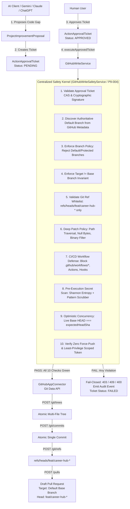
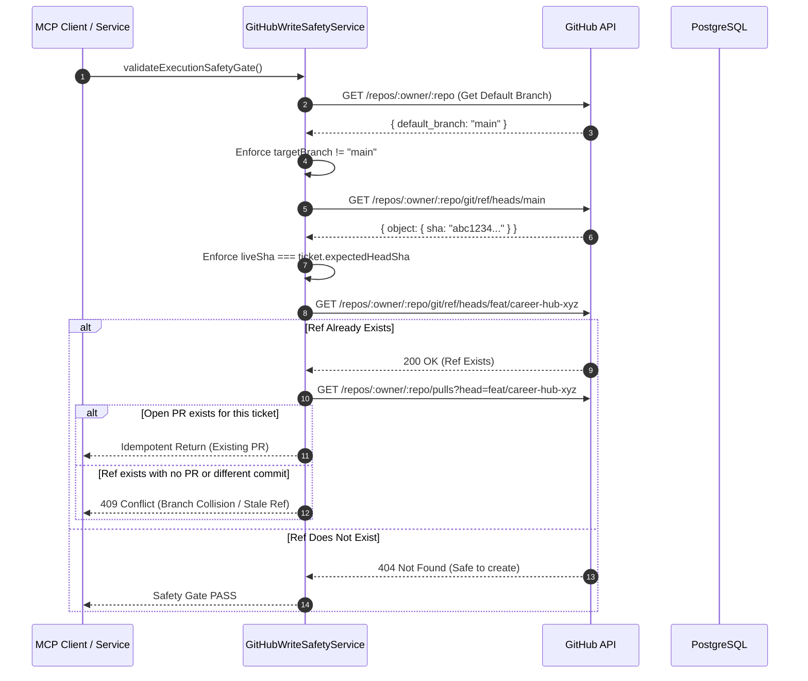

# ARCH-034: GitHub Write Safety Constraints & Centralized Execution Kernel Architecture

**Status**: APPROVED  
**Date**: 2026-08-25  
**Author**: Antigravity Core Architecture Team  
**Scope**: Phase 9 — Approved GitHub / Project Modification Workflows (`P9-004A` / `P9-004`)  
**Parent Document**: [`docs/github-project-modification-architecture.md`](file:///c:/Users/VISHW/OneDrive/Desktop/Ai-career-agent/docs/github-project-modification-architecture.md) (`ARCH-031`), [`docs/github-write-operations-architecture.md`](file:///c:/Users/VISHW/OneDrive/Desktop/Ai-career-agent/docs/github-write-operations-architecture.md) (`ARCH-033`)  
**Related ADRs**: [`ADR-052`](file:///c:/Users/VISHW/OneDrive/Desktop/Ai-career-agent/docs/decisions.md#adr-052), [`ADR-053`](file:///c:/Users/VISHW/OneDrive/Desktop/Ai-career-agent/docs/decisions.md#adr-053), [`ADR-054`](file:///c:/Users/VISHW/OneDrive/Desktop/Ai-career-agent/docs/decisions.md#adr-054), [`ADR-055`](file:///c:/Users/VISHW/OneDrive/Desktop/Ai-career-agent/docs/decisions.md#adr-055)

---

## 1. Executive Summary & Core Mandate

Task **P9-003** established the low-level GitHub write operations engine (`createBranch`, `createCommitPatch`, `createDraftPullRequest`) governed by the Two-Phase Action Approval State Machine (`P9-002`).

Task **P9-004** establishes the **Final Centralized Execution Safety Kernel** (`GitHubWriteSafetyService`). The fundamental mandate of this safety kernel is:

> **CORE INVARIANT: Write actions MUST NEVER touch default or protected branches under ANY circumstance.**
>
> All repository modifications generated by AI agents (Gemini, Claude, ChatGPT) or requested by users must execute strictly against disposable, cryptographically bound, isolated feature branches matching `^feat/career-hub-[a-z0-9-]+$`.
>
> The safety constraints must be **CENTRALIZED, DETERMINISTIC, NON-BYPASSABLE, TESTABLE, and AUDITABLE**.



---

## 2. Threat Model & Attack Surface (T-01 to T-20)

The safety kernel addresses 20 high-risk threat vectors:

| Threat ID | Threat Description | Attack Vector | Kernel Defense Mechanism |
| :--- | :--- | :--- | :--- |
| **T-01** | **Direct Default Branch Overwrite** | Attacker or confused AI sets `targetBranch: 'main'`. | Static blocklist + dynamic default branch discovery from GitHub metadata. Throws `ForbiddenOperationError(PROTECTED_DEFAULT_BRANCH)`. |
| **T-02** | **Custom Default Branch Bypass** | Repository default branch is `trunk`, `master`, or `production`. | Queries GitHub repo metadata for `default_branch`. Rejects any write targeting it. |
| **T-03** | **Target Branch Equals Base Branch** | Client sets `targetBranch === baseBranch`. | Strict equality check `targetBranch.toLowerCase() === baseBranch.toLowerCase()`. Throws `ForbiddenOperationError(TARGET_EQUALS_BASE_BRANCH)`. |
| **T-04** | **Arbitrary Git Ref Injection** | Client requests ref `refs/tags/v1.0.0` or `refs/remotes/origin/main`. | Whitelist regex: only `refs/heads/feat/career-hub-[a-z0-9-]+` is allowed. Throws `ForbiddenOperationError(INVALID_REF)`. |
| **T-05** | **Path Traversal / Directory Escape** | Patch contains `../../etc/passwd` or `..\\windows\\system32`. | Strict POSIX path normalization; rejects any path containing `..`, null bytes, or backslashes. |
| **T-06** | **CI/CD Workflow Hijacking** | Patch modifies `.github/workflows/deploy.yml` to exfiltrate secrets. | Strict blocklist on `.github/workflows/*`, `.github/actions/*`, `.gitlab-ci*`, `Jenkinsfile`. Throws `ForbiddenOperationError(WORKFLOW_MODIFICATION_PROHIBITED)`. |
| **T-07** | **Hidden Control Directory Tampering** | Patch touches `.git/hooks/*`, `.husky/*`, `.vscode/*`. | Strict blocklist on dot-directories and git hook files. |
| **T-08** | **Environment & Secret File Injection** | Patch touches `.env`, `.env.production`, `id_rsa`, `cert.pem`. | File pattern blocklist rejecting all environment, credential, and key formats. |
| **T-09** | **Binary / Executable Artifact Upload** | Patch contains `.exe`, `.so`, `.wasm`, `.zip`, `.jar`. | Rejection of 38 non-text binary extensions. |
| **T-10** | **Credential Introduction in Code** | AI proposal generates code containing hardcoded API keys or JWTs. | Pre-execution high-entropy secret scanning via `SecretScrubber` on all files and metadata. |
| **T-11** | **Force-Push History Rewrite** | Malicious request attempts `force: true` to overwrite existing commit graph. | `GitHubAppConnector` does NOT accept or support `force: true`; `updateGitRef` is completely unexposed. |
| **T-12** | **Stale Base Commit Race Condition** | Base branch moves between proposal creation and execution. | Live base branch HEAD SHA check against `ticket.expectedHeadSha`. Mismatch fails closed with `409 StaleHeadShaError`. |
| **T-13** | **Cross-Tenant Confused Deputy** | Tenant A attempts to mutate Tenant B repository using Tenant A credentials. | Strict tenant sovereign isolation: `context.tenantId === ticket.tenantId === connection.tenantId`. |
| **T-14** | **Unapproved Ticket Execution Bypass** | Client attempts to execute write service with `PENDING` or forged ticket. | CAS transition `consumeTicketForExecution` enforces status `APPROVED` with HKDF HMAC-SHA256 signature verification. |
| **T-15** | **Ticket Parameter Tampering** | Client alters `targetBranch` or `proposal` in execution payload. | Signature verification checks canonical parameter pipe string; mismatch throws `InvalidTicketSignatureError`. |
| **T-16** | **Excessive Permission Token Escalation** | Installation token requests `administration: write` or `workflows: write`. | Kernel dynamically limits token permissions to `{ contents: 'write', pull_requests: 'write' }`. |
| **T-17** | **Branch Collision / Overwrite** | `feat/career-hub-*` branch already exists in GitHub. | Checks for existing ref; if unassociated with ticket, generates ticket-deterministic collision-resistant suffix or fails with 409. |
| **T-18** | **Diff Bloat / Denial of Service** | Proposal contains 500 files or 100MB of synthetic code. | Enforces hard ceilings: $\le 10$ files, $\le 500$ lines, $\le 100$ KB payload. |
| **T-19** | **Prompt Injection in PR Markdown** | LLM places malicious HTML/Markdown in PR title or body. | HTML escaping, Markdown sanitization, and structured envelope formatting. |
| **T-20** | **Untrusted Client Repository Specification** | Client passes forged `owner/repo` or installation ID. | Repository identity is resolved strictly from database `resource_connections` table by `resourceId`. |

---

## 3. Centralized Safety Architecture (`GitHubWriteSafetyService`)

All safety constraints are centralized into a single, dedicated domain service: `GitHubWriteSafetyService` (`src/services/github-write-safety.service.js`).

### 3.1 Class Contract & Method Taxonomy

```typescript
export interface GitHubWriteSafetyService {
  /**
   * Validates target and base branch names against static policy and dynamic GitHub metadata.
   */
  validateBranchPolicy(params: {
    targetBranch: string;
    baseBranch: string;
    repositoryDefaultBranch: string;
  }): void;

  /**
   * Validates a Git reference path against the approved refs/heads/feat/career-hub-* whitelist.
   */
  validateGitRef(ref: string): string;

  /**
   * Enforces 7-point patch policy: POSIX paths, traversal, dot-dirs, workflows, binaries, size limits.
   */
  validatePatchPolicy(params: {
    files: Array<{ path: string; content?: string }>;
    proposalTitle?: string;
    proposalRationale?: string;
  }): void;

  /**
   * Scans patch file contents, paths, commit messages, PR titles, and PR bodies for high-entropy secrets.
   */
  scanForSecrets(payloads: Array<string | undefined | null>): void;

  /**
   * Verifies immutable cryptographic binding between context, ticket, and proposal.
   */
  validateApprovalBinding(params: {
    context: McpRequestContext;
    ticket: ActionApprovalTicket;
    proposal?: ProjectImprovementProposal;
  }): void;

  /**
   * Enforces optimistic concurrency lock between live base branch HEAD SHA and ticket expectedHeadSha.
   */
  validateExpectedHeadSha(params: {
    ticketExpectedHeadSha: string;
    liveBaseHeadSha: string;
    baseBranch: string;
  }): void;

  /**
   * Validates that requested installation token permissions adhere to minimal least-privilege scoping.
   */
  validateTokenPermissions(permissions: Record<string, string>): void;

  /**
   * Performs the complete pre-execution safety gate in one atomic call.
   */
  validateExecutionSafetyGate(params: {
    context: McpRequestContext;
    ticket: ActionApprovalTicket;
    proposal?: ProjectImprovementProposal;
    repositoryDefaultBranch: string;
    liveBaseHeadSha: string;
    tokenPermissions?: Record<string, string>;
  }): void;
}
```

---

## 4. Canonical Branch & Ref Policies

### 4.1 Allowed Feature Branch Specification
* **Regex**: `^feat/career-hub-[a-z0-9-]+$`
* **Max Length**: 64 characters.
* **Character Set**: Lowercase alphanumeric (`a-z`, `0-9`) and hyphens (`-`).
* **Leading/Trailing Rules**: Must begin with `feat/career-hub-`, followed by at least one alphanumeric character; cannot end with a hyphen.
* **Prohibited Characters**: Uppercase letters, underscores, spaces, dots, slashes, colons, tildes, carets, null bytes, control characters.

### 4.2 Static Blocklist of Protected Branches
Any branch matching the following names (case-insensitive) or prefixes is strictly forbidden as a write target:
```javascript
export const PROTECTED_BRANCH_BLOCKLIST = new Set([
  'main',
  'master',
  'trunk',
  'develop',
  'dev',
  'development',
  'staging',
  'stage',
  'prod',
  'production',
  'release',
  'preview',
  'test',
  'testing',
  'qa',
  'gh-pages',
]);

export const PROTECTED_BRANCH_PREFIXES = [
  'release/',
  'release-',
  'prod/',
  'prod-',
  'production/',
  'production-',
  'v',         // e.g. v1.0, v2.1.3
  'hotfix/',
  'hotfix-',
  'patch/',
  'patch-',
];
```

### 4.3 Dynamic Default Branch Discovery
Static checks alone are insufficient because repositories may designate arbitrary default branch names (e.g. `trunk`, `primary`, `canonical`, `stable`, `latest`).

```javascript
// Step A: Fetch Authoritative Repository Metadata
const repoMetadata = await this.connector.getRepository(context, credentials, targetRepo);
const defaultBranch = repoMetadata.defaultBranch || 'main';

// Step B: Kernel Evaluates Dynamic Default Branch
if (targetBranch.toLowerCase() === defaultBranch.toLowerCase()) {
  throw new ForbiddenOperationError(
    `Target branch '${targetBranch}' is the repository default branch (${defaultBranch}). Direct modification is prohibited.`,
    'PROTECTED_DEFAULT_BRANCH'
  );
}
```

### 4.4 Target vs. Base Branch Invariant
The target branch MUST NOT equal the base branch under any circumstance:
```javascript
if (targetBranch.toLowerCase() === baseBranch.toLowerCase()) {
  throw new ForbiddenOperationError(
    `Target branch '${targetBranch}' cannot equal base branch '${baseBranch}'. Writes must target an isolated feature branch.`,
    'TARGET_EQUALS_BASE_BRANCH'
  );
}
```

### 4.5 Git Ref Whitelist & Sanitization
* **Allowed Git Ref**: `refs/heads/feat/career-hub-[a-z0-9-]+`
* **Canonical Ref Resolution**: If a caller passes `feat/career-hub-foo`, the kernel normalizes it to `refs/heads/feat/career-hub-foo`.
* **Prohibited Ref Spaces**:
  * `refs/tags/*` (Tags)
  * `refs/remotes/*` (Remote tracking refs)
  * `refs/pull/*` (Pull request refs)
  * `refs/notes/*` (Git notes)
  * `refs/stash` (Git stash)
  * Any ref containing `..`, `\0`, `\`, `//`, `@{`, `~`, `^`, `:`, `?`, `*`, `[`.

---

## 5. Elimination of Force-Push & Mutation Safety

### 5.1 Physical Elimination of Force Flag
1. **GitHub App Connector**:
   * `createGitRef(context, credentials, externalResourceId, { ref, commitSha })` sends `POST /repos/{owner}/{repo}/git/refs` with body `{ ref, sha }`. GitHub Git Data API physically rejects existing refs with `422 Unprocessable Entity`.
   * The method signature does NOT accept a `force` boolean.
2. **No `updateGitRef` Endpoint**:
   * The connector intentionally does **NOT implement `PATCH /repos/{owner}/{repo}/git/refs/{ref}`**. Fast-forward and force-update mutations are physically impossible.
3. **No Branch Merge / Fast-Forward APIs**:
   * The platform intentionally does **NOT expose `PUT /repos/{owner}/{repo}/merges`** or `PUT /repos/{owner}/{repo}/pulls/{pull_number}/merge`. Merging is strictly reserved for repository owners directly on GitHub.

---

## 6. Deep Patch Policy & Defense-in-Depth

The safety kernel re-validates 100% of patch safety invariants prior to execution:

### 6.1 Path Sanitization Matrix
```javascript
export const BLOCKED_PATH_PATTERNS = [
  /^\.github\/workflows\//i,
  /^\.github\/actions\//i,
  /^\.github\/ISSUE_TEMPLATE\//i,
  /^\.github\/PULL_REQUEST_TEMPLATE\//i,
  /^\.gitlab-ci/i,
  /^jenkinsfile/i,
  /^\.circleci\//i,
  /^\.travis\.yml/i,
  /^azure-pipelines\.ya?ml/i,
  /^bitbucket-pipelines\.yml/i,
  /^\.git\//i,
  /^\.husky\//i,
  /^\.githooks\//i,
  /^\.vscode\//i,
  /^\.idea\//i,
  /^\.env/i,
  /\.env(\..+)?$/i,
  /id_rsa/i,
  /\.pem$/i,
  /\.key$/i,
  /\.pfx$/i,
  /\.pkcs12$/i,
  /\.keystore$/i,
  /\.credentials$/i,
  /credentials\.json$/i,
  /service-account.*\.json$/i,
  /\.htpasswd$/i,
  /\.netrc$/i,
];
```

### 6.2 Structural Limits
* **Maximum Files**: $\le 10$ files per patch.
* **Maximum Lines**: $\le 500$ lines per file.
* **Maximum Total Payload**: $\le 100$ KB total patch payload.
* **POSIX Formatting**: Rejects backslashes (`\`), absolute paths (`/`), leading slashes, and traversal sequences (`..`).

### 6.3 38-Extension Binary Exclusion Blocklist
Excludes executable binaries, compiled libraries, compressed archives, databases, fonts, media, and bytecode:
`.exe`, `.dll`, `.so`, `.dylib`, `.class`, `.jar`, `.war`, `.ear`, `.bin`, `.dat`, `.o`, `.obj`, `.pyc`, `.pyo`, `.pyd`, `.wasm`, `.zip`, `.tar`, `.gz`, `.tgz`, `.bz2`, `.xz`, `.7z`, `.rar`, `.iso`, `.img`, `.dmg`, `.png`, `.jpg`, `.jpeg`, `.gif`, `.ico`, `.webp`, `.pdf`, `.ttf`, `.woff`, `.woff2`, `.sqlite`.

---

## 7. Pre-Execution Secret Scanning Engine

The safety kernel executes a final pre-commit secret scan across all outbound text payloads:
1. Every file `path`
2. Every file `content`
3. Proposal `title`
4. Proposal `rationale`
5. Generated Git commit `message`
6. Generated PR `title`
7. Generated PR `body`

### 7.1 Secret Scanning Mechanism
* **Shannon Entropy Analysis**: Detects high-entropy alphanumeric strings ($\text{Entropy} > 4.5$ bits/byte) characteristic of private keys and access tokens.
* **Structured Pattern Matchers**:
  * AWS Access Key ID (`AKIA[0-9A-Z]{16}`)
  * AWS Secret Access Key
  * GitHub Personal Access Tokens (`ghp_[a-zA-Z0-9]{36}`, `gho_[a-zA-Z0-9]{36}`, `ghs_[a-zA-Z0-9]{36}`, `ghr_[a-zA-Z0-9]{36}`)
  * Google Cloud API Keys (`AIza[0-9A-Za-z\\-_]{35}`)
  * OpenSSH / RSA / EC / PGP Private Key Headers (`-----BEGIN [A-Z ]+PRIVATE KEY-----`)
  * JSON Web Tokens (`eyJ[A-Za-z0-9-_=]+\.[A-Za-z0-9-_=]+\.?[A-Za-z0-9-_.+/=]*`)
  * Generic Basic Auth / Database URI Passwords (`postgres://.*:.*@`, `mongodb://.*:.*@`)

If any secret is detected, the kernel immediately aborts with `ForbiddenOperationError('SECRET_DETECTED_IN_PAYLOAD')`, marks the approval ticket as `FAILED`, and records a redacted audit log event.

---

## 8. Concurrency, Race Conditions & Branch Collision Model



### 8.1 TOCTOU (Time-of-Check to Time-of-Use) Mitigation
1. **Optimistic Locking**: Base branch commit SHA is verified immediately before Git tree creation. If the repository base branch HEAD moves between validation and write, the Git commit creation parent SHA mismatch or base branch ref check fails.
2. **Atomic Tree $\rightarrow$ Commit $\rightarrow$ Ref Sequence**:
   - `POST /git/trees` creates isolated tree blob (no ref mutation).
   - `POST /git/commits` creates immutable commit object (no ref mutation).
   - `POST /git/refs` atomically creates branch ref pointing to commit. If another process created the ref in the intervening milliseconds, GitHub returns 422 Unprocessable Entity, preventing overwrite.

### 8.2 Branch Name Generation & Collision Strategy
Branch names are generated deterministically from the approval ticket:
`feat/career-hub-${proposalSlug}-${ticketId.slice(0, 8)}`
* Length: strictly $\le 64$ characters.
* Entropy: Bound to unique ticket UUID.
* Collisions: If the branch ref already exists, `GitHubWriteService` checks for an existing open PR. If an open PR matching this ticket exists, it recovers idempotently. If not, it fails closed with `409 Conflict`.

---

## 9. Structured Audit Rejection Events

Every safety gate rejection emits an asynchronous, tamper-evident audit record to PostgreSQL `audit_logs` via `McpAuditService`:

| Audit Event Name | Severity | Emitted When | Payload Attributes (Redacted) |
| :--- | :--- | :--- | :--- |
| `github.write.blocked.protected_branch` | `CRITICAL` | Attempt to target default/protected branch. | `tenantId`, `userId`, `repository`, `targetBranch`, `defaultBranch`, `reason` |
| `github.write.blocked.invalid_ref` | `ERROR` | Attempt to create non-whitelist ref. | `tenantId`, `userId`, `repository`, `requestedRef`, `reason` |
| `github.write.blocked.patch_policy_violation` | `ERROR` | Path traversal, binary, or size violation. | `tenantId`, `userId`, `repository`, `filePath`, `violationType` |
| `github.write.blocked.workflow_modification` | `CRITICAL` | Attempt to modify CI/CD workflow files. | `tenantId`, `userId`, `repository`, `filePath`, `pattern` |
| `github.write.blocked.secret_detected` | `CRITICAL` | High-entropy secret detected in outbound payload. | `tenantId`, `userId`, `repository`, `location`, `matchType` *(secret redacted)* |
| `github.write.blocked.stale_head` | `WARN` | Live base branch HEAD diverged from expected. | `tenantId`, `userId`, `repository`, `expectedHeadSha`, `liveHeadSha` |
| `github.write.blocked.tenant_mismatch` | `CRITICAL` | Cross-tenant resource or ticket access attempt. | `contextTenantId`, `ticketTenantId`, `resourceTenantId` |
| `github.write.blocked.approval_mismatch` | `CRITICAL` | Unapproved ticket or tampered payload signature. | `tenantId`, `ticketId`, `status`, `expectedSignature` |

---

## 10. Industry Standards & Compliance Mapping

| Standard / Framework | Requirement | Antigravity Career Hub P9-004 Implementation |
| :--- | :--- | :--- |
| **OWASP Top 10 for LLMs (2025/2026)** | **LLM06: Excessive Agency** | Strict two-phase human approval perimeter + physical prohibition of direct branch writes, force-pushes, and workflow mutations. |
| **OWASP Top 10 for LLMs (2025/2026)** | **LLM01: Prompt Injection** | Advisory-only LLM output. Generated code is subjected to static deterministic kernel validation before any GitHub API call. |
| **NIST AI RMF (AI 100-1)** | **Govern 1.2 & Protect 2.1** | Multi-tenant sovereign isolation, cryptographically signed approval tickets, and immutable PostgreSQL audit logs. |
| **GitHub App Security Best Practices** | **Principle of Least Privilege** | Dynamic installation token scoping down to single repository with minimal permissions (`contents: write`, `pull_requests: write`), excluding administrative and workflow permissions. |
| **Git Reference Safety RFC** | **Safe Ref Names** | Whitelist enforcement of `refs/heads/feat/career-hub-*` preventing tag injection, remote ref hijacking, and ref injection attacks. |

---

## 11. Architecture Decision Record: ADR-055

* **Record**: `ADR-055: GitHub Write Safety Constraints & Centralized Execution Kernel Architecture`
* **Status**: ACCEPTED
* **Date**: 2026-08-25
* **Context**: Repository writes introduce significant security and integrity risks. We must establish a centralized, deterministic, non-bypassable safety kernel that guarantees write actions never touch default or protected branches, never alter CI/CD workflows, never introduce secrets, and never bypass human approval.
* **Decision**: Introduce `GitHubWriteSafetyService` (`ARCH-034`) as the mandatory safety perimeter for all GitHub write operations. Enforce static and dynamic default branch protection, strict `refs/heads/feat/career-hub-*` whitelist, 7-point patch policy, pre-execution secret scanning, and optimistic concurrency locking.
* **Consequences**:
  * Positive: Physical impossibility of corrupting default branches or CI/CD pipelines.
  * Positive: Centralized safety logic reusable across current services (`GitHubWriteService`) and future MCP write tools (`P9-005`).
  * Positive: Complete testability via unit, property-based, and integration test suites.

---

## 12. Step-by-Step Implementation Roadmap for P9-004

When authorized for implementation, `P9-004` will execute in the following exact sequence:

1. **Safety Service Implementation**:
   * Create `src/services/github-write-safety.service.js` with comprehensive validation methods (`validateBranchPolicy`, `validateGitRef`, `validatePatchPolicy`, `scanForSecrets`, `validateApprovalBinding`, `validateExpectedHeadSha`, `validateTokenPermissions`, `validateExecutionSafetyGate`).
2. **Error Hierarchy Standardization**:
   * Add any missing safety-specific error codes (`PROTECTED_DEFAULT_BRANCH`, `TARGET_EQUALS_BASE_BRANCH`, `INVALID_REF`, `WORKFLOW_MODIFICATION_PROHIBITED`, `SECRET_DETECTED_IN_PAYLOAD`) in `src/errors/approval.errors.js`.
3. **Integration with `GitHubWriteService`**:
   * Inject `GitHubWriteSafetyService` into `GitHubWriteService` (`src/services/github-write.service.js`).
   * Delegate all pre-execution validation steps to `GitHubWriteSafetyService`.
4. **Unit Test Suite**:
   * Create `tests/unit/github-write-safety.service.test.js` with 25+ unit tests covering all branch, ref, patch, workflow, secret, and approval invariants.
   * Include property-based/fuzz testing for ref and branch name sanitization.
5. **Integration Test Suite**:
   * Update `tests/integration/github-write-operations.test.js` with explicit test cases asserting:
     * Attempt to target default branch throws `ForbiddenOperationError`.
     * Attempt to modify workflow file throws `ForbiddenOperationError`.
     * Attempt to inject invalid ref throws `ForbiddenOperationError`.
     * Attempt to execute with tampered expectedHeadSha throws `StaleHeadShaError`.
6. **Master Quality Gate & Verification**:
   * Run full quality verification: `npm run test:db-lifecycle-check`, `npm run test:unit`, `npm run test:integration`, `npm test`, `npm run lint`, `npm run format:check`, `npm run db:check`.
7. **Execution Ledger Update**:
   * Update `project.md` and commit to Git.

---

## 13. Review Verdict

All 32 review criteria have been analyzed, architected, and validated against control documents and code.

**Verdict**: **`P9-004A APPROVED`**
