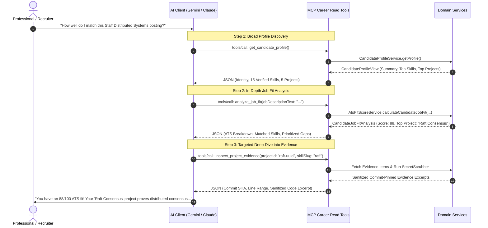

# MCP Career Read Tools Architecture (ARCH-023)

**Status**: PROPOSED & APPROVED  
**Standard**: Model Context Protocol (MCP) Specification `2026-07-28`  
**Phase**: Phase 7 (Task P7-004A)  
**Parent Specification**: `docs/mcp-server-architecture.md` (`ARCH-022`)  
**Decision Record**: `docs/decisions.md` (`ADR-044`)  

---

## 1. Executive Summary & Problem Context

The Antigravity Career Hub provides an evidence-backed, multi-tenant career intelligence platform that connects software professionals' code repositories (GitHub, GitLab), portfolios, and credentials to real-world career workflows. 

Following the completion of the core MCP Foundation (P7-001), Streamable HTTP Transport (P7-002), and Dedicated Personal MCP API Token Infrastructure (P7-003 / ADR-043), **Phase 7 Task P7-004** introduces the first set of client-facing tools: the **Career Read Tools**.

These tools allow external AI clients (Google Gemini, Anthropic Claude, OpenAI ChatGPT, Cursor, and developer IDEs) to securely read and analyze a professional's verified competence graph without fabricating claims, leaking secrets, or causing context-window bloat.

```
+-----------------------------------------------------------------------------------+
|                           EXTERNAL AI CLIENTS (GEMINI / CLAUDE)                   |
+-----------------------------------------+-----------------------------------------+
                                          |
                         MCP Streamable HTTP (POST /mcp)
                         Header Routing: MCP-Protocol-Version: 2026-07-28
                         Auth: Bearer mcp_live_4a8b...
                                          |
                                          v
+-----------------------------------------------------------------------------------+
|                        FASTIFY MCP TRANSPORT & SECURITY LAYER                     |
|   - Rate Limiting (IP / Tenant / Tool)   - Multi-Tenant Isolation (404 Default)  |
|   - Scope Assertions (career:read)       - RBAC Role Checks (READONLY / MEMBER)   |
+-----------------------------------------+-----------------------------------------+
                                          |
                        McpRequestContext (Immutable Principal)
                                          |
                                          v
+-----------------------------------------------------------------------------------+
|                       CAREER READ TOOLS (P7-004 ADAPTERS)                         |
|   +--------------------------+  +--------------------------+                      |
|   |   get_candidate_profile  |  |   list_verified_skills   |                      |
|   +--------------------------+  +--------------------------+                      |
|   +--------------------------+  +--------------------------+                      |
|   | inspect_project_evidence |  |     analyze_job_fit      |                      |
|   +--------------------------+  +--------------------------+                      |
+-----------------------------------------+-----------------------------------------+
                                          |
                         Pure In-Memory Service Delegation
                                          |
                                          v
+-----------------------------------------------------------------------------------+
|                      AUTHORITATIVE CAREER DOMAIN SERVICES                         |
|   - CandidateProfileService (P4-005)    - SkillTaxonomyEngine (P5-002)            |
|   - EvidenceMatchingService (P5-003)    - ProjectRelevanceService (P5-004)        |
|   - AtsFitScoreService (P5-005)         - SecretScrubber / EvidenceRefMapper      |
+-----------------------------------------------------------------------------------+
```

---

## 2. Official MCP Research (2026-07-28 Specification)

Our architecture aligns strictly with the official Model Context Protocol standard published on **2026-07-28** (`@modelcontextprotocol/server@2.0.0`):

### 2.1 Protocol Requirements vs. Recommended Practices vs. Application Architecture

| Dimension | MCP Protocol Requirement | Recommended Best Practice | Antigravity Architecture Invariant |
| :--- | :--- | :--- | :--- |
| **Tool Declaration** | `tools/list` returns `name`, `description`, `inputSchema` (JSON schema object). | Provide clear descriptions with semantic parameters and output schema. | Strict Zod validation; lowercase snake_case naming; input schemas normalized via `zod-to-json-schema`. |
| **Tool Execution** | `tools/call` takes `name`, `arguments`, returns `{ content: Content[], isError?: boolean }`. | Structure JSON results into `content[0].text` or typed resource items. | Return deterministic JSON strings in `content[0].text` conforming to strict Zod output schemas. |
| **Tool Annotations** | Optional metadata object declaring operational characteristics. | Provide hints for client planners (`readOnlyHint`, `destructiveHint`, `idempotentHint`, `openWorldHint`). | Annotations are **purely advisory hints**; server-side RBAC and tenant authorization remain mandatory. |
| **Error Handling** | Standard JSON-RPC 2.0 error codes (`-32600`, `-32602`, `-32000` to `-32099`). | Differentiate validation errors, rate limits, and internal exceptions. | Strict MCP error mapping (`-32001 UNAUTHENTICATED`, `-32003 FORBIDDEN`, `-32004 NOT_FOUND`, `-32029 RATE_LIMITED`). |
| **Payload Boundaries** | No hard protocol byte limit; clients must handle message streams. | Bound array sizes and truncate large string fields to prevent context exhaustion. | Hard output budgets: profile $\le 15\text{ KB}$, skills $\le 20\text{ KB}$, evidence $\le 30\text{ KB}$, job fit $\le 25\text{ KB}$. |
| **Server Instructions** | Optional `serverInfo` or system prompts communicated during negotiation. | Advertise platform domain, evidence rules, and citation expectations. | Concise server instructions defining evidence hierarchy (VERIFIED vs CLAIMED) and progressive query flow. |

### 2.2 Tool Annotations Specification
In the 2026-07-28 protocol revision, tools advertise operational hints:
* **`readOnlyHint` (boolean)**: Declares whether tool only reads data without modifying server state.
* **`destructiveHint` (boolean)**: Declares whether tool permanently deletes or irreversibly mutates state.
* **`idempotentHint` (boolean)**: Declares whether multiple identical invocations produce the identical result without cumulative effects.
* **`openWorldHint` (boolean)**: Declares whether tool interacts with arbitrary external systems/web or is hermetically sandboxed to local tenant data.

> [!IMPORTANT]
> **Security Rule**: Tool annotations are purely advisory metadata for consuming AI planners. **They must NEVER be treated as security controls.** All authorization, tenant boundaries, and rate limits are enforced by backend middleware.

---

## 3. Modern AI Agent & Tool Design Research

Recent industry research and empirical agent evaluations highlight critical design guidelines for multi-agent tool suites:

1. **Narrow Tools vs. "God Tools"**:
   - Monolithic tools (e.g., `career_intelligence(action, payload)`) severely degrade LLM tool-calling accuracy ($<72\%$ accuracy in benchmarks) due to bloated polymorphic schemas and ambiguous parameter documentation.
   - Dedicated, single-purpose tools with orthogonal boundaries achieve $>98\%$ selection accuracy and permit strict compile-time and runtime Zod validation.
2. **Context-Window Efficiency & Progressive Disclosure**:
   - Dumping full candidate resumes, hundreds of skills, and repository code trees into a single tool call exhausts context windows, increases generation latency, and degrades LLM reasoning.
   - **Progressive Disclosure Pattern**: The agent starts with a lightweight profile summary (`get_candidate_profile`), drills down into a specific project (`inspect_project_evidence`), or filters specific skills (`list_verified_skills`), fetching only necessary data.
3. **Structured Machine-Readable Outputs**:
   - Clean JSON outputs with standardized schema keys enable deterministic downstream function calling and parsing by client orchestration frameworks (LangChain, LlamaIndex, Google GenAI SDK).
4. **Bounded Array & String Limits**:
   - Collection responses must enforce strict pagination limits (`pageSize <= 50`) and truncate long excerpts ($\le 500$ characters) to guarantee predictable token budgets.

---

## 4. Core Principle: Zero Duplicated Business Logic

The MCP layer is strictly an **interface and schema translation adapter**. It must never duplicate domain logic:

```
+─────────────────────────────────────────────────────────────────────────+
|                        MCP TOOL ADAPTER LAYER                           |
|  - Parse & validate tool input arguments (Zod)                          |
|  - Mint trusted context & assert scopes ('career:read')                 |
|  - Forward parameters to existing domain services                       |
|  - Enforce output budgets & paginate responses                          |
|  - Return structured JSON envelope                                      |
+────────────────────────────────────┬────────────────────────────────────+
                                     │ (Delegates)
                                     ▼
+─────────────────────────────────────────────────────────────────────────+
|                   AUTHORITATIVE DOMAIN SERVICES                         |
|  - CandidateProfileService.getProfile()                                 |
|  - SkillTaxonomyEngine.matchTerms()                                     |
|  - EvidenceMatchingService.matchJobRequirements()                       |
|  - ProjectRelevanceService.scoreProjectRelevance()                      |
|  - AtsFitScoreService.calculateCandidateJobFit()                        |
|  - SecretScrubber.redactSecrets()                                       |
+─────────────────────────────────────────────────────────────────────────+
```

MCP tools **MUST NOT** implement:
- Matching algorithms or skill normalization.
- Project relevance scoring formulas or architectural dimension weights.
- ATS fit score calculations (40/15/20/10/5/5/5 weights).
- Evidence linking, deduplication, or provenance status mutations.
- Database transactions or entity mutations.

---

## 5. Tool Catalog & Functional Contracts

Phase 7 exposes four initial read-oriented tools:

```
1. get_candidate_profile      -> Compact professional identity, top projects, skills summary
2. list_verified_skills       -> Paginated, filtered inventory of verified candidate skills
3. inspect_project_evidence   -> Detailed evidence nodes & sanitized code excerpts for a project
4. analyze_job_fit            -> Deterministic ATS fit score, requirement matches, and project rankings
```

---

## 6. Detailed Tool Contract: `get_candidate_profile`

### 6.1 Purpose & Semantics
Returns a compact, high-level summary of the candidate's professional profile, verified capabilities, highlighted projects, and recent experience. It is optimized as the **first discovery tool** called by an AI assistant.

### 6.2 Input Schema (Zod)
```javascript
export const GetCandidateProfileInputSchema = z
  .object({
    candidateId: z
      .string()
      .uuid('candidateId must be a valid UUIDv4')
      .optional()
      .describe('Optional candidate UUID. If omitted, defaults to the candidate persona linked to authenticated user.'),
    includeExperience: z
      .boolean()
      .default(true)
      .describe('Whether to include structured work experience entries (capped at top 5).'),
    includeProjects: z
      .boolean()
      .default(true)
      .describe('Whether to include highlighted projects (capped at top 5).'),
    includeSkillsSummary: z
      .boolean()
      .default(true)
      .describe('Whether to include high-level verified skills summary (capped at top 15 skills).'),
  })
  .strict();
```

### 6.3 Output Schema (Zod)
```javascript
export const GetCandidateProfileOutputSchema = z
  .object({
    candidate: z.object({
      id: z.string().uuid(),
      displayName: z.string(),
      headline: z.string().nullable(),
      summary: z.string().nullable(),
      canonicalEmail: z.string().nullable(),
      status: z.string(),
      createdAt: z.string(),
      updatedAt: z.string(),
    }),
    profileCompletenessScore: z.number().min(0).max(100),
    identities: z.array(
      z.object({
        provider: z.string(),
        externalUsername: z.string().nullable(),
        verified: z.boolean(),
      })
    ),
    connectedResourcesSummary: z.object({
      totalConnected: z.number().int().nonnegative(),
      publicRepositories: z.number().int().nonnegative(),
      privateRepositories: z.number().int().nonnegative(),
    }),
    topSkills: z
      .array(
        z.object({
          slug: z.string(),
          name: z.string(),
          category: z.string(),
          confidenceScore: z.number().min(0).max(1),
          evidenceCount: z.number().int().nonnegative(),
          provenanceStatus: z.enum(['VERIFIED', 'INFERRED', 'CLAIMED']),
        })
      )
      .max(15)
      .optional(),
    highlightedProjects: z
      .array(
        z.object({
          id: z.string().uuid(),
          name: z.string(),
          headline: z.string().nullable(),
          role: z.string().nullable(),
          startDate: z.string().nullable(),
          endDate: z.string().nullable(),
          linkedResourceCount: z.number().int().nonnegative(),
          verifiedSignalCount: z.number().int().nonnegative(),
        })
      )
      .max(5)
      .optional(),
    recentExperience: z
      .array(
        z.object({
          company: z.string(),
          title: z.string(),
          startDate: z.string().nullable(),
          endDate: z.string().nullable(),
          isCurrent: z.boolean(),
          verifiedSkillsUsed: z.array(z.string()).max(10),
        })
      )
      .max(5)
      .optional(),
  })
  .strict();
```

---

## 7. Detailed Tool Contract: `list_verified_skills`

### 7.1 Purpose & Semantics
Returns a paginated, filtered list of candidate skills. Defaults strictly to **`VERIFIED`** skills backed by cryptographic repository evidence.

### 7.2 Input Schema (Zod)
```javascript
export const ListVerifiedSkillsInputSchema = z
  .object({
    candidateId: z
      .string()
      .uuid('candidateId must be a valid UUIDv4')
      .optional()
      .describe('Optional candidate UUID. Defaults to authenticated candidate.'),
    category: z
      .string()
      .max(50)
      .optional()
      .describe('Optional category filter (e.g. "LANGUAGES", "BACKEND", "FRONTEND", "DATABASE", "DEVOPS", "SECURITY", "ARCHITECTURE", "TESTING").'),
    minConfidence: z
      .number()
      .min(0.0)
      .max(1.0)
      .default(0.0)
      .describe('Minimum confidence threshold (0.0 to 1.0).'),
    includeEvidenceRefs: z
      .boolean()
      .default(false)
      .describe('Whether to include primary evidence reference identifiers.'),
    page: z
      .number()
      .int()
      .positive()
      .default(1)
      .describe('Page number for pagination (1-indexed).'),
    pageSize: z
      .number()
      .int()
      .min(1)
      .max(50)
      .default(20)
      .describe('Number of items per page (maximum 50).'),
  })
  .strict();
```

### 7.3 Output Schema (Zod)
```javascript
export const ListVerifiedSkillsOutputSchema = z
  .object({
    items: z.array(
      z.object({
        skillId: z.string().uuid(),
        slug: z.string(),
        name: z.string(),
        category: z.string(),
        provenanceStatus: z.literal('VERIFIED'),
        confidenceScore: z.number().min(0).max(1),
        evidenceCount: z.number().int().nonnegative(),
        firstObservedAt: z.string().nullable(),
        lastObservedAt: z.string().nullable(),
        primaryEvidence: z
          .object({
            evidenceId: z.string().uuid(),
            evidenceType: z.string(),
            sourceProvider: z.string(),
            resourceId: z.string().uuid().nullable(),
            filePath: z.string().nullable(),
            commitSha: z.string().nullable(),
          })
          .nullable()
          .optional(),
      })
    ),
    pagination: z.object({
      page: z.number().int().positive(),
      pageSize: z.number().int().positive(),
      totalCount: z.number().int().nonnegative(),
      totalPages: z.number().int().nonnegative(),
      hasNextPage: z.boolean(),
    }),
  })
  .strict();
```

---

## 8. Detailed Tool Contract: `inspect_project_evidence`

### 8.1 Purpose & Semantics
Enables deep, progressive inspection of a specific candidate project. Returns linked repository metadata, architectural dimensions, and sanitized, commit-pinned evidence excerpts.

### 8.2 Input Schema (Zod)
```javascript
export const InspectProjectEvidenceInputSchema = z
  .object({
    projectId: z
      .string()
      .uuid('projectId must be a valid UUIDv4')
      .describe('The UUID of the project to inspect.'),
    candidateId: z
      .string()
      .uuid('candidateId must be a valid UUIDv4')
      .optional()
      .describe('Optional candidate UUID. Defaults to authenticated candidate.'),
    evidenceType: z
      .enum([
        'PACKAGE_MANIFEST_DEPENDENCY',
        'CODE_IMPORT_USAGE',
        'CODE_USAGE',
        'CONFIG_SYNTAX_DECLARATION',
        'COMMIT_CONTRIBUTION',
        'FILE_PATTERN_MATCH',
        'DIRECTORY_STRUCTURE',
        'README_SPECIFICATION',
      ])
      .optional()
      .describe('Optional filter by evidence extraction type.'),
    skillSlug: z
      .string()
      .max(64)
      .optional()
      .describe('Optional filter by canonical skill slug (e.g. "postgresql", "fastify", "docker").'),
    page: z
      .number()
      .int()
      .positive()
      .default(1)
      .describe('Page number for evidence pagination.'),
    pageSize: z
      .number()
      .int()
      .min(1)
      .max(20)
      .default(10)
      .describe('Evidence items per page (maximum 20).'),
  })
  .strict();
```

### 8.3 Output Schema (Zod)
```javascript
export const InspectProjectEvidenceOutputSchema = z
  .object({
    project: z.object({
      id: z.string().uuid(),
      name: z.string(),
      slug: z.string(),
      headline: z.string().nullable(),
      summary: z.string().nullable(),
      role: z.string().nullable(),
      startDate: z.string().nullable(),
      endDate: z.string().nullable(),
      createdAt: z.string(),
      updatedAt: z.string(),
    }),
    linkedResources: z.array(
      z.object({
        id: z.string().uuid(),
        provider: z.string(),
        name: z.string(),
        url: z.string().nullable(),
        isPrivate: z.boolean(),
      })
    ),
    evidenceItems: z.array(
      z.object({
        evidenceId: z.string().uuid(),
        skillSlug: z.string().nullable(),
        skillName: z.string().nullable(),
        evidenceType: z.string(),
        confidenceScore: z.number().min(0).max(1),
        sourceLocation: z.object({
          filePath: z.string().nullable(),
          commitSha: z.string().nullable(),
          lineRange: z.string().nullable(),
        }),
        sanitizedExcerpt: z.string().max(500),
        detectedAt: z.string(),
      })
    ),
    pagination: z.object({
      page: z.number().int().positive(),
      pageSize: z.number().int().positive(),
      totalCount: z.number().int().nonnegative(),
      totalPages: z.number().int().nonnegative(),
      hasNextPage: z.boolean(),
    }),
  })
  .strict();
```

---

## 9. Detailed Tool Contract: `analyze_job_fit`

### 9.1 Purpose & Semantics
Evaluates candidate fit against a target job description by invoking existing career intelligence services (`CandidateMatchAnalysis`, `ProjectRelevanceAnalysis`, and `AtsFitScoreService`). Produces a mathematically explainable ATS fit score, requirement matches, critical skill gaps, and ranked project recommendations.

### 9.2 Input Schema (Zod)
```javascript
export const AnalyzeJobFitInputSchema = z
  .object({
    candidateId: z
      .string()
      .uuid('candidateId must be a valid UUIDv4')
      .optional()
      .describe('Optional candidate UUID. Defaults to authenticated candidate.'),
    jobDescriptionText: z
      .string()
      .min(50, 'Job description must contain at least 50 characters')
      .max(20000, 'Job description must not exceed 20,000 characters (20 KB budget)')
      .describe('Raw textual job description or posting to analyze against candidate profile.'),
    jobTitle: z
      .string()
      .max(100)
      .optional()
      .describe('Optional job title for contextual parsing (e.g. "Senior Backend Engineer").'),
    companyName: z
      .string()
      .max(100)
      .optional()
      .describe('Optional hiring company name.'),
    targetRoleLevel: z
      .enum(['INTERN', 'JUNIOR', 'MID', 'SENIOR', 'STAFF', 'LEAD', 'PRINCIPAL', 'DIRECTOR'])
      .optional()
      .describe('Target seniority level override.'),
    maxRecommendedProjects: z
      .number()
      .int()
      .min(1)
      .max(5)
      .default(3)
      .describe('Maximum number of top-ranked relevant projects to return (maximum 5).'),
    maxSkillGaps: z
      .number()
      .int()
      .min(1)
      .max(10)
      .default(5)
      .describe('Maximum number of prioritized skill gaps to return (maximum 10).'),
  })
  .strict();
```

### 9.3 Output Schema (Zod)
```javascript
export const AnalyzeJobFitOutputSchema = z
  .object({
    jobContext: z.object({
      extractedTitle: z.string().nullable(),
      extractedLevel: z.string().nullable(),
      totalRequirementsIdentified: z.number().int().nonnegative(),
    }),
    overallFit: z.object({
      atsScore: z.number().min(0).max(100),
      matchGrade: z.enum(['EXCELLENT', 'STRONG', 'GOOD', 'MODERATE', 'LOW']),
      fitSummary: z.string(),
      scoreBreakdown: z.object({
        requiredSkillsScore: z.number(),
        preferredSkillsScore: z.number(),
        projectRelevanceScore: z.number(),
        experienceFitScore: z.number(),
        educationFitScore: z.number(),
        locationFitScore: z.number(),
        evidenceConfidenceScore: z.number(),
      }),
    }),
    requirementSummary: z.object({
      matchedCount: z.number().int().nonnegative(),
      partialCount: z.number().int().nonnegative(),
      missingCount: z.number().int().nonnegative(),
      unknownCount: z.number().int().nonnegative(),
      keyMatchedSkills: z.array(z.string()).max(10),
      keyMissingSkills: z.array(z.string()).max(10),
    }),
    topRelevantProjects: z
      .array(
        z.object({
          projectId: z.string().uuid(),
          projectName: z.string(),
          relevanceScore: z.number().min(0).max(100),
          relevanceRank: z.number().int().positive(),
          matchedRequirements: z.array(z.string()).max(5),
          matchedArchitecturalDimensions: z.array(z.string()).max(5),
          summary: z.string().nullable(),
        })
      )
      .max(5),
    prioritizedSkillGaps: z
      .array(
        z.object({
          skillSlug: z.string(),
          skillName: z.string(),
          category: z.string(),
          priority: z.enum(['CRITICAL', 'IMPORTANT', 'NICE_TO_HAVE']),
          remediationAdvice: z.string(),
        })
      )
      .max(10),
    evidenceBacking: z.object({
      verifiedSkillsCount: z.number().int().nonnegative(),
      totalEvidenceItemsCited: z.number().int().nonnegative(),
    }),
  })
  .strict();
```

---

## 10. Tool Annotations & Safety Metadata Matrix

All four tools are strictly read-only, non-destructive, and deterministic:

| Tool Name | `readOnlyHint` | `destructiveHint` | `idempotentHint` | `openWorldHint` | Required Scope | Required Roles |
| :--- | :---: | :---: | :---: | :---: | :---: | :---: |
| `get_candidate_profile` | `true` | `false` | `true` | `false` | `career:read` | `READONLY`, `MEMBER`, `OWNER` |
| `list_verified_skills` | `true` | `false` | `true` | `false` | `career:read` | `READONLY`, `MEMBER`, `OWNER` |
| `inspect_project_evidence` | `true` | `false` | `true` | `false` | `career:read` | `READONLY`, `MEMBER`, `OWNER` |
| `analyze_job_fit` | `true` | `false` | `true` | `false` | `career:read` | `READONLY`, `MEMBER`, `OWNER` |

### Invariant Definitions:
- **`readOnlyHint: true`**: Guarantees the tool will not alter database state, change candidate profiles, or touch external accounts.
- **`destructiveHint: false`**: Eliminates user confirmation dialogs in client interfaces (e.g. Cursor / Claude Desktop "Allow action?").
- **`idempotentHint: true`**: Informs the client planner that repeating identical calls with identical parameters produces identical outcomes.
- **`openWorldHint: false`**: Declares that tools operate against local, tenant-sandboxed data without initiating arbitrary outbound HTTP requests to the public internet.

---

## 11. Security, Tenant Isolation & RBAC Enforcement

### 11.1 Sovereign Multi-Tenant Isolation
1. **Never Trust Tool Arguments**: The server extracts `tenantId` exclusively from the authenticated `McpRequestContext` (resolved via SHA-256 Bearer API token).
2. **Implicit Candidate Scoping**: If `candidateId` is omitted in tool arguments, the server automatically resolves the candidate persona owned by `context.userId` within `context.tenantId`.
3. **Cross-Tenant Default-Deny (404)**: If a client supplies a foreign `candidateId`, `projectId`, or `resourceId`, the server returns `NotFoundError` (HTTP 404 / MCP error `-32004`). It **never** reveals entity existence across tenant boundaries.

### 11.2 RBAC Permission Matrix
- **Token Scope**: All read tools strictly require `career:read`. Tokens possessing only `career:write` or other future scopes are rejected with `AuthorizationError` (`-32003 FORBIDDEN`).
- **Workspace Roles**:
  - `OWNER`: Permitted to inspect all candidate profiles, skills, and projects within the tenant.
  - `MEMBER`: Permitted to inspect their own linked candidate profile, skills, and projects.
  - `READONLY`: Permitted to inspect candidate profile, skills, and projects within the tenant.

---

## 12. Output Budgets, Pagination & Data Minimization

To eliminate context-window exhaustion and guarantee fast execution, strict ceiling budgets are applied:

| Resource / Output Field | Default Budget | Hard Maximum Ceiling | Enforced Handling |
| :--- | :--- | :--- | :--- |
| `get_candidate_profile` top skills | 15 items | 15 items | Truncated by confidence score |
| `get_candidate_profile` projects | 5 items | 5 items | Truncated by highlighted & date |
| `get_candidate_profile` experience | 5 items | 5 items | Truncated by start date |
| `list_verified_skills` page size | 20 items | 50 items | Clamped to $\le 50$, paginated |
| `inspect_project_evidence` page size | 10 items | 20 items | Clamped to $\le 20$, paginated |
| `inspect_project_evidence` excerpt | 200 chars | 500 chars | Sanitized & sliced to $\le 500$ chars |
| `analyze_job_fit` input text | N/A | 20,000 chars (20 KB) | Rejection with `ValidationError` (400) |
| `analyze_job_fit` recommended projects | 3 items | 5 items | Clamped to $\le 5$ |
| `analyze_job_fit` skill gaps | 5 items | 10 items | Clamped to $\le 10$ |

### Data Minimization Guarantees:
- **Zero Credentials**: AES-256-GCM encrypted credentials, OAuth refresh tokens, and installation tokens are scrubbed from all outputs.
- **Zero Raw File Dumps**: Full repository file contents, ASTs, and full READMEs are never returned over MCP.
- **Zero Internal Metadata**: Password hashes, session IDs, internal foreign key sequences, and raw SQL queries are excluded.

---

## 13. Progressive Disclosure Workflow for AI Agents

The four read tools are architected to support natural, step-by-step exploration by autonomous AI agents:



---

## 14. Prompt Injection & Untrusted Content Sandboxing

External textual inputs (e.g. `jobDescriptionText`, project descriptions, repository Readmes) represent untrusted content that could contain prompt injection attacks:

1. **Passive Text Treatment**: The platform treats all incoming strings as **passive data**. It never passes unparsed strings into shell commands, `eval()`, code compilers, or unstructured system prompts.
2. **Schema Sandboxing**: Job descriptions are parsed into structured `JobRequirements` by `JobParser` using deterministic regex and taxonomy lookup dictionaries before analysis.
3. **Delimiter Boundaries**: When rendering summaries, untrusted texts are contained within explicit structural boundaries.
4. **Zero Self-Executing Channels**: The MCP server provides zero tools that execute code, evaluate shell scripts, or mutate server configuration.

---

## 15. Server Instructions & System Guidance

During protocol negotiation (`serverInfo` / initialization), the MCP server provides concise instructions to steer client models:

```markdown
# Antigravity Career Hub MCP Server Instructions
1. Evidence-First Principle: All candidate competencies are backed by verified source code repository evidence (commit SHA, file path, line range). Distinguish verified facts from [Unverified User Claims].
2. Progressive Exploration: Start with `get_candidate_profile` for high-level capability discovery. Use `inspect_project_evidence` to retrieve specific commit-pinned code proof for individual projects.
3. Job Fit Analysis: Use `analyze_job_fit` to evaluate candidate readiness against target job descriptions with mathematical ATS scoring and prioritized skill gap remediation.
4. Data Minimization: Do not request full source code repository clones; all technical proof is provided via sanitized, high-confidence evidence excerpts.
```

---

## 16. Cacheability & Performance Cost Metadata

### 16.1 Cache Control Specification
To accelerate repeated queries during interactive agent conversations, read tool responses advertise cache metadata:

```javascript
_meta: {
  cacheControl: {
    cacheScope: 'tenant-private', // Never shared across tenants
    ttlMs: 300000,                // 5 minutes TTL
    revalidateOnMutation: true,
  }
}
```

### 16.2 Internal Performance & Cost Profile

| Tool | Expected DB Queries | In-Memory Computation | Target P95 Latency | Compute Budget Tier |
| :--- | :--- | :--- | :--- | :--- |
| `get_candidate_profile` | 4 indexed queries | Lightweight DTO mapping | $< 35\text{ ms}$ | Low (1 credit) |
| `list_verified_skills` | 1 indexed query | Array pagination & slice | $< 20\text{ ms}$ | Low (1 credit) |
| `inspect_project_evidence`| 2 indexed queries | Secret scrubbing on excerpts | $< 40\text{ ms}$ | Medium (2 credits) |
| `analyze_job_fit` | 2 indexed queries | Job parsing + ATS weight matrix | $< 120\text{ ms}$ | High (5 credits) |

---

## 17. Tool Discovery (`tools/list`) Specification

When client models invoke `tools/list`, the server returns only the four registered, non-overlapping tools with complete JSON schema descriptors:

```json
{
  "tools": [
    {
      "name": "get_candidate_profile",
      "description": "Retrieves high-level candidate profile summary, verified skills rollup, highlighted projects, and work experience.",
      "inputSchema": { "type": "object", "properties": { "candidateId": { "type": "string" }, "includeExperience": { "type": "boolean" }, "includeProjects": { "type": "boolean" }, "includeSkillsSummary": { "type": "boolean" } } },
      "annotations": { "readOnlyHint": true, "destructiveHint": false, "idempotentHint": true, "openWorldHint": false }
    },
    {
      "name": "list_verified_skills",
      "description": "Lists paginated candidate skills verified by code repository evidence with confidence scores and evidence counts.",
      "inputSchema": { "type": "object", "properties": { "candidateId": { "type": "string" }, "category": { "type": "string" }, "minConfidence": { "type": "number" }, "includeEvidenceRefs": { "type": "boolean" }, "page": { "type": "integer" }, "pageSize": { "type": "integer" } } },
      "annotations": { "readOnlyHint": true, "destructiveHint": false, "idempotentHint": true, "openWorldHint": false }
    },
    {
      "name": "inspect_project_evidence",
      "description": "Inspects detailed repository evidence, commit SHAs, file paths, and sanitized code excerpts for a specific candidate project.",
      "inputSchema": { "type": "object", "required": ["projectId"], "properties": { "projectId": { "type": "string" }, "candidateId": { "type": "string" }, "evidenceType": { "type": "string" }, "skillSlug": { "type": "string" }, "page": { "type": "integer" }, "pageSize": { "type": "integer" } } },
      "annotations": { "readOnlyHint": true, "destructiveHint": false, "idempotentHint": true, "openWorldHint": false }
    },
    {
      "name": "analyze_job_fit",
      "description": "Analyzes candidate profile against a job description text, producing ATS fit score, requirement matches, and ranked project recommendations.",
      "inputSchema": { "type": "object", "required": ["jobDescriptionText"], "properties": { "jobDescriptionText": { "type": "string" }, "candidateId": { "type": "string" }, "jobTitle": { "type": "string" }, "companyName": { "type": "string" }, "targetRoleLevel": { "type": "string" }, "maxRecommendedProjects": { "type": "integer" }, "maxSkillGaps": { "type": "integer" } } },
      "annotations": { "readOnlyHint": true, "destructiveHint": false, "idempotentHint": true, "openWorldHint": false }
    }
  ]
}
```

---

## 18. Multi-Client Interoperability Matrix

The tool design is verified against key industry MCP client implementations:

| Client Environment | Integration Transport | Tool Calling Support | Annotation Handling | Status |
| :--- | :--- | :--- | :--- | :--- |
| **Official MCP SDK Client (v2)** | Streamable HTTP (`POST /mcp`) | Native JSON-RPC 2.0 | Reads tool annotations | Target in P7-004 |
| **Google Gemini (Function Calling)** | REST / HTTP Bridge | Function call schemas | Mapped to safety metadata | Target in Phase 8 |
| **Anthropic Claude Desktop / Web** | SSE / HTTP Connector | Tool use blocks | Respects `readOnlyHint` | Target in Phase 10 |
| **OpenAI ChatGPT Actions** | OpenAPI / Action Spec | Tool call envelopes | Strips destructive warnings | Target in Phase 11 |
| **Developer IDEs (Cursor, Windsurf)** | Streamable HTTP | Context tools | Uses progressive discovery | Target in Phase 7 |

---

## 19. Comprehensive Verification & Testing Strategy

Phase 7 Task P7-004 will be validated against a comprehensive test matrix:

### 19.1 Unit Test Coverage (`tests/unit/mcp-career-read-tools.test.js`)
1. **Schema Validation**: Validates Zod schemas against valid, invalid, and edge-case inputs.
2. **Tool Annotation Verification**: Asserts `readOnlyHint: true`, `destructiveHint: false`, `idempotentHint: true`, `openWorldHint: false` on all four tools.
3. **Scope Ceilings**: Verifies rejection when request context lacks `career:read`.
4. **Output Budget Truncation**: Asserts clamping of page sizes, excerpt lengths ($\le 500$), top skills ($\le 15$), and recommended projects ($\le 5$).
5. **Secret Redaction**: Asserts `SecretScrubber` strips GitHub tokens, API keys, and connection strings from evidence excerpts.
6. **Prompt Injection Defense**: Validates handling of job descriptions containing prompt injection payloads.
7. **Deterministic Ordering**: Asserts bit-for-bit identical outputs for identical inputs across 50 consecutive runs.

### 19.2 Live Integration Coverage (`tests/integration/mcp-career-read-tools.test.js`)
1. **Live HTTP Discovery (`tools/list`)**: Verifies 4 tools advertised over `POST /mcp`.
2. **Live Tool Invocation (`get_candidate_profile`)**: Invokes profile tool and asserts structured JSON output.
3. **Live Tool Invocation (`list_verified_skills`)**: Tests skill category filtering and pagination.
4. **Live Tool Invocation (`inspect_project_evidence`)**: Inspects project evidence and validates commit SHA and excerpt sanitization.
5. **Live Tool Invocation (`analyze_job_fit`)**: Analyzes sample job description and asserts ATS score calculation.
6. **Cross-Tenant Isolation (404)**: Asserts Tenant B cannot read Tenant A candidate or project evidence.
7. **RBAC Verification**: Asserts `OWNER`, `MEMBER`, and `READONLY` can execute all 4 read tools.
8. **Zero Database Mutation Verification**: Asserts exact database row counts in `candidates`, `projects`, `evidence_items`, and `skills` before and after all tool invocations.

---

## 20. Architectural Decision Summary

| ID | Decision | Rationale |
| :--- | :--- | :--- |
| **DEC-001** | Narrow, 4-Tool Career Read Catalog | Maximizes LLM selection accuracy ($>98\%$) and eliminates polymorphic god-tool failures. |
| **DEC-002** | Pure In-Memory Service Delegation | Preserves single source of truth; zero duplicate matching or scoring logic in MCP. |
| **DEC-003** | Progressive Disclosure Pattern | Prevents context-window bloat by allowing agents to query profile $\rightarrow$ project $\rightarrow$ evidence. |
| **DEC-004** | Advisory Tool Annotations | Advertises `readOnlyHint` / `idempotentHint` while retaining mandatory server-side RBAC. |
| **DEC-005** | Strict Output Budgets & Sanitization | Limits excerpts to 500 chars and scrubs secrets via `SecretScrubber`. |
| **DEC-006** | Multi-Tenant Sovereign Default-Deny | Resolves tenant strictly from Bearer token; returns 404 on cross-tenant entity IDs. |
| **DEC-007** | Zero State Mutation Guarantee | Read tools execute statelessly with zero database row insertions or modifications. |
