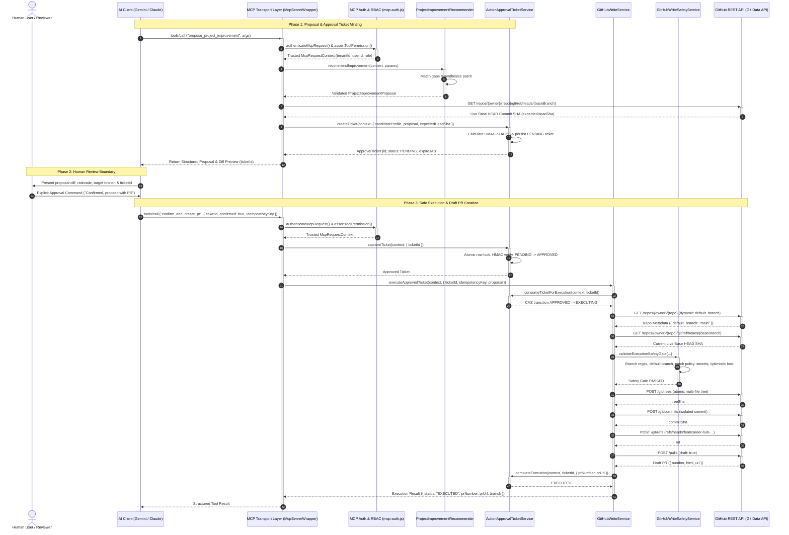

# ARCH-035: MCP GitHub Write Tools Architecture & Security Specification

**Status**: IMPLEMENTED & VERIFIED (Task P9-005)  
**Security Level**: Critical Execution Boundary  
**Standard**: MCP Spec 2026-07-28  

## 1. Executive Summary & Strategic Context

In Phase 9, Tasks P9-001 through P9-004 implemented and verified the foundational components for approved repository modifications:
1. **P9-001**: `ProjectImprovementRecommenderService` — Analyzes missing candidate skill gaps from job descriptions and synthesizes validated, evidence-grounded multi-file code patches.
2. **P9-002**: `ActionApprovalTicketService` — Implements the Two-Phase Human-in-the-Loop Approval State Machine with cryptographic HMAC-SHA256 signatures, single-use atomic CAS transitions, and optimistic concurrency locks.
3. **P9-003**: `GitHubWriteService` & `GitHubAppConnector` — Executes atomic Git Data API operations (`trees` $\rightarrow$ `commits` $\rightarrow$ `refs` $\rightarrow$ `pulls`) with repository-scoped installation tokens and non-destructive rollback.
4. **P9-004**: `GitHubWriteSafetyService` — Centralized deterministic execution safety kernel enforcing static and dynamic default branch protection (`default_branch`), target branch isolation (`feat/career-hub-*`), 7-point patch defense-in-depth, pre-execution secret scanning, and token permission checks.

**Task P9-005A** defines the Model Context Protocol (MCP) interface layer for exposing these capabilities to AI clients (Gemini, Claude, ChatGPT, IDE agents). 

### Core Architectural Mandate
> **MCP is strictly a transport and interface presentation layer.**  
> MCP MUST NOT become an alternate authorization system, MUST NOT provide low-level write primitives, and MUST NOT bypass the centralized safety kernel or approval state machine.

---

## 2. Tool Boundaries & The Anti-Primitive Principle

### 2.1 Approved Tool Inventory
The platform exposes **exactly two** domain-specific MCP write tools:

| Tool Name | Operation Type | Primary Purpose | Required Role | Required Scope |
| :--- | :--- | :--- | :--- | :--- |
| `propose_project_improvement` | Analysis & Proposal Minting | Evaluates skill gaps, generates code patch, queries live base commit, and mints a `PENDING` `ActionApprovalTicket`. | `MEMBER` or `OWNER` | `career:write` |
| `confirm_and_create_pr` | Execution Gate & PR Creation | Receives explicit human approval confirmation, transitions ticket to `APPROVED`, verifies safety kernel, and creates remote branch and Draft PR. | `MEMBER` or `OWNER` | `career:write` |

### 2.2 Strict Prohibitions: No Generic Write Primitives
The following generic tools are **strictly prohibited** and MUST NEVER be exposed over MCP:
* ❌ `modify_repository`
* ❌ `write_file` / `edit_file`
* ❌ `create_commit`
* ❌ `create_branch` / `delete_branch`
* ❌ `execute_command` / `run_shell`
* ❌ `push_code`

#### Rationale (Inverse Authority Principle & OWASP LLM08)
Allowing AI models direct access to raw file mutation or arbitrary Git branch creation primitives creates an unconstrained attack surface where prompt injections or hallucinated plans can directly destroy repository code, introduce backdoors, or bypass human review. By restricting the MCP interface to high-level, domain-specific workflow tools (`propose` $\rightarrow$ `confirm`), all code modifications remain bounded, immutable, cryptographically signed, and subject to human oversight before execution.

---

## 3. End-to-End Execution Sequence & Safety Boundaries



---

## 4. Tool Contracts & Canonical Zod Schemas

### 4.1 `propose_project_improvement`

#### Input Schema
```typescript
import { z } from 'zod';

export const ProposeProjectImprovementInputSchema = z
  .object({
    candidateId: z
      .string()
      .uuid('Candidate ID must be a valid UUID')
      .optional()
      .describe('Optional target candidate profile UUID. Defaults to authenticated user persona.'),
    jobDescriptionId: z
      .string()
      .uuid('Job Description ID must be a valid UUID')
      .optional()
      .describe('Optional ID of previously analyzed job description stored in tenant workspace.'),
    jobDescriptionText: z
      .string()
      .min(50, 'Job description text must be at least 50 characters')
      .max(50000, 'Job description text must not exceed 50,000 characters')
      .optional()
      .describe('Raw job description text to parse and extract missing skill requirements from.'),
    targetSkillSlugs: z
      .array(
        z
          .string()
          .regex(/^[a-z0-9]+(?:-[a-z0-9]+)*$/, 'Skill slugs must be kebab-case')
          .max(64)
      )
      .max(10, 'Maximum 10 target skills per proposal')
      .optional()
      .describe('Optional explicit filter for specific skill gaps to address.'),
    targetRepositoryId: z
      .string()
      .uuid('Repository Resource ID must be a valid UUID')
      .optional()
      .describe('Optional specific connected repository resource ID to enhance.'),
  })
  .refine((data) => data.jobDescriptionId || data.jobDescriptionText, {
    message: 'Either jobDescriptionId or jobDescriptionText must be provided',
    path: ['jobDescriptionText'],
  })
  .strict();
```

#### Output Schema
```typescript
export const ProposeProjectImprovementOutputSchema = z
  .object({
    proposalId: z.string().uuid(),
    ticketId: z.string().uuid(),
    status: z.literal('PENDING_HUMAN_APPROVAL'),
    actionType: z.literal('PROJECT_IMPROVEMENT_PR'),
    title: z.string().max(256),
    rationale: z.string().max(2000),
    targetSkill: z.object({
      slug: z.string(),
      name: z.string(),
      gapStatus: z.enum(['MISSING', 'PARTIAL', 'INSUFFICIENT_EVIDENCE', 'ADJACENT_COVERAGE']),
      confidenceScore: z.number().min(0).max(1),
    }),
    repository: z.object({
      id: z.string().uuid(),
      name: z.string(),
      defaultBranch: z.string(),
      baseBranch: z.string(),
      targetBranch: z.string().regex(/^feat\/career-hub-[a-z0-9-]+$/),
      expectedHeadSha: z.string().length(40),
    }),
    patchSummary: z.object({
      fileCount: z.number().int().min(1).max(10),
      totalDiffLines: z.number().int().min(1).max(500),
      files: z.array(
        z.object({
          path: z.string(),
          changeType: z.enum(['CREATE', 'MODIFY']),
          additions: z.number().int().nonnegative(),
          deletions: z.number().int().nonnegative(),
          diffPreview: z.string().max(4000),
        })
      ),
    }),
    verificationPlan: z.object({
      instructions: z.string().max(2000),
      recommendedTests: z.array(z.string()).max(10),
    }),
    approvalRequirements: z.object({
      requiredRole: z.literal('MEMBER'),
      expiresAt: z.string().datetime(),
      ttlSeconds: z.number().int().positive(),
      confirmationInstructions: z.string(),
    }),
  })
  .strict();
```

---

### 4.2 `confirm_and_create_pr`

#### Input Schema
```typescript
export const ConfirmAndCreatePrInputSchema = z
  .object({
    ticketId: z
      .string()
      .uuid('ticketId must be a valid UUID matching an existing approval ticket')
      .describe('The unique ApprovalTicket UUID returned by propose_project_improvement.'),
    confirmed: z
      .literal(true, {
        errorMap: () => ({
          message: 'confirmed must be explicitly true to authorize repository modification',
        }),
      })
      .describe('Explicit human confirmation flag. Must be strictly boolean true.'),
    idempotencyKey: z
      .string()
      .min(16, 'Idempotency key must be at least 16 characters')
      .max(128, 'Idempotency key cannot exceed 128 characters')
      .optional()
      .describe('Optional client-supplied idempotency key to safely retry requests.'),
    userNotes: z
      .string()
      .max(500, 'User notes cannot exceed 500 characters')
      .optional()
      .describe('Optional human reviewer audit notes recorded in ticket history.'),
  })
  .strict();
```

#### Output Schema
```typescript
export const ConfirmAndCreatePrOutputSchema = z
  .object({
    operationId: z.string().uuid(),
    ticketId: z.string().uuid(),
    status: z.literal('EXECUTED'),
    repositoryName: z.string(),
    baseBranch: z.string(),
    targetBranch: z.string().regex(/^feat\/career-hub-[a-z0-9-]+$/),
    commitSha: z.string().length(40),
    pullRequest: z.object({
      number: z.number().int().positive(),
      url: z.string().url(),
      title: z.string(),
      state: z.literal('open'),
      draft: z.literal(true),
    }),
    executedAt: z.string().datetime(),
  })
  .strict();
```

---

## 5. Authentication, Identity & RBAC Matrix

### 5.1 Immutable `McpRequestContext` as Sole Identity Source
Tool execution handlers **NEVER** accept `tenantId`, `userId`, `role`, or `installationId` from tool argument payloads. All identity attributes are extracted exclusively from the trusted, authenticated `McpRequestContext` minted by `authenticateMcpRequest()`.

```
Client Bearer Token
       ↓
authenticateMcpRequest() -> Validates signature, expiry, tenant active status
       ↓
McpRequestContext (Object.freeze)
       ├── requestId: UUID
       ├── tenantId: UUID (Trusted)
       ├── userId: UUID (Trusted)
       ├── role: 'OWNER' | 'MEMBER' | 'READONLY'
       └── tokenScopes: ['career:read', 'career:write']
```

### 5.2 RBAC Permission Matrix

| Tool Name | Required Scope | `READONLY` Role | `MEMBER` Role | `OWNER` Role | External Side Effect |
| :--- | :--- | :--- | :--- | :--- | :--- |
| `propose_project_improvement` | `career:write` | ❌ **403 FORBIDDEN** | ✅ **ALLOWED** | ✅ **ALLOWED** | DB Write (`action_approval_tickets` row) |
| `confirm_and_create_pr` | `career:write` | ❌ **403 FORBIDDEN** | ✅ **ALLOWED** | ✅ **ALLOWED** | DB Write + External GitHub Branch & Draft PR |

### 5.3 Proposing vs. Approving User Decoupling
* **Collaborative Review Permitted**: A proposal generated by a candidate (`userId: A`, `role: MEMBER`) may be confirmed and executed by an engineering lead or workspace owner (`userId: B`, `role: OWNER`), provided both users belong to the identical sovereign `tenantId`.
* **Cross-Tenant Strict Isolation**: If a user in Tenant B attempts to inspect, approve, or execute an approval ticket created in Tenant A, the system immediately fails closed with **`404 NOT_FOUND`** (preventing ticket existence enumeration).

---

## 6. MCP Tool Annotations (2026-07-28 Spec)

Tool registration must declare accurate capability hints in accordance with the official MCP 2026-07-28 specification:

```javascript
export const MCP_WRITE_TOOL_DEFINITIONS = Object.freeze({
  propose_project_improvement: {
    name: 'propose_project_improvement',
    description:
      'Analyzes candidate skill gaps from a job description, synthesizes a targeted code patch, ' +
      'and mints an ActionApprovalTicket. STOP: Requires explicit human review before PR creation.',
    inputSchema: ProposeProjectImprovementInputSchema,
    outputSchema: ProposeProjectImprovementOutputSchema,
    requiredRole: 'MEMBER',
    requiredScopes: ['career:write'],
    annotations: {
      readOnlyHint: false,      // Persists PENDING approval ticket in PostgreSQL
      destructiveHint: false,   // Non-destructive; creates ephemeral proposal
      idempotentHint: false,    // Mints a new unique proposal ID on each call
      openWorldHint: true,      // Queries dynamic codebase evidence graph
    },
  },

  confirm_and_create_pr: {
    name: 'confirm_and_create_pr',
    description:
      'Authorizes and executes an approved ActionApprovalTicket to create an isolated feature branch ' +
      'and open a Draft Pull Request on GitHub. Requires explicit human confirmation.',
    inputSchema: ConfirmAndCreatePrInputSchema,
    outputSchema: ConfirmAndCreatePrOutputSchema,
    requiredRole: 'MEMBER',
    requiredScopes: ['career:write'],
    annotations: {
      readOnlyHint: false,      // Mutates GitHub repository state
      destructiveHint: false,   // Non-destructive: isolated feat/career-hub-* branch & Draft PR only
      idempotentHint: true,     // Idempotent retry using ticketId and idempotencyKey
      openWorldHint: true,      // Interacts with external GitHub REST API
    },
  },
});
```

---

## 7. Human-in-the-Loop Semantics & AI Loop Safety

### 7.1 Meaning of `confirmed: true`
In `confirm_and_create_pr`, `confirmed: true` represents a legally and operationally binding assertion that:
1. An authorized human operator has inspected the generated file diff and rationale.
2. The operator authorizes creating a remote feature branch and opening a Draft PR in the target repository.
3. The AI client is acting as an authenticated conduit for that explicit human decision.

### 7.2 AI Self-Approval Prevention (OWASP LLM08)
To prevent autonomous AI agents from creating proposals and immediately approving them in an uninterrupted loop:
1. **Machine-Readable Stopping Instructions**: The output of `propose_project_improvement` explicitly returns:
   ```json
   {
     "status": "PENDING_HUMAN_APPROVAL",
     "approvalRequirements": {
       "confirmationInstructions": "STOP: Display this diff to the user. Do NOT call confirm_and_create_pr until the human user explicitly instructs you to proceed."
     }
   }
   ```
2. **Tool-Loop Budgeting (Max 3 Rounds)**: The system enforces a strict 3-round execution budget per conversation turn. If an agent attempts to chain `propose` $\rightarrow$ `confirm` without user interaction, client UI applications (e.g. IDE plugin or Web App) intercept the `PENDING` state and require a physical button click or affirmative prompt from the user before issuing the `confirm_and_create_pr` call.
3. **Audit Provenance**: The approving `userId` is permanently recorded in `action_approval_tickets.approved_by_user_id` and included in all emitted audit logs.

---

## 8. Idempotency, Concurrency & Rollback Guarantees

### 8.1 Idempotency Key Semantics
* `confirm_and_create_pr` accepts an optional `idempotencyKey`.
* If a network timeout occurs during PR creation, the client can safely re-send `confirm_and_create_pr` with the same `ticketId` and `idempotencyKey`.
* `GitHubWriteService` checks whether an open PR already exists for `ticket.targetBranch` (`getPullRequestByHead`). If found, it returns the existing PR metadata with HTTP 200 without creating duplicate commits or PRs.

### 8.2 Atomic State Transitions
```
PENDING  ──(approveTicket)──>  APPROVED  ──(consumeTicketForExecution)──>  EXECUTING  ──(completeExecution)──>  EXECUTED
   │                              │                                             │
   └──(expire/reject/cancel)──────┴──(StaleHeadSha / Safety Rejection)─────────┴──(GitHub API 500)────────────>  FAILED
```
* Execution pickup uses PostgreSQL row-level locks (`SELECT FOR UPDATE`) and atomic CAS (`status = 'APPROVED' AND consumed_at IS NULL`).
* Replay attacks or parallel execution attempts fail closed with **`409 Conflict`** (`ApprovalTicketStateError`).

### 8.3 Non-Destructive Rollback
If PR creation fails after creating the remote Git commit or branch ref:
1. `GitHubWriteService` invokes `connector.deleteGitRef(context, credentials, repo, targetBranch)`.
2. The ticket is transitioned to `FAILED`.
3. Rollback **never** touches default branches (`main`, `master`) and **never** force-pushes.

---

## 9. Standardized Error Mapping & Zero-Leakage Protocol

All domain errors are translated into standardized JSON-RPC 2.0 / MCP error codes conforming to ARCH-022:

| Internal Domain Error | HTTP Status | MCP Error Code | Client-Visible Safe Message |
| :--- | :--- | :--- | :--- |
| `AuthenticationError` / Invalid Bearer | 401 | `-32001` (`UNAUTHENTICATED`) | `Authentication failed. Invalid or expired token.` |
| `AuthorizationError` / Insufficient Role | 403 | `-32003` (`FORBIDDEN`) | `Operation forbidden. Insufficient role permissions.` |
| `ProtectedDefaultBranchError` | 403 | `-32003` (`FORBIDDEN`) | `Target branch violates default branch protection policy.` |
| `WorkflowModificationError` | 403 | `-32003` (`FORBIDDEN`) | `Modification of CI/CD workflow files is strictly prohibited.` |
| `SecretDetectedError` | 403 | `-32003` (`FORBIDDEN`) | `Secret or high-entropy credential detected in outbound payload.` |
| `NotFoundError` / Cross-Tenant Resource | 404 | `-32004` (`NOT_FOUND`) | `Requested resource not found.` |
| `ApprovalTicketNotFoundError` | 404 | `-32004` (`NOT_FOUND`) | `Approval ticket not found.` |
| `StaleHeadShaError` | 409 | `-32009` (`CONFLICT`) | `Base branch HEAD has moved. Please refresh proposal.` |
| `ApprovalTicketStateError` | 409 | `-32009` (`CONFLICT`) | `Approval ticket is not in an executable state.` |
| `BranchCollisionError` | 409 | `-32009` (`CONFLICT`) | `Target feature branch already exists in repository.` |
| `ApprovalTicketExpiredError` | 410 | `-32009` (`CONFLICT`) | `Approval ticket has expired. Please generate a new proposal.` |
| `ValidationError` / Malformed Arguments | 400 | `-32602` (`INVALID_PARAMS`) | `Invalid tool arguments. [details]` |
| `RateLimitError` | 429 | `-32029` (`RATE_LIMITED`) | `Rate limit exceeded. Please retry later.` |

### Zero-Leakage Guarantee
* Internal stack traces, database connection strings, GitHub App private keys, installation tokens, and raw GitHub API errors are **NEVER** reflected in MCP responses.
* `SecretScrubber` redacts all outbound text previews.

---

## 10. Structured Audit Logging Model

The MCP layer and downstream services emit structured, immutable audit records to the PostgreSQL `audit_logs` table via `McpAuditService`:

| Audit Event Type | Owning Layer | Trigger Condition |
| :--- | :--- | :--- |
| `mcp.project_improvement.proposed` | MCP Tool Layer | Successful execution of `propose_project_improvement` |
| `mcp.project_improvement.approval_requested` | Approval Service | Creation of `PENDING` `ActionApprovalTicket` |
| `mcp.project_improvement.approval_confirmed` | Approval Service | Transition of ticket `PENDING` $\rightarrow$ `APPROVED` |
| `mcp.project_improvement.execution_started` | GitHub Write Service | Transition of ticket `APPROVED` $\rightarrow$ `EXECUTING` |
| `mcp.project_improvement.execution_completed` | GitHub Write Service | Successful Draft PR creation (`EXECUTED`) |
| `mcp.project_improvement.execution_failed` | GitHub Write Service | Git Data API error or optimistic lock failure (`FAILED`) |
| `mcp.project_improvement.approval_rejected` | Approval Service | Ticket cancelled or rejected by user |
| `mcp.write.blocked.*` | Safety Kernel | Security policy violation (branch, patch, secrets, ref) |

---

## 11. Security Threat Model (T-01 to T-20)

| ID | Threat Vector | Mitigation Strategy | Enforcing Layer |
| :--- | :--- | :--- | :--- |
| **T-01** | AI client attempts to bypass approval and call `confirm_and_create_pr` with fake ticket ID | Lookups strictly query DB with `tenant_id = context.tenantId`; missing tickets throw `404 NOT_FOUND`. | `ActionApprovalTicketService` |
| **T-02** | Client tampers with proposal patch after ticket creation | Dynamic patch fingerprint verification (`computePatchFingerprint`) vs ticket's `patch_fingerprint`. | `GitHubWriteSafetyService` |
| **T-03** | Client modifies ticket parameters in DB to target `main` branch | HMAC-SHA256 signature verification fails; execution aborted with `InvalidTicketSignatureError`. | `approval-signer.js` |
| **T-04** | Client passes arbitrary `branch` or `repository` in `confirm_and_create_pr` arguments | Input schema strictly accepts only `{ ticketId, confirmed, idempotencyKey }`. Execution parameters are loaded strictly from the verified DB record. | `ConfirmAndCreatePrInputSchema` |
| **T-05** | Attacker calls `confirm_and_create_pr` across tenant boundary (Tenant A $\rightarrow$ Tenant B) | DB queries enforce `tenant_id = context.tenantId`; cross-tenant lookup returns `404 NOT_FOUND`. | `approval-ticket.repository.js` |
| **T-06** | Attacker uses `READONLY` API token to approve ticket or write code | `assertToolPermission` enforces `requiredRole: 'MEMBER'`; `approveTicket` rejects `READONLY` with 403. | `mcp-auth.js` |
| **T-07** | Attacker uses `career:read` token to invoke write tools | `assertToolPermission` asserts `career:write` in `context.tokenScopes`; fails with 403. | `mcp-auth.js` |
| **T-08** | Base branch HEAD advances after proposal creation (Race Condition) | `expectedHeadSha` lock verifies live SHA before tree creation; mismatch throws `409 StaleHeadShaError`. | `GitHubWriteSafetyService` |
| **T-09** | AI model attempts to inject malicious GitHub Action workflow (`.github/workflows/backdoor.yml`) | Patch policy blocks all `.github/workflows/*` with `WorkflowModificationError` (403). | `GitHubWriteSafetyService` |
| **T-10** | Generated patch contains hardcoded secrets or API tokens | High-entropy Shannon scanner ($\text{Entropy} > 4.5$) blocks execution with `SecretDetectedError` (403). | `GitHubWriteSafetyService` |
| **T-11** | Attacker attempts path traversal (`../../etc/passwd`) | Path sanitizer rejects leading `/`, `\`, and `..` sequences with `PatchPolicyViolationError` (403). | `project-improvement.schemas.js` |
| **T-12** | Attacker targets repository default branch with custom name (e.g. `develop` or `prod`) | Authoritative runtime discovery reads `default_branch` from GitHub metadata and rejects match. | `GitHubWriteSafetyService` |
| **T-13** | Replay attack on approved ticket | Row-level CAS lock ensures single-use transition; subsequent attempts throw `409 Conflict`. | `ActionApprovalTicketService` |
| **T-14** | Network timeout during PR creation causes client retry | Idempotent PR lookup by head branch ref returns existing PR without duplicating commits. | `GitHubWriteService` |
| **T-15** | PR creation fails mid-operation after branch ref is pushed | Non-destructive rollback deletes `feat/career-hub-*` ref and marks ticket `FAILED`. | `GitHubWriteService` |
| **T-16** | AI prompt injection in job description attempts to override tool parameters | Untrusted text is bounded by Zod schema; cannot modify context tenant or execution parameters. | `JobDescriptionParser` |
| **T-17** | DoS attack via oversized multi-file diff payload | Strict payload limits: max 10 files, max 500 lines, max 100 KB total bytes. | `GitHubWriteSafetyService` |
| **T-18** | Untrusted client attempts to forge `installationId` | Connection credentials resolved strictly from PostgreSQL `resource_connections` by `resourceId`. | `GitHubWriteService` |
| **T-19** | Output response leaks GitHub installation access token | Output schemas explicitly omit credentials, tokens, and HMAC signing keys. | Zod Output Schemas |
| **T-20** | AI tries to auto-confirm in single tool loop | Stopping instructions and client UI gate require explicit human confirmation step. | MCP Tool Definitions & UI |

---

## 12. Controlled Live Sandbox Verification Strategy

Live end-to-end MCP verification will execute against the designated test repository:
* **Repository**: `vishu1803/Ai-job-mcp`
* **Prerequisites**: `GITHUB_APP_*` credentials in `.env.local`.

### Safe Sandbox Flow:
1. Initialize in-memory `McpServerWrapper` with `MCP_WRITE_TOOL_DEFINITIONS`.
2. Authenticate test request with valid personal MCP API token (`role: 'MEMBER'`, `scopes: ['career:write']`).
3. Call `propose_project_improvement` targeting `vishu1803/Ai-job-mcp`.
4. Assert returned proposal has `status: 'PENDING_HUMAN_APPROVAL'`, valid `ticketId`, and isolated branch `feat/career-hub-live-*`.
5. Call `confirm_and_create_pr` with `{ ticketId, confirmed: true }`.
6. Assert returned result has `status: 'EXECUTED'`, commit SHA, and Draft PR URL.
7. Cleanup: Automatically close the Draft PR and delete the feature branch ref via `GitHubAppConnector`.
8. Assert zero modifications occurred on the `main` branch.

---

## 13. Comprehensive Test Strategy for Task P9-005

### 13.1 Unit Test Suite (`tests/unit/mcp-write-tools.test.js`)
* **Schema Validation**: Verify valid/invalid payloads for `propose_project_improvement` and `confirm_and_create_pr`.
* **RBAC & Scope Verification**: Verify `READONLY` and `career:read` tokens are rejected with 403.
* **Tool Annotation Integrity**: Verify `readOnlyHint`, `destructiveHint`, `idempotentHint`, `openWorldHint` values.
* **Error Mapping**: Verify all domain errors map to correct MCP JSON-RPC 2.0 error codes.

### 13.2 Integration Test Suite (`tests/integration/mcp-write-tools.test.js`)
* **Happy Path**: JSON-RPC `tools/call` for `propose` $\rightarrow$ inspect ticket $\rightarrow$ `confirm` $\rightarrow$ Draft PR opened.
* **Anti-Tamper & Concurrency**: Verify tampered ticket or stale base HEAD returns 409.
* **Multi-Tenant Sovereign Isolation**: Verify Tenant B cannot confirm Tenant A's ticket (404 NOT_FOUND).
* **Idempotency**: Verify duplicate calls with same `idempotencyKey` return identical PR without duplicating writes.
* **Zero Production Bypass**: Verify safety kernel executes and blocks dangerous targets.

### 13.3 Live Sandbox Suite (`tests/integration/live/mcp-write-tools.live.test.js`)
* Real GitHub App API interaction with `vishu1803/Ai-job-mcp` with automatic cleanup.
