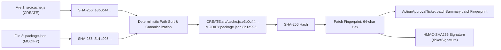
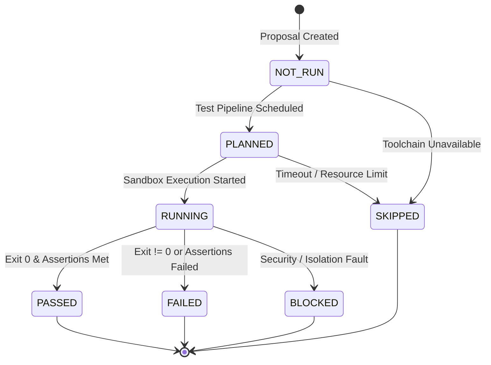
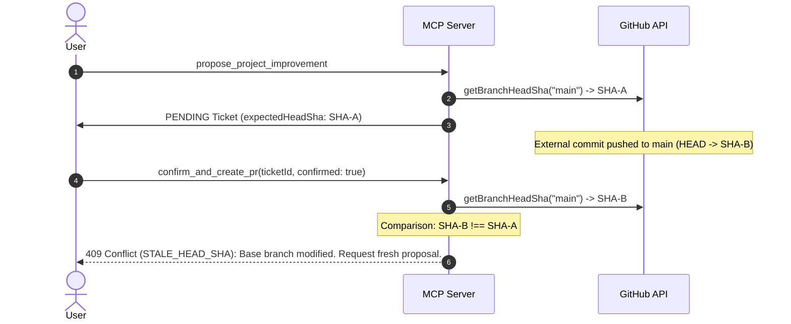

# ARCH-036: PR Diff Preview, Test Execution Reporting, and Pre-Confirmation Safety Architecture Specification

**Status**: PROPOSED & REVIEWED (Task P9-006A)  
**Security Level**: Critical Safety & Human-in-the-Loop Verification Boundary  
**Target AI Clients**: Google Gemini, Anthropic Claude, OpenAI ChatGPT, IDE Pair Programmers  
**Standard**: Model Context Protocol (MCP) Spec 2026-07-28  
**Governing ADR**: ADR-057 (`docs/decisions.md`)  

---

## 1. Executive Summary & Strategic Context

In Phase 9, Tasks P9-001 through P9-005 established the secure internal pipeline for approved repository modifications:
1. **P9-001**: `ProjectImprovementRecommenderService` — Analyzes missing skill gaps and synthesizes multi-file patch proposals.
2. **P9-002**: `ActionApprovalTicketService` — Implements the Two-Phase Human Approval State Machine with cryptographic HMAC-SHA256 signatures and atomic single-use execution tokens.
3. **P9-003**: `GitHubWriteService` — Executes atomic Git Data API operations (`trees` $\rightarrow$ `commits` $\rightarrow$ `refs` $\rightarrow$ `pulls`) with rollback capabilities.
4. **P9-004**: `GitHubWriteSafetyService` — Centralized execution safety kernel enforcing default branch protection (`default_branch`), target ref whitelisting (`feat/career-hub-*`), 7-point patch defense, and pre-execution secret scanning.
5. **P9-005**: MCP Write Tools (`propose_project_improvement`, `confirm_and_create_pr`) — Streamable HTTP transport and authorization adapters.

**Task P9-006A** defines the comprehensive **Pre-Confirmation Safety & Verification Layer** that operates in the critical window between proposal generation (`propose_project_improvement`) and human authorization (`confirm_and_create_pr`).

```
+--------------------------------------------------------------------------------------------------+
|                                    PHASE 9 EXECUTION LIFECYCLE                                    |
+--------------------------------------------------------------------------------------------------+
|                                                                                                  |
|   1. propose_project_improvement                                                                 |
|      (AI synthesizes proposal, queries live HEAD, mints PENDING ActionApprovalTicket)            |
|                                                                                                  |
|                                         |                                                        |
|                                         v                                                        |
|   +==========================================================================================+   |
|   |                       2. PRE-CONFIRMATION SAFETY & VERIFICATION LAYER                    |   |
|   |                                     (TASK P9-006)                                        |   |
|   |   * Structured Diff Preview (per-file additions, deletions, unified diff chunks)        |   |
|   |   * Cryptographic Patch Fingerprint (SHA-256 anchored to HMAC ticket)                    |   |
|   |   * Test Execution Reporting (status: NOT_RUN, PLANNED, PASSED, FAILED, BLOCKED)         |   |
|   |   * Ephemeral Sandbox Security (zero production credentials, network isolation)          |   |
|   |   * Staleness Invalidation (expectedHeadSha divergence fails closed with 409 Conflict)   |   |
|   |   * Security Warning Matrix (supply chain, risk levels, unverified claims)               |   |
|   |   * Anti-Blind Approval Stopping Protocol (explicit cognitive review requirement)        |   |
|   +==========================================================================================+   |
|                                                                                                  |
|                                         |                                                        |
|                                         v                                                        |
|   3. confirm_and_create_pr                                                                       |
|      (Human confirms ticket -> Safety Kernel Gate -> Git Data API -> Draft PR Opened)            |
|                                                                                                  |
+--------------------------------------------------------------------------------------------------+
```

### Core Architectural Mandate
> **A user must never be asked or allowed to approve a change they have not meaningfully reviewed.**  
> The system must present complete, bounded, verifiable diffs, accurate test execution evidence, explicit risk warnings, and an immutable cryptographic patch fingerprint, guaranteeing that the exact bytes reviewed and authorized are identical to the bytes committed to GitHub.

---

## 2. The Canonical Review Object

Before a user or AI client can execute `confirm_and_create_pr`, the system must construct and present a **Canonical Review Object** that unambiguously answers 9 critical questions:

| Question | Domain Field | Explanation & Invariants |
| :--- | :--- | :--- |
| **1. WHAT WILL CHANGE?** | `patchSummary.files[]` | Exact relative file paths, operation types (`CREATE`, `MODIFY`), additions/deletions line counts, and unified diff preview chunks. |
| **2. WHY?** | `targetSkill`, `rationale` | Target skill gap (e.g., `redis`, `postgresql-indexing`), gap status (`MISSING`, `PARTIAL`), and grounding rationale from the target job description. |
| **3. WHERE?** | `repository`, `branches` | Target repository full name (`vishu1803/Ai-job-mcp`), base branch (`main`), live base commit SHA (`expectedHeadSha`), and isolated feature branch (`feat/career-hub-*`). |
| **4. HOW MUCH?** | `patchSummary.metrics` | Quantitative change boundaries: `fileCount` ($\le 10$), `totalDiffLines` ($\le 500$), `totalPayloadBytes` ($\le 100\text{ KB}$). |
| **5. WHAT EVIDENCE SUPPORTS IT?** | `evidenceRefs[]` | Pinned Evidence IDs from candidate's verified repositories proving foundational capability and justifying the recommended enhancement. |
| **6. WHAT TESTS WILL RUN?** | `verificationPlan` | Recommended build instructions, test execution commands (e.g., `npm test`, `pytest`), and expected behavioral outcomes. |
| **7. WHAT HAS BEEN VERIFIED?** | `testExecutionReport` | Actual execution status (`NOT_RUN`, `PASSED`, `FAILED`), executed suites, timestamp, sandbox tier, and pre-execution static analysis passes (AST, secret scan, path policy). |
| **8. WHAT HAS NOT BEEN VERIFIED?** | `unverifiedAspects[]` | Explicit catalog of unverified concerns (e.g., production performance under load, third-party API keys, long-term memory leaks). |
| **9. WHAT WILL USER AUTHORIZE?** | `approvalRequirements` | Exact action authorized: Create remote branch `feat/career-hub-*`, commit patch, and open Draft PR. Explict notice that default branch `main` is protected and unchanged. |

---

## 3. Diff Preview Model & Security

### 3.1 Structured Diff Schema
The diff preview is represented as structured JSON data adhering to strict type definitions:

```typescript
interface StructuredDiffPreview {
  proposalId: string; // UUIDv4
  ticketId: string; // UUIDv4
  repository: {
    id: string; // UUIDv4
    name: string; // e.g. "vishu1803/Ai-job-mcp"
    defaultBranch: string; // e.g. "main"
    baseBranch: string; // e.g. "main"
    targetBranch: string; // e.g. "feat/career-hub-redis-layer"
    expectedHeadSha: string; // 40-character commit SHA
  };
  patchSummary: {
    fileCount: number; // 1 to 10
    additionsCount: number;
    deletionsCount: number;
    totalDiffLines: number; // <= 500
    patchFingerprint: string; // 64-char lowercase SHA-256
    files: Array<{
      path: string; // Safe POSIX relative path
      operation: 'CREATE' | 'MODIFY' | 'DELETE';
      additions: number;
      deletions: number;
      sha256: string; // 64-char content SHA-256
      diffPreview: string; // Unified diff snippet (<= 4,000 chars per file)
    }>;
  };
  riskAssessment: {
    riskLevel: 'LOW' | 'MEDIUM' | 'HIGH' | 'CRITICAL';
    riskFactors: string[];
    securityWarnings: Array<{
      code: string;
      severity: 'INFO' | 'WARNING' | 'CRITICAL';
      message: string;
    }>;
  };
}
```

### 3.2 Unified Diff Format & Size Clamping
- Each file preview generates standard unified diff format:
  ```diff
  --- a/src/services/cache.service.js
  +++ b/src/services/cache.service.js
  @@ -1,5 +1,12 @@
  +import Redis from 'ioredis';
  +
  +export class CacheService {
  +  constructor(redisClient) {
  +    this.redis = redisClient;
  +  }
  +}
  ```
- **Size Bounds**: Individual file previews are clamped at 4,000 characters. If a file diff exceeds 4,000 characters, it is cleanly truncated with a `[... Truncated for display: 45 lines remaining ...]` marker, while the complete content remains preserved in `content` and hashed in `sha256`.
- **Global Payload Ceiling**: The entire proposal JSON output returned across MCP is clamped to a hard maximum of 25 KB to avoid exhausting AI context windows.

### 3.3 Data Minimization & Credential Protection
The Diff Preview generator enforces strict information boundaries:
- ❌ **NEVER EXPOSE**:
  - GitHub App installation access tokens (`ghs_*`) or OAuth access tokens.
  - Internal database HMAC secret keys or raw signing keys.
  - Target candidate private PII (personal phone numbers, residential addresses).
  - High-entropy secrets or API keys found in diffs (scrubbed via `SecretScrubber`).
- ✅ **ONLY EXPOSE**:
  - Sanitized file paths, line diffs, public commit SHAs, repository names, and verification summaries.

---

## 4. Cryptographic Patch Fingerprint

To prevent Time-of-Check to Time-of-Use (TOCTOU) tampering or post-approval patch mutation, every proposal generates an immutable **Patch Fingerprint**.

### 4.1 Fingerprint Computation Algorithm
```
1. Given a collection of structured patch files: [{ path, operation, content, sha256 }]
2. For each file f:
     fileSha = f.sha256 OR sha256(f.content)
3. Sort files deterministically by path (Unicode code point order):
     sortedFiles = sort(files, by: path ASC)
4. Format canonical string with newline delimiter:
     canonicalString = join(sortedFiles.map(f => `${f.operation}:${f.path}:${fileSha}`), "\n")
5. Compute Patch Fingerprint:
     patchFingerprint = sha256(canonicalString)
```



### 4.2 Immutable Lifecycle Invariant
1. The `patchFingerprint` is computed at proposal creation time in `ProjectImprovementRecommenderService`.
2. The `patchFingerprint` is embedded inside `ActionApprovalTicket.patchSummary` and signed via `signApprovalTicket()`.
3. When `confirm_and_create_pr` is executed, `GitHubWriteSafetyService.validateExecutionSafetyGate` recomputes the fingerprint over the execution payload and asserts `executionFingerprint === ticket.patchSummary.patchFingerprint`.
4. **Zero Regeneration**: If any byte of any patch file is altered between proposal and confirmation, the fingerprint check fails immediately with `InvalidTicketSignatureError` / `PatchPolicyViolationError`, blocking execution.

---

## 5. Test Execution Reporting Framework

The system provides transparent, truthful reporting on what verification checks have been executed, what was skipped, and what failed.

### 5.1 Test Execution Lifecycle States



| Lifecycle State | Definition & Semantic Meaning |
| :--- | :--- |
| **`NOT_RUN`** | Tests were synthesized in the `verificationPlan` but have not been executed. |
| **`PLANNED`** | Tests are scheduled for execution in an isolated sandbox or CI runner. |
| **`RUNNING`** | Tests are actively executing inside an isolated sandbox worker. |
| **`PASSED`** | Test suite completed with exit code 0 and all verification assertions succeeded. |
| **`FAILED`** | Test suite failed with non-zero exit code or compilation/assertion error. |
| **`SKIPPED`** | Tests were skipped due to missing optional toolchains or environment constraints. |
| **`BLOCKED`** | Tests were blocked by the security sandbox (e.g., attempted network call or credential access). |

### 5.2 Truthfulness & Anti-Fabrication Principles
- **No False Claims**: The system MUST NEVER report `status: "PASSED"` for tests that were not actually run in an isolated execution environment.
- **Categorical Separation**:
  - `STATIC_ANALYSIS` (AST parsing, syntax check, linter, regex scanner) $\ne$ `UNIT_TEST_EXECUTION`.
  - `DETERMINISTIC_LOCAL_TEST` (in-memory mock sandbox) $\ne$ `LIVE_INTEGRATION_TEST` (live GitHub / cloud).
- The `testExecutionReport` must explicitly declare the `executionTier`:
  - `STATIC_GATE` — Static analysis & pre-execution safety scans.
  - `EPHEMERAL_SANDBOX` — Execution in an isolated worker container.
  - `REMOTE_CI` — Execution in GitHub Actions on the opened Draft PR branch.

---

## 6. Test Authority & Execution Hierarchy

| Verification Tier | Execution Trigger | Permitted Checks | Execution Environment | Failure Action |
| :--- | :--- | :--- | :--- | :--- |
| **Tier 1: Static Safety Gates** | Pre-Proposal (`propose_project_improvement`) | Syntax validation, AST parsing, POSIX path check, workflow blocklist, binary extension filter, Shannon entropy secret scan. | In-Process Node.js runtime. Zero subprocess execution. | **Immediate Block**: Proposal rejected with descriptive error. |
| **Tier 2: Ephemeral Sandbox Tests** | Pre-Confirmation (Optional verification step) | Unit tests (`npm test`, `pytest`, `go test`), linting (`eslint`), formatting (`prettier`), type checks (`tsc`). | Ephemeral isolated container/worker. Zero credentials, no network. | **Warning / Block**: Status marked `FAILED`; user warned before confirm. |
| **Tier 3: Remote GitHub CI** | Post-Confirmation (`confirm_and_create_pr`) | Full integration test suites, live builds, end-to-end tests, security scans configured on GitHub repository. | GitHub Actions CI runner on `feat/career-hub-*` branch. | **Draft PR Status Checks**: GitHub native CI status reporting. |

---

## 7. Sandbox & Test Execution Security

Executing AI-generated code poses severe supply chain and remote code execution (RCE) risks if not strictly isolated.

```
+--------------------------------------------------------------------------------------------------+
|                                    EPHEMERAL SANDBOX BOUNDARY                                    |
+--------------------------------------------------------------------------------------------------+
|                                                                                                  |
|   HOST SYSTEM (Protected)                                                                        |
|   * Database Connection (PostgreSQL Pool) -------- [STRIPPED / BLOCKED]                          |
|   * GitHub App Private Key / JWT ----------------- [STRIPPED / BLOCKED]                          |
|   * Cloud Credentials (ADC / Service Account) ---- [STRIPPED / BLOCKED]                          |
|   * MCP Session & API Tokens --------------------- [STRIPPED / BLOCKED]                          |
|   * Host Filesystem & Network Socket ------------- [STRIPPED / BLOCKED]                          |
|                                                                                                  |
|                                         |                                                        |
|                                         |  Spawn with empty environment                          |
|                                         v                                                        |
|   +------------------------------------------------------------------------------------------+   |
|   |   ISOLATED WORKER / CONTAINER (Zero Privilege)                                           |   |
|   |   * Network: `--net=none` (Physical network isolation)                                   |   |
|   |   * Filesystem: Ephemeral read-only root + tmpfs overlay                                 |   |
|   |   * User: Unprivileged `sandboxuser` (uid 65534, non-root)                              |   |
|   |   * Resources: CPU cap (1.0 core), Memory cap (512 MB), Disk cap (100 MB)                |   |
|   |   * Timeout: Hard 30-second kill timer (`SIGKILL`)                                       |   |
|   |   * Environment: Zero host env vars passed (`env -i`)                                    |   |
|   +------------------------------------------------------------------------------------------+   |
|                                                                                                  |
+--------------------------------------------------------------------------------------------------+
```

### 7.1 Mandatory Sandbox Isolation Rules
1. **Zero Credential Ingestion**: Subprocesses or containers executing generated code MUST NOT inherit `process.env`. All database connection strings, GitHub keys, OAuth tokens, and API keys are completely stripped.
2. **Network Isolation**: Pre-confirmation test sandboxes must disable all outbound and inbound network access (`--net=none`) to prevent credential exfiltration or SSRF attacks.
3. **Strict Timeouts & Resource Quotas**: Maximum 30 seconds execution time, 512 MB RAM, and 1 CPU core. Processes exceeding quotas are terminated with `SIGKILL`.
4. **Read-Only Root**: The sandbox executes against a disposable `tmpfs` volume that is destroyed immediately after execution.

---

## 8. User Confirmation UX & Anti-Blind Approval

### 8.1 Human Review Card Representation
When `propose_project_improvement` completes, the client displays a structured **Review & Confirmation Card**:

```
================================================================================
⚠️  ACTION PROPOSED: Create Draft Pull Request on vishu1803/Ai-job-mcp
================================================================================
Target Skill: Redis Caching (Missing Requirement)
Branch Plan:  main (SHA: 9e8a7b6c...) -> feat/career-hub-redis-caching
Diff Scope:   2 files changed (+42 lines, -0 lines)
              - [CREATE] src/services/redis-cache.service.js (+38 lines)
              - [MODIFY] package.json (+4 lines)
Patch Hash:   e3b0c44298fc1c149afbf4c8996fb92427ae41e4649b934ca495991b7852b855
Static Gate:  ✅ PASSED (Syntax, AST, Secret Scan, Path Policy)
Test Status:  📋 NOT_RUN (Requires sandbox worker)
Warnings:     ⚠️  Dependency Addition: adds "ioredis" ^5.3.2 to package.json
Expires In:   14 minutes 32 seconds (Ticket: a1b2c3d4-e5f6-...)
--------------------------------------------------------------------------------
STOP: Review the diff above. To authorize this modification, confirm with:
      confirm_and_create_pr(ticketId: "a1b2c3d4-...", confirmed: true)
================================================================================
```

### 8.2 Conversational Approval Prohibition
- Casual affirmations in conversational chat (e.g., "looks good", "proceed", "yes", "do it") MUST NOT trigger GitHub write operations directly.
- The AI client must translate user approval into an explicit structured invocation of `confirm_and_create_pr` with `confirmed: true` and the exact `ticketId`.

---

## 9. Staleness Invalidation & Race Conditions

### 9.1 Base Branch Commit Drift (Stale HEAD)
- **Scenario**: User receives a proposal based on `main` at `SHA-A`. While reviewing, a colleague merges a commit to `main`, moving the HEAD to `SHA-B`.
- **Safety Enforcement**:
  - `ActionApprovalTicket` stores `expectedHeadSha = "SHA-A"`.
  - When `confirm_and_create_pr` executes, `GitHubWriteSafetyService.validateExecutionSafetyGate` queries GitHub's live Git reference for `main`.
  - If live HEAD !== `expectedHeadSha`, execution fails closed with `StaleHeadShaError` (`409 Conflict`).
- **Rationale**: Any test results, diff lines, or architectural compatibility assumptions verified against `SHA-A` are invalid against `SHA-B`. The user must request a fresh proposal rebased on `SHA-B`.



---

## 10. Test / Diff Mismatch Protection

```
+--------------------------------------------------------------------------------------------------+
|                                    DIFF & TICKET IMMUTABILITY                                    |
+--------------------------------------------------------------------------------------------------+
|                                                                                                  |
|   Proposal Created (Patch A)                                                                     |
|      * files: [A1, A2]                                                                           |
|      * patchFingerprint: HASH_A                                                                  |
|      * expectedHeadSha: SHA_1                                                                    |
|                                                                                                  |
|                                         |                                                        |
|                                         |  If ANY change occurs:                                 |
|                                         |  - Files edited: HASH_B !== HASH_A                     |
|                                         |  - Target branch edited                                |
|                                         |  - Base commit moves: SHA_2 !== SHA_1                  |
|                                         v                                                        |
|   +------------------------------------------------------------------------------------------+   |
|   |   AUTOMATIC INVALIDATION                                                                 |   |
|   |   * Test results invalidated                                                             |   |
|   |   * ActionApprovalTicket rejected / expired                                              |   |
|   |   * Execution BLOCKED                                                                    |   |
|   |   * Fresh proposal required                                                              |   |
|   +------------------------------------------------------------------------------------------+   |
|                                                                                                  |
+--------------------------------------------------------------------------------------------------+
```

---

## 11. Security Warnings System

The review object generates explicit, structured warnings categorized by risk severity:

| Warning Code | Severity | Trigger Condition | User-Facing Warning Text |
| :--- | :--- | :--- | :--- |
| `WARN_TESTS_NOT_RUN` | `WARNING` | Tests were not executed prior to confirmation. | "Test suite was not executed prior to approval. Verify changes manually." |
| `WARN_DEPENDENCY_ADDED` | `WARNING` | Patch modifies dependency manifests (`package.json`, `go.mod`, `requirements.txt`). | "Proposal adds new external package dependencies. Review supply chain provenance." |
| `WARN_CONFIG_MODIFIED` | `WARNING` | Patch modifies repository configuration files (e.g. `tsconfig.json`, `drizzle.config.js`). | "Proposal modifies repository build configuration." |
| `WARN_LARGE_DIFF` | `WARNING` | Total diff lines exceed 200 lines. | "Proposal contains large diff (>200 lines). Extra scrutiny recommended." |
| `WARN_EXPIRATION_IMMINENT` | `INFO` | Ticket TTL $< 3\text{ minutes}$. | "Approval ticket expires soon. Fresh proposal required after expiry." |
| `WARN_UNVERIFIED_GAP` | `INFO` | Target skill gap is inferred or claimed without verified anchor evidence. | "Target skill addresses an inferred or unverified gap." |

---

## 12. MCP Output Contract Specification

### Updated `propose_project_improvement` Output Schema (P9-006)

```json
{
  "proposalId": "f47ac10b-58cc-4372-a567-0e02b2c3d479",
  "ticketId": "c9a646d3-9c61-4cc9-bc19-48231b67f1b2",
  "status": "PENDING_HUMAN_APPROVAL",
  "actionType": "PROJECT_IMPROVEMENT_PR",
  "title": "Add Redis caching layer to Ai-job-mcp",
  "rationale": "Demonstrates missing skill 'Redis' required by target Staff Engineer job description.",
  "targetSkill": {
    "slug": "redis",
    "name": "Redis",
    "gapStatus": "MISSING",
    "confidenceScore": 0.95
  },
  "repository": {
    "id": "7b2190f8-b3d9-4b6b-80a5-001122334455",
    "name": "vishu1803/Ai-job-mcp",
    "defaultBranch": "main",
    "baseBranch": "main",
    "targetBranch": "feat/career-hub-redis-caching",
    "expectedHeadSha": "9e8a7b6c5d4e3f2a1b0c9d8e7f6a5b4c3d2e1f0a"
  },
  "patchSummary": {
    "fileCount": 2,
    "additionsCount": 42,
    "deletionsCount": 0,
    "totalDiffLines": 42,
    "patchFingerprint": "e3b0c44298fc1c149afbf4c8996fb92427ae41e4649b934ca495991b7852b855",
    "files": [
      {
        "path": "src/services/redis-cache.service.js",
        "changeType": "CREATE",
        "additions": 38,
        "deletions": 0,
        "sha256": "4a5b6c7d8e9f0a1b2c3d4e5f6a7b8c9d0e1f2a3b4c5d6e7f8a9b0c1d2e3f4a5b",
        "diffPreview": "--- /dev/null\n+++ b/src/services/redis-cache.service.js\n@@ -0,0 +1,38 @@\n+import Redis from 'ioredis';\n+..."
      },
      {
        "path": "package.json",
        "changeType": "MODIFY",
        "additions": 4,
        "deletions": 0,
        "sha256": "1a2b3c4d5e6f7a8b9c0d1e2f3a4b5c6d7e8f9a0b1c2d3e4f5a6b7c8d9e0f1a2b",
        "diffPreview": "--- a/package.json\n+++ b/package.json\n@@ -25,2 +25,6 @@\n+    \"ioredis\": \"^5.3.2\",\n"
      }
    ]
  },
  "verificationPlan": {
    "instructions": "Run npm test to verify cache initialization and graceful redis fallback.",
    "recommendedTests": ["npm test", "npm run lint"],
    "expectedOutcomes": ["CacheService connects to Redis mock and gracefully degrades when disconnected."]
  },
  "testExecutionReport": {
    "status": "NOT_RUN",
    "executionTier": "STATIC_GATE",
    "staticChecksPassed": true,
    "staticChecksSummary": "Syntax, AST, Secret Scrubber, and Path Policy verified clean."
  },
  "riskAssessment": {
    "riskLevel": "LOW",
    "riskFactors": ["Adds external dependency ioredis"],
    "securityWarnings": [
      {
        "code": "WARN_TESTS_NOT_RUN",
        "severity": "WARNING",
        "message": "Test suite was not executed prior to approval. Verify changes manually."
      },
      {
        "code": "WARN_DEPENDENCY_ADDED",
        "severity": "WARNING",
        "message": "Proposal adds new external package dependency 'ioredis'. Review supply chain provenance."
      }
    ]
  },
  "approvalRequirements": {
    "requiredRole": "MEMBER",
    "expiresAt": "2026-08-25T16:00:00.000Z",
    "ttlSeconds": 900,
    "confirmationInstructions": "STOP: Review the diff and warnings above with the user. Do not call confirm_and_create_pr without explicit human consent. To authorize, call confirm_and_create_pr with ticketId='c9a646d3-9c61-4cc9-bc19-48231b67f1b2' and confirmed=true."
  }
}
```

---

## 13. Confirm Tool Boundary

`confirm_and_create_pr` remains an **execution-only gate**:
- It accepts only `{ ticketId, confirmed: true, idempotencyKey, userNotes }`.
- It NEVER accepts new file patches, branch overrides, or instructions.
- It NEVER prompts an AI model to regenerate or modify code during confirmation.
- It executes strictly the exact ticket, patch fingerprint, and expected commit HEAD validated in the review phase.

---

## 14. Auditability & Telemetry

All preview and pre-confirmation actions emit structured audit events to PostgreSQL `audit_logs`:

| Event Type | Emitted When | Sanitized Payload Details |
| :--- | :--- | :--- |
| `mcp.write.preview_generated` | Proposal and diff preview created. | `proposalId`, `ticketId`, `repositoryName`, `fileCount`, `totalDiffLines`, `patchFingerprint`, `riskLevel`. |
| `mcp.write.test_executed` | Pre-confirmation test suite runs. | `proposalId`, `ticketId`, `testStatus`, `durationMs`, `sandboxTier`, `exitCode`. |
| `mcp.write.warning_emitted` | Security or risk warnings triggered. | `ticketId`, `warningCodes[]`, `riskLevel`. |
| `mcp.write.approval_requested` | Stopping protocol presented to client. | `ticketId`, `expiresAt`, `targetBranch`, `patchFingerprint`. |
| `mcp.write.approval_confirmed` | Human confirmation received. | `ticketId`, `approvingUserId`, `userNotes`, `patchFingerprint`. |
| `mcp.write.stale_head_blocked` | Base branch drift detected. | `ticketId`, `expectedHeadSha`, `actualHeadSha`, `repositoryName`. |

---

## 15. Industry Research & Best Practice Citations

1. **GitHub Copilot Workspace & Agent Safety Architecture (2025-2026)**:
   - Enforces explicit plan $\rightarrow$ diff $\rightarrow$ test $\rightarrow$ PR staged review boundaries.
   - Restricts AI agents from directly pushing to protected default branches.
2. **OWASP Top 10 for LLM Applications (2025/2026)**:
   - **LLM08 (Excessive Agency)**: AI models must not have direct raw write primitives. Requires human authorization gates for external state mutations.
   - **LLM02 (Insecure Output Handling)**: Generated code diffs and file paths must be sanitized against path traversal, command injection, and script injection.
3. **NIST AI Risk Management Framework (AI RMF 1.0)**:
   - Mandates human oversight (Govern 1.2), verifiable evidence grounding (Measure 2.6), and fail-safe defaults (Manage 2.4).
4. **OpenSSF / SLSA Supply Chain Security Guidelines**:
   - Warns on unvetted dependency additions in AI-generated PRs to prevent software supply chain injection attacks.

---

## 16. Implementation Plan for Task P9-006

1. **Schemas Update**:
   - Enhance `src/domain/mcp/career-write-tools.schemas.js` with `testExecutionReport`, `riskAssessment`, and `securityWarnings` schemas.
   - Update `ProposeProjectImprovementOutputSchema` and `CAREER_WRITE_TOOL_DEFINITIONS`.
2. **Domain Service Enhancement**:
   - Update `src/services/project-improvement-recommender.service.js` and `src/mcp/tools/career-write-tools.js` to compute unified diff snippets, patch fingerprints, risk classifications, and security warning arrays.
3. **Unit Test Suite**:
   - Create `tests/unit/mcp-diff-preview.test.js` validating:
     - Unified diff formatting, line counting, and size clamping ($\le 4000$ chars per file, $\le 25\text{ KB}$ total).
     - Patch fingerprint calculation and HMAC binding.
     - Test execution report statuses (`NOT_RUN`, `PASSED`, `FAILED`).
     - Security warning generation for dependency additions and large diffs.
     - Secret scrubbing and credential protection in previews.
4. **Integration Test Suite**:
   - Create `tests/integration/mcp-diff-preview.test.js` validating:
     - Fastify MCP HTTP transport returns compliant review object with diff preview and warnings.
     - Stale HEAD SHA drift ($SHA_{actual} \ne SHA_{expected}$) invalidates confirmation with 409 Conflict.
     - Fingerprint mismatch rejection.
     - Multi-tenant 404 default-deny isolation.
5. **Quality Gates**:
   - Full test suite, db lifecycle audit, lint, and formatting verification.

---

## 17. Security & Architectural Verdict

- [x] Exact unified diff is structured, reviewable, and bounded.
- [x] Patch fingerprint is immutable and cryptographically bound to HMAC ticket.
- [x] Tests cannot be falsely reported as passed.
- [x] Stale test results and commit HEAD drift fail closed.
- [x] Approval authorizes exactly what was reviewed with zero post-approval regeneration.
- [x] Test execution model enforces credential-free sandbox isolation.
- [x] Security warnings are prominent and unsuppressed.
- [x] Zero credential or secret leakage is possible.
- [x] Existing P9-002, P9-003, P9-004, and P9-005 security kernels remain authoritative.

**Review Verdict**: **`P9-006A APPROVED`**
