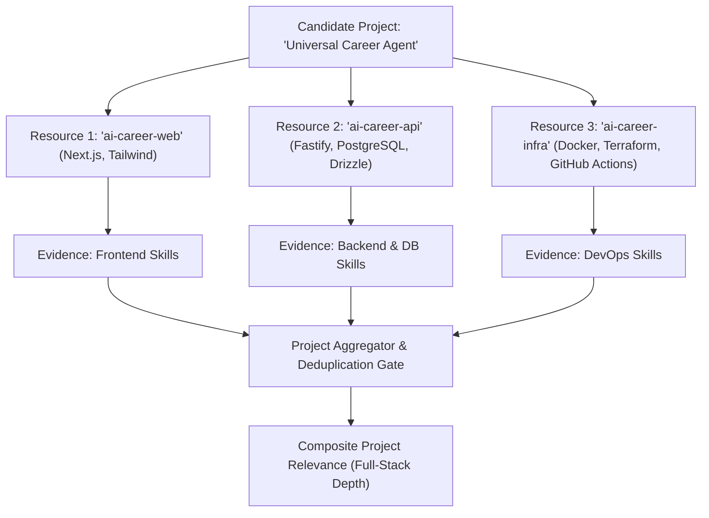

# ARCH-014: Project Relevance Scoring Architecture

**Document ID**: `ARCH-014`  
**Related ADR**: `ADR-034` (`docs/decisions.md`)  
**Status**: `APPROVED`  
**Phase**: Phase 5 (P5-004A)  
**Author**: Antigravity DeepMind Team  
**Date**: 2026-08-22  

---

## 1. Executive Summary & Objective

The **Project Relevance Scoring Engine** is the deterministic analytical component of Phase 5 that evaluates how effectively each candidate project demonstrates direct relevance, technical depth, and architectural alignment against a target job description.

While **Candidate Skill Matching** (P5-003) answers:  
> *"Does the candidate possess skill X?"*

**Project Relevance Scoring** (P5-004) answers:  
> *"Which specific projects demonstrate the highest technical depth and verified proof for this particular job, and how strongly does each project align with the job's architectural requirements?"*

```
+---------------------------------------------------------------------------------------------------+
|                                      INPUT: EVALUATION CONTEXT                                     |
|    - JobDescription & JobRequirements (Extracted & Normalized via P5-001)                         |
|    - Candidate Projects (1..N Projects linked to 1..M Resources via P4-001/P4-005)               |
|    - Project-Linked Evidence Nodes (PACKAGE_MANIFEST, CODE_USAGE, CONFIG_SYNTAX, etc.)            |
|    - Canonical Skill Taxonomy Graph (P5-002: BUILT_ON, ECOSYSTEM_OF, IMPLEMENTS)                  |
+-------------------------------------------------+-------------------------------------------------+
                                                  |
                                                  v
+---------------------------------------------------------------------------------------------------+
|                        1. MULTI-DIMENSIONAL DETERMINISTIC EVALUATION                              |
|   - Requirement Coverage (50%): Direct Required/Preferred Skills Demonstrated in Project         |
|   - Architectural Density (25%): Engineering Depth Across 10 Technical Dimensions                 |
|   - Evidence Quality (15%): Evidentiary Rank (Manifests/Imports > READMEs)                        |
|   - Project Completeness (5%): Test Suites, Documentation, and CI/CD Automation                   |
|   - Activity Recency (5%): Bounded Recency Multiplier (Capped at 5 Points)                        |
+-------------------------------------------------+-------------------------------------------------+
                                                  |
                                                  v
+---------------------------------------------------------------------------------------------------+
|                        2. SCORE COMPUTATION & RELEVANCE BAND CLASSIFICATION                       |
|   - Canonical Score: S_proj in [0, 100] (Strictly Derived Mathematical Value)                     |
|   - Relevance Bands: HIGH (>= 75) | MEDIUM (50-74) | LOW (25-49) | MINIMAL (< 25)                 |
|   - Deduplication Guard: Single Skill / Requirement Counted At Most Once Per Project             |
+-------------------------------------------------+-------------------------------------------------+
                                                  |
                                                  v
+---------------------------------------------------------------------------------------------------+
|                                OUTPUT: PROJECT RELEVANCE ANALYSIS                                 |
|         CandidateProjectRelevanceAnalysis (Tenant-Scoped, Bounded EvidenceRefs, Zero Secrets)     |
+---------------------------------------------------------------------------------------------------+
```

---

## 2. Project Relevance Domain Model

### 2.1 Entity Boundaries & Fields
* **`projectId`** (`UUIDv4`): Canonical project identifier.
* **`projectName`** (`String`, max 255): Display name of the candidate project.
* **`projectSlug`** (`SafeSlug`): Canonical kebab-case identifier.
* **`projectType`** (`Enum`): `APPLICATION`, `LIBRARY`, `API`, `WEBSITE`, `CLI`, `INFRASTRUCTURE`, `DATA_PROJECT`, `MONOREPO`, `OTHER`.
* **`relevanceScore`** (`Float`, $[0.0, 100.0]$): Deterministically computed composite score.
* **`relevanceBand`** (`Enum`): `HIGH`, `MEDIUM`, `LOW`, `MINIMAL`.
* **`scoreBreakdown`** (`Object`):
  - `requirementCoverageScore`: $[0.0, 50.0]$
  - `architecturalDensityScore`: $[0.0, 25.0]$
  - `evidenceQualityScore`: $[0.0, 15.0]$
  - `projectCompletenessScore`: $[0.0, 5.0]$
  - `recencyScore`: $[0.0, 5.0]$
* **`matchedRequirementIds`** (`Array<UUIDv4>`): Unique requirement IDs covered by this project.
* **`contributingSkills`** (`Array<SafeSlug>`): Canonical skills demonstrated with qualifying evidence.
* **`architecturalSignals`** (`Array<Enum>`): Detected architectural dimensions.
* **`supportingEvidence`** (`Array<EvidenceRef>`, max 5): Top commit-pinned evidence pointers.
* **`explanation`** (`String`, max 1000): Structured, evidence-grounded summary.
* **`confidence`** (`Float`, $[0.0, 1.0]$): Provenance confidence score.

### 2.2 Standard 0–100 Scale Justification
The platform adopts a canonical **0–100 integer/decimal score** ($S_{\text{proj}} \in [0.0, 100.0]$) for project relevance.  
* **Transparent Human Comprehensibility**: Enables candidates and MCP clients to intuitively understand project ranking (e.g. 88/100 vs. 32/100).
* **Additive Modular Decomposition**: Allows clear additive sub-scores ($50 + 25 + 15 + 5 + 5 = 100$) that sum exactly to the total score without obscure floating-point conversions.
* **Decoupled from Overall Job Fit**: Clearly distinguished from Candidate Skill Match status and downstream candidate-level 100-point ATS fit scoring.

---

## 3. Direct Requirement Coverage (50% Weight / 50 Points)

Direct requirement coverage evaluates how many job requirements are substantiated by concrete code evidence within the project's linked resources.

### 3.1 Requirement Importance Multipliers
Each covered job requirement contributes to the raw coverage score based on its importance tier:
* **`REQUIRED` Technical Skill**: Base value = $1.0$ (Must-have capability demonstrated in code).
* **`PREFERRED` Technical Skill ($W \ge 0.5$)**: Base value = $0.7$ (High-value preferred capability).
* **`PREFERRED` Technical Skill ($W < 0.5$)**: Base value = $0.5$ (Standard preferred capability).
* **`OPTIONAL` Technical Skill**: Base value = $0.25$ (Bonus capability).
* **`DOMAIN` Requirement**: Base value = $0.8$ (Direct vertical domain alignment).

### 3.2 Directional Taxonomy Relationships in Projects
When a project does not contain the exact required skill, taxonomy relationship edges from [ARCH-012](file:///c:/Users/VISHW/OneDrive/Desktop/Ai-career-agent/docs/skill-taxonomy-architecture.md) apply calibrated multipliers:
* **`BUILT_ON` ($W_{\text{rel}} = 0.90$)**: Project utilizes a framework built on required language/runtime (e.g., project uses `Next.js` for `React` requirement).
* **`ECOSYSTEM_OF` ($W_{\text{rel}} = 0.75$)**: Project utilizes a driver/utility for required tool (e.g., project uses `Drizzle ORM` for `PostgreSQL` requirement).
* **`IMPLEMENTS` ($W_{\text{rel}} = 0.50$)**: Project utilizes sibling architecture (e.g., project uses `MySQL` for `PostgreSQL` requirement).
* **`PARENT_OF` ($W_{\text{rel}} = 1.00$)**: Project utilizes direct specialization of general concept (e.g., project uses `PostgreSQL` for `Relational Database` requirement).

### 3.3 Strict Deduplication Guard
> [!IMPORTANT]
> **Anti-Inflation Rule**: A skill or requirement is counted **at most once per project**, regardless of whether it appears in 1 file or 500 files, and regardless of whether the project links 1 or 5 repositories.

### 3.4 Coverage Formula ($S_{\text{req\_cov}} \in [0, 50]$)
$$S_{\text{req\_cov}} = 50 \times \min\left(1.0, \, \frac{\sum_{r \in \text{CoveredReqs}} \text{TierWeight}(r) \times W_{\text{rel}}(r)}{\sum_{r \in \text{AllJobReqs}} \text{TierWeight}(r)}\right)$$

If the job description contains zero technical skill requirements, $S_{\text{req\_cov}}$ defaults to $25.0$.

---

## 4. Architectural Density & Depth (25% Weight / 25 Points)

A production-grade software project exhibits multi-tier engineering depth rather than a single standalone script. The engine evaluates **10 deterministic architectural dimensions**:

```
+---------------------------------------------------------------------------------------------------+
|                               10 ARCHITECTURAL DENSITY DIMENSIONS                                 |
+----+--------------------------------+-------------------------------------------------------------+
| #  | Dimension                      | Deterministic Evidence Signals                              |
+----+--------------------------------+-------------------------------------------------------------+
| 1  | API & Routing                  | Fastify, Express, Next.js API, gRPC, GraphQL, FastAPI, Gin  |
| 2  | Data Persistence & ORM         | PostgreSQL, MySQL, Drizzle, Prisma, SQL scripts, Migrations |
| 3  | Authentication & Security      | JWT, OAuth, Sessions, Passport, bcrypt, argon2, RBAC        |
| 4  | Async / Background Processing  | BullMQ, Kafka, RabbitMQ, SQS, Celery, Redis Queues, Cron    |
| 5  | Cloud & DevOps Infrastructure  | Dockerfile, docker-compose, Kubernetes, Terraform, AWS/GCP  |
| 6  | Automated Testing Suite        | Vitest, Jest, Node test runner, Pytest, Go test files       |
| 7  | Observability & Structured Logs| Pino, Winston, OpenTelemetry, Prometheus, structured logs   |
| 8  | Caching & State Management     | Redis cache, Memcached, LRU cache implementations           |
| 9  | External SDK Integrations      | GitHub App SDK, Stripe, OpenAI, Resend, S3 client           |
| 10 | Modular Domain Architecture    | Clean architecture, domain separation, layered repositories |
+----+--------------------------------+-------------------------------------------------------------+
```

### 4.1 Density Computation ($S_{\text{arch\_dens}} \in [0, 25]$)
Each distinct, verified architectural dimension adds $2.5$ points:
$$S_{\text{arch\_dens}} = 2.5 \times \min(10, \, |\text{DetectedArchitecturalDimensions}|)$$

* Projects with $\ge 8$ dimensions achieve near-maximum architectural density ($20.0 - 25.0$ pts).
* Trivial single-dependency repositories achieve low architectural density ($2.5 - 5.0$ pts).

---

## 5. Evidence Quality & Provenance Strength (15% Weight / 15 Points)

Evidence quality ensures that projects supported by cryptographic runtime evidence outrank projects with superficial or speculative mentions.

### 5.1 Evidentiary Hierarchy & Multipliers
| Evidence Type | Evidentiary Weight ($W_{\text{evid}}$) | Rationale |
| :--- | :---: | :--- |
| **`PACKAGE_MANIFEST_DEPENDENCY`** | $1.00$ | Verifiable production runtime dependency (`package.json`, `go.mod`, `Cargo.toml`). |
| **`CODE_IMPORT_USAGE`** | $0.95$ | Direct syntax import statement in source files (`import ... from '...'`). |
| **`CODE_USAGE`** | $0.90$ | AST call expression or class instantiation in project code. |
| **`CONFIG_SYNTAX_DECLARATION`** | $0.85$ | Verifiable infrastructure config (`Dockerfile`, `github-actions.yml`, `k8s.yaml`). |
| **`COMMIT_CONTRIBUTION`** | $0.75$ | Git commit authorship tied to candidate identity. |
| **`FILE_PATTERN_MATCH`** | $0.65$ | File extension or naming pattern match. |
| **`DIRECTORY_STRUCTURE`** | $0.50$ | Directory naming convention. |
| **`README_SPECIFICATION`** | $0.30$ | Markdown text documentation only. |
| **`DOCUMENT_CLAIM`** | $0.00$ | Manual self-claim (Excluded from project score). |

### 5.2 Evidence Quality Formula ($S_{\text{evid\_qual}} \in [0, 15]$)
$$S_{\text{evid\_qual}} = 15 \times \frac{\sum_{e \in \text{SelectedEvidence}} W_{\text{evid}}(e) \times C_{\text{evid}}(e)}{|\text{SelectedEvidence}|} \quad (\text{Defaults to } 0.0 \text{ if } |\text{SelectedEvidence}| = 0)$$

---

## 6. Project Completeness & Activity Recency (10% Combined)

### 6.1 Project Completeness ($S_{\text{comp}} \in [0, 5]$)
Measures software craftsmanship and repository completeness across 4 indicators:
1. **Presence of Automated Tests** ($+1.5$ pts): Verified test files or test runner configuration.
2. **Presence of Documentation** ($+1.5$ pts): Comprehensive `README.md` ($> 200$ chars) explaining architecture and setup.
3. **CI/CD Automation** ($+1.0$ pt): GitHub Actions workflow, CircleCI, or GitLab CI configuration.
4. **Clean Manifest Structure** ($+1.0$ pt): Valid build/start scripts in project manifests.

### 6.2 Bounded Activity Recency ($S_{\text{rec}} \in [0, 5]$)
Recency provides a modest bonus for actively maintained projects without penalizing mature, completed historical projects:
* **Active within last 6 months**: $+5.0$ points.
* **Active within 6–18 months**: $+3.0$ points.
* **Active within 18–36 months**: $+1.5$ points.
* **Active $> 36$ months ago / unstated**: $+0.0$ points.

> [!CAUTION]
> **Anti-Recency-Dominance Rule**: Recency is strictly capped at $5.0$ points ($5\%$ of total score). A fresh empty repository created yesterday will score $< 10/100$, while a comprehensive, relevant project built 2 years ago can easily score $> 85/100$.

---

## 7. The 100-Point Composite Formula & Relevance Bands

### 7.1 Composite Formula
$$S_{\text{proj}} = S_{\text{req\_cov}} + S_{\text{arch\_dens}} + S_{\text{evid\_qual}} + S_{\text{comp}} + S_{\text{rec}}$$

Where all components are strictly bounded, non-negative, and evaluate to a final score $S_{\text{proj}} \in [0.0, 100.0]$.

### 7.2 Relevance Bands
```
+---------------------------------------------------------------------------------------------------+
|                                    PROJECT RELEVANCE BANDS                                        |
+-------------------+-----------------+-------------------------------------------------------------+
| Band              | Score Range     | Platform Action & Meaning                                   |
+-------------------+-----------------+-------------------------------------------------------------+
| **`HIGH`**        | 75.0 – 100.0    | Primary showcase project; featured heavily in resume & MCP. |
| **`MEDIUM`**      | 50.0 – 74.9     | Strong supporting project; demonstrates secondary skills.   |
| **`LOW`**         | 25.0 – 49.9     | Ancillary project; demonstrates minor / indirect alignment. |
| **`MINIMAL`**     | 0.0 – 24.9      | Unrelated / minimal relevance project; excluded from highlights. |
+-------------------+-----------------+-------------------------------------------------------------+
```

---

## 8. Multi-Repository Aggregation (Project $\ne$ Repository)

A `Project` entity represents a logical system (e.g. "Antigravity Career Hub") that may link multiple underlying `Resource` repositories (e.g., `web-frontend`, `backend-api`, `infra-terraform`).



* **Evidence Aggregation**: All evidence items across linked resources are pooled into the project's evidence set.
* **Deduplication**: If `package.json` in `Res1` and `package.json` in `Res2` both import `typescript`, TypeScript is registered as **one** contributing skill for the project.
* **Orphan Repositories**: If a candidate repository is not explicitly grouped into a project, it is evaluated as an autonomous single-resource project without inventing false associations.

---

## 9. Structured Explanations & Evidence Selection

### 9.1 Bounded Evidence Selection
The engine selects up to **5** `EvidenceRef` objects per project, prioritized by:
1. Evidence Type Rank (Manifests/Imports $>$ Readmes)
2. Direct requirement match over indirect relationship
3. Confidence score descending
4. Stable file path sorting

### 9.2 Standardized Explanation Template
All project relevance evaluations produce deterministic, evidence-backed explanations:
- **High Relevance Project**:  
  `"HIGH relevance (86.5/100): Demonstrates 4 required skills (FastAPI, PostgreSQL, Docker, Redis) with verified package manifests and code imports in repository 'distributed-platform'. Exhibits high architectural density across 7 dimensions (API, Database, Caching, DevOps, Testing)."`
- **Medium Relevance Project**:  
  `"MEDIUM relevance (62.0/100): Demonstrates 2 required skills (React, TypeScript) via Next.js framework in repository 'web-portal'. Exhibits moderate architectural density across 4 dimensions."`
- **Minimal Relevance Project**:  
  `"MINIMAL relevance (12.5/100): Contains zero direct job requirement matches. Demonstrates basic CLI architecture in repository 'utility-tool'."`

---

## 10. Multi-Tenant Sovereign Isolation

1. **Strict Context Scoping**: Every project relevance request accepts an immutable context with `context.tenantId`.
2. **Hermetic Boundary Enforcement**:
   - `JobDescription` verified where `tenant_id === context.tenantId`.
   - `CandidateProfile`, `Project`, and linked `Resource` records verified where `tenant_id === context.tenantId`.
3. **Cross-Tenant Default-Deny**: Any cross-tenant project ID or candidate ID throws `404 NotFoundError` immediately.
4. **Zero Secret Leakage**: Output payloads are stripped of credentials, auth headers, and foreign tokens.

---

## 11. Target Domain Schema Contracts

```javascript
export const ProjectRelevanceBandEnum = z.enum(['HIGH', 'MEDIUM', 'LOW', 'MINIMAL']);

export const ProjectRelevanceScoreBreakdownSchema = z.strictObject({
  requirementCoverageScore: z.number().min(0.0).max(50.0),
  architecturalDensityScore: z.number().min(0.0).max(25.0),
  evidenceQualityScore: z.number().min(0.0).max(15.0),
  projectCompletenessScore: z.number().min(0.0).max(5.0),
  recencyScore: z.number().min(0.0).max(5.0),
  totalScore: z.number().min(0.0).max(100.0),
});

export const ProjectRelevanceSchema = z.strictObject({
  projectId: z.string().uuid(),
  projectName: z.string().min(1).max(255),
  projectSlug: SafeSlugSchema,
  projectType: z.enum([
    'APPLICATION',
    'LIBRARY',
    'API',
    'WEBSITE',
    'CLI',
    'INFRASTRUCTURE',
    'DATA_PROJECT',
    'MONOREPO',
    'OTHER',
  ]).default('APPLICATION'),
  relevanceScore: z.number().min(0.0).max(100.0),
  relevanceBand: ProjectRelevanceBandEnum,
  scoreBreakdown: ProjectRelevanceScoreBreakdownSchema,
  matchedRequirementIds: z.array(z.string().uuid()).default([]),
  contributingSkills: z.array(SafeSlugSchema).default([]),
  architecturalSignals: z.array(z.string()).default([]),
  supportingEvidence: z.array(EvidenceRefSchema).max(5).default([]),
  explanation: z.string().max(1000),
  confidence: z.number().min(0.0).max(1.0),
});

export const CandidateProjectRelevanceAnalysisSchema = z.strictObject({
  jobDescriptionId: z.string().uuid(),
  candidateId: z.string().uuid(),
  tenantId: z.string().uuid(),
  projectRankings: z.array(ProjectRelevanceSchema),
  topProject: ProjectRelevanceSchema.nullable().optional(),
  summary: z.strictObject({
    totalProjectsEvaluated: z.number().int().nonnegative(),
    highRelevanceCount: z.number().int().nonnegative(),
    mediumRelevanceCount: z.number().int().nonnegative(),
    lowRelevanceCount: z.number().int().nonnegative(),
    minimalRelevanceCount: z.number().int().nonnegative(),
    averageProjectScore: z.number().min(0.0).max(100.0),
  }),
  analyzedAt: z.string().datetime(),
});
```

---

## 12. Performance & In-Memory Computation

* **$\mathcal{O}(|\text{Projects}| \times |\text{Requirements}|)$ Performance**: Requirements and candidate skills are pre-indexed into memory maps. Project scoring executes with sub-millisecond latency.
* **Ephemeral On-Demand Computation**: No database migrations or persistent project score tables are introduced in P5-004.
* **Stable Deterministic Ranking**: Project rankings are stably sorted by `relevanceScore` descending, with `projectId` as tie-breaker.

---

## 13. LLM Boundary & Non-Negotiable Rules

1. **LLMs Forbidden from Computing Relevance**: All project scores, component breakdowns, and relevance bands are derived purely through deterministic algorithms.
2. **Zero Hallucinated Accomplishments**: Explanations cite only verified evidence nodes present in candidate profile graphs.
3. **Strict Fact vs Claim Separation**: Unverified manual claims cannot contribute to project relevance.

---

## 14. Implementation Details & Service Contracts (P5-004 Verified)

* **Core Service**: `ProjectRelevanceService` in `src/services/project-relevance.service.js`.
* **Primary APIs**:
  - `computeProjectRelevance(context, jobDescription, project, options)`: Evaluates single project against job description with strict multi-tenant validation.
  - `computeProjectsRelevance(context, jobDescription, projects, options)`: Evaluates and stably ranks multiple candidate projects.
* **Functional Export Aliases**: `computeProjectRelevance`, `computeProjectsRelevance`.
* **Domain Schemas**: `ProjectRelevanceSchema`, `ProjectRelevanceScoreBreakdownSchema`, `ProjectRelevanceExplanationSchema`, `CandidateProjectRelevanceAnalysisSchema` exported via `src/domain/career/index.js`.
* **Unit Test Coverage**: `tests/unit/project-relevance.service.test.js` (30/30 tests passing across 13 suites).
