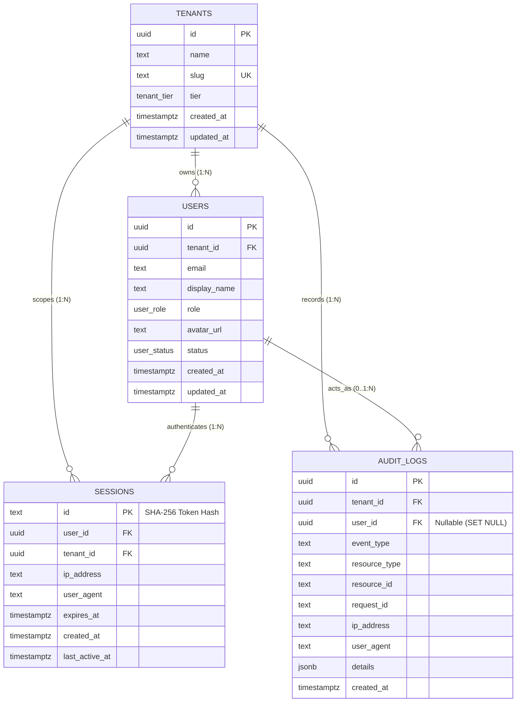

# Core Database Schema Architectural Review & Approval (P1-004A)

**Project**: Antigravity Career Hub (Universal AI Career MCP Platform)  
**Task ID**: P1-004A (Design Review & Approval Gate)  
**Author**: Lead Architecture & Security Agent  
**Date**: 2026-08-20  
**Status**: **APPROVED WITH NOTES**  
**Governing Documents**: [`docs/data-model.md`](file:///C:/Users/VISHW/OneDrive/Desktop/Ai-career-agent/docs/data-model.md), [`docs/security.md`](file:///C:/Users/VISHW/OneDrive/Desktop/Ai-career-agent/docs/security.md), [`docs/architecture.md`](file:///C:/Users/VISHW/OneDrive/Desktop/Ai-career-agent/docs/architecture.md), [`.github/instructions/database.instructions.md`](file:///C:/Users/VISHW/OneDrive/Desktop/Ai-career-agent/.github/instructions/database.instructions.md)

---

## 1. Executive Summary & Review Scope

This design document establishes the formal architectural review for the four core platform foundation entities defined in [`docs/data-model.md`](file:///C:/Users/VISHW/OneDrive/Desktop/Ai-career-agent/docs/data-model.md) and [`docs/security.md`](file:///C:/Users/VISHW/OneDrive/Desktop/Ai-career-agent/docs/security.md):

1. **`tenants`**: Workspace isolation root entity.
2. **`users`**: Individual authenticated identity.
3. **`sessions`**: Active Web UI login sessions with hashed token identifiers.
4. **`audit_logs`**: Immutable compliance, security, and MCP invocation audit trail.

This review validates relational integrity, PostgreSQL 16+ / Drizzle ORM compatibility, tenant isolation guarantees, indexing strategies, deletion cascades, and secret/PII sanitization prior to authoring Drizzle schema definitions and migrations in Task `P1-004`.

---

## 2. Detailed Entity Design Specifications

### 2.1. Entity: `tenants` (Workspace Root)

* **Purpose**: Serves as the top-level tenancy boundary. Every resource, user, candidate profile, and evidence item in the platform is strictly scoped to a tenant.
* **Table Name**: `tenants`

| Column Name | Drizzle / PG Type | Modifiers / Constraints | Specification Origin | Description & Rationale |
| :--- | :--- | :--- | :--- | :--- |
| `id` | `uuid` | `primaryKey()`, `defaultRandom()` | **SPECIFIED** | Globally unique tenant identifier (UUIDv4/v7). |
| `name` | `text` | `notNull()` | **SPECIFIED** | Human-readable workspace name (e.g. "Vishwash's Workspace"). |
| `slug` | `text` | `notNull()`, `unique()` | **SPECIFIED** | URL-safe unique workspace slug for routing/vanity domains. |
| `tier` | `tenant_tier` (enum) | `notNull()`, `default('FREE')` | **SPECIFIED** | Subscription tier: `'FREE'`, `'PRO'`, `'ENTERPRISE'`. |
| `created_at` | `timestamptz` | `notNull()`, `defaultNow()` | **SPECIFIED** | Record creation timestamp with timezone. |
| `updated_at` | `timestamptz` | `notNull()`, `defaultNow()` | **SPECIFIED** | Record last update timestamp with timezone. |

#### Constraints & Indexes
* `tenants_slug_unique`: Unique constraint on `slug`.
* `idx_tenants_slug`: B-tree index on `slug` for fast lookup during subdomain / routing resolution.

---

### 2.2. Entity: `users` (Identity & Account)

* **Purpose**: Represents an individual human actor authenticated to the platform.
* **Table Name**: `users`

| Column Name | Drizzle / PG Type | Modifiers / Constraints | Specification Origin | Description & Rationale |
| :--- | :--- | :--- | :--- | :--- |
| `id` | `uuid` | `primaryKey()`, `defaultRandom()` | **SPECIFIED** | Globally unique user identifier. |
| `tenant_id` | `uuid` | `notNull()`, `references(tenants.id, CASCADE)` | **SPECIFIED** | Strict tenant boundary foreign key. |
| `email` | `text` | `notNull()` | **SPECIFIED** | Primary email address (PII). Unique per tenant. |
| `display_name` | `text` | `notNull()` | **SPECIFIED** | User's full or preferred name. |
| `role` | `user_role` (enum) | `notNull()`, `default('MEMBER')` | **SPECIFIED** | RBAC role: `'OWNER'`, `'MEMBER'`, `'READONLY'`. |
| `avatar_url` | `text` | `null` | **SPECIFIED** | Optional URL to user's profile avatar. |
| `status` | `user_status` (enum) | `notNull()`, `default('ACTIVE')` | **SPECIFIED** | Account lifecycle: `'ACTIVE'`, `'SUSPENDED'`, `'DELETED'`. |
| `created_at` | `timestamptz` | `notNull()`, `defaultNow()` | **SPECIFIED** | Creation timestamp. |
| `updated_at` | `timestamptz` | `notNull()`, `defaultNow()` | **SPECIFIED** | Last update timestamp. |

#### Constraints & Indexes
* `users_tenant_email_unique`: Unique composite constraint on `(tenant_id, email)` preventing duplicate emails within the same tenant while allowing provider-neutral account federation.
* `idx_users_tenant_id`: B-tree index on `tenant_id` for tenant-scoped user listings.
* `idx_users_status`: B-tree index on `status` to filter active accounts during auth lookup.

#### Provider Neutrality & Identity Federation
* External OAuth provider IDs (e.g. GitHub User ID, Google Sub ID) are decoupled from the core `users` table and will reside in `resource_connections` (Phase 2) or dedicated auth provider links. This prevents hardcoding the identity schema to any single provider.

---

### 2.3. Entity: `sessions` (Web UI Authentication)

* **Purpose**: Tracks active Web UI login sessions with secure, non-plaintext token identifiers.
* **Table Name**: `sessions`

| Column Name | Drizzle / PG Type | Modifiers / Constraints | Specification Origin | Description & Rationale |
| :--- | :--- | :--- | :--- | :--- |
| `id` | `text` | `primaryKey()` | **SPECIFIED** | Cryptographic 32-byte session secret hash (SHA-256). Plaintext token is never stored. |
| `user_id` | `uuid` | `notNull()`, `references(users.id, CASCADE)` | **SPECIFIED** | Foreign key to authenticated user. |
| `tenant_id` | `uuid` | `notNull()`, `references(tenants.id, CASCADE)` | **SPECIFIED** | Denormalized tenant key for instant tenant context resolution without extra joins. |
| `ip_address` | `text` | `null` | **SPECIFIED** | Masked client IP address (e.g. `192.168.1.***` or `/24` subnet) for audit and anomaly detection. |
| `user_agent` | `text` | `null` | **SPECIFIED** | Client User-Agent string for device identification. |
| `expires_at` | `timestamptz` | `notNull()` | **SPECIFIED** | Expiration timestamp (24-hour TTL per `docs/security.md`). |
| `created_at` | `timestamptz` | `notNull()`, `defaultNow()` | **SPECIFIED** | Session issuance timestamp. |
| `last_active_at` | `timestamptz` | `notNull()`, `defaultNow()` | **DERIVED** | Last activity timestamp for idle session detection. |

#### Constraints & Indexes
* `idx_sessions_user_id`: B-tree index on `user_id` to query active sessions per user (e.g. "logout all devices").
* `idx_sessions_expires_at`: B-tree index on `expires_at` for high-performance expired session purge cron jobs.
* `idx_sessions_tenant_user`: Composite index on `(tenant_id, user_id)` for tenant-scoped session management.

#### Security & Token Invariants
* **Never Plaintext**: The cookie contains the raw secret; the database stores only `SHA-256(secret)`. Even if the database is read compromised, active sessions cannot be hijacked.
* **Revocation**: Instant revocation by `DELETE FROM sessions WHERE id = ?`.

---

### 2.4. Entity: `audit_logs` (Compliance & Security Ledger)

* **Purpose**: Immutable append-only audit trail recording all security events, connector actions, consequential state changes, and MCP tool invocations.
* **Table Name**: `audit_logs`

| Column Name | Drizzle / PG Type | Modifiers / Constraints | Specification Origin | Description & Rationale |
| :--- | :--- | :--- | :--- | :--- |
| `id` | `uuid` | `primaryKey()`, `defaultRandom()` | **SPECIFIED** | Immutable audit event identifier. |
| `tenant_id` | `uuid` | `notNull()`, `references(tenants.id, CASCADE)` | **SPECIFIED** | Mandatory tenant scoping for audit ledger isolation. |
| `user_id` | `uuid` | `null`, `references(users.id, SET NULL)` | **SPECIFIED** | Actor user ID. Nullable with `SET NULL` on user deletion to preserve compliance history. |
| `event_type` | `text` | `notNull()` | **SPECIFIED** | Standardized event name (e.g. `AUTH_LOGIN`, `MCP_TOOL_INVOKED`, `CONNECTOR_CONNECTED`, `ACTION_CONFIRMED`). |
| `resource_type` | `text` | `notNull()` | **SPECIFIED** | Target entity type (e.g. `User`, `EvidenceItem`, `ResourceConnection`, `ActionApproval`). |
| `resource_id` | `text` | `null` | **SPECIFIED** | Identifier of the affected resource. |
| `request_id` | `text` | `null` | **DERIVED** | Fastify request ID / MCP correlation ID for end-to-end trace correlation. |
| `ip_address` | `text` | `null` | **SPECIFIED** | Masked client IP address. |
| `user_agent` | `text` | `null` | **SPECIFIED** | Client User-Agent string. |
| `details` | `jsonb` | `notNull()`, `default('{}')` | **SPECIFIED** | Sanitized event metadata (strictly redacted of secrets, passwords, tokens, and PII). |
| `created_at` | `timestamptz` | `notNull()`, `defaultNow()` | **SPECIFIED** | Immutable event timestamp (no `updated_at` column). |

#### Constraints & Indexes
* `idx_audit_logs_tenant_created`: Composite B-tree index on `(tenant_id, created_at DESC)` for high-performance chronological audit trail inspection.
* `idx_audit_logs_tenant_event`: Composite index on `(tenant_id, event_type)` for filtering audit events by category.
* `idx_audit_logs_request_id`: B-tree index on `request_id` for distributed trace investigation.

#### Immutability & Audit Safety
* Append-only table. Updates (`UPDATE`) and in-place deletions (`DELETE`) are strictly forbidden by application layer design and database permissions in production.

---

## 3. Entity-Relationship Diagram



---

## 4. Multi-Tenant Isolation Matrix

| Entity | Tenant Scoped? | User Scoped? | Foreign Keys | Cascading Rule | Required Query Isolation Rule | Index Support |
| :--- | :--- | :--- | :--- | :--- | :--- | :--- |
| **`tenants`** | Root Boundary | No | None | N/A (Root) | Query strictly by `id = req.tenantId` or `slug = :slug` | `idx_tenants_slug` |
| **`users`** | Yes (`tenant_id`) | Root Identity | `tenant_id -> tenants.id` | `ON DELETE CASCADE` | `WHERE tenant_id = req.tenantId AND id = req.userId` | `idx_users_tenant_id`, `(tenant_id, email) UNIQUE` |
| **`sessions`** | Yes (`tenant_id`) | Yes (`user_id`) | `tenant_id -> tenants.id`<br>`user_id -> users.id` | `ON DELETE CASCADE` (both) | `WHERE id = hash(token)` + verify `session.tenant_id == req.tenantId` | `idx_sessions_user_id`, `idx_sessions_expires_at`, `idx_sessions_tenant_user` |
| **`audit_logs`** | Yes (`tenant_id`) | Yes (`user_id`, opt) | `tenant_id -> tenants.id`<br>`user_id -> users.id` | `tenant_id`: `CASCADE`<br>`user_id`: `SET NULL` | `WHERE tenant_id = req.tenantId ORDER BY created_at DESC` | `(tenant_id, created_at DESC)`, `(tenant_id, event_type)`, `request_id` |

---

## 5. Constraint & Index Strategy Summary

| Table | Constraint / Index Name | Columns | Type | Documented Purpose & Query Pattern |
| :--- | :--- | :--- | :--- | :--- |
| `tenants` | `tenants_pkey` | `id` | Primary Key | Point lookups by tenant ID |
| `tenants` | `tenants_slug_unique` | `slug` | Unique Constraint | Subdomain and URL slug uniqueness |
| `tenants` | `idx_tenants_slug` | `slug` | B-tree Index | Workspace resolution by slug |
| `users` | `users_pkey` | `id` | Primary Key | Point lookups by user ID |
| `users` | `users_tenant_email_unique` | `(tenant_id, email)` | Unique Composite | Prevents duplicate accounts per tenant |
| `users` | `idx_users_tenant_id` | `tenant_id` | B-tree Index | Member list & tenant scoping |
| `users` | `idx_users_status` | `status` | B-tree Index | Authentication filter (`status = 'ACTIVE'`) |
| `sessions` | `sessions_pkey` | `id` | Primary Key | Fast lookup by SHA-256 token hash |
| `sessions` | `idx_sessions_user_id` | `user_id` | B-tree Index | Fetch all active sessions for a user |
| `sessions` | `idx_sessions_expires_at` | `expires_at` | B-tree Index | Batch cleanup of expired sessions |
| `sessions` | `idx_sessions_tenant_user` | `(tenant_id, user_id)` | Composite Index | Tenant-scoped session invalidation |
| `audit_logs` | `audit_logs_pkey` | `id` | Primary Key | Single audit entry retrieval |
| `audit_logs` | `idx_audit_logs_tenant_created` | `(tenant_id, created_at DESC)` | Composite B-tree | Chronological tenant audit timeline |
| `audit_logs` | `idx_audit_logs_tenant_event` | `(tenant_id, event_type)` | Composite B-tree | Audit filtering by event category |
| `audit_logs` | `idx_audit_logs_request_id` | `request_id` | B-tree Index | Request trace correlation across services |

---

## 6. Lifecycle & Deletion Cascade Analysis

1. **Tenant Hard Deletion**:
   - Deleting a row from `tenants` triggers `ON DELETE CASCADE` across `users`, `sessions`, and `audit_logs`. This ensures complete multi-tenant tenant data erasure compliance (GDPR right to be forgotten / workspace deletion).
2. **User Deletion**:
   - Deleting a user triggers `ON DELETE CASCADE` on `sessions` (all active logins immediately terminate).
   - For `audit_logs`, `user_id` uses `ON DELETE SET NULL`. This preserves historical compliance and security event records for the tenant while disassociating the deleted user ID.
3. **Session Expiry**:
   - Sessions expire deterministically at `expires_at`. Expired sessions are ignored by queries (`WHERE expires_at > NOW()`) and purged asynchronously via a periodic background cleanup task without affecting user accounts.

---

## 7. Security & Redaction Audit

| Security Domain | Risk Evaluated | Architectural Mitigation | Status |
| :--- | :--- | :--- | :--- |
| **Credential Storage** | Plaintext session token leak | Session `id` stores SHA-256 hash only. Raw token never enters DB. | **SECURE** |
| **Cross-Tenant IDOR** | Malicious query for foreign user/session | Foreign key constraints + mandatory `WHERE tenant_id = ?` query filter. | **SECURE** |
| **Audit Log Poisoning** | Leakage of API keys / PII in audit payloads | `details` JSONB column must pass through `src/utils/logger.js` redaction filter prior to database insertion. | **SECURE** |
| **Audit Traceability** | Disconnected service errors | `request_id` correlation column links audit entries to Pino logs. | **SECURE** |
| **PII Protection** | User email exposed in logs | `email` is registered in `SENSITIVE_KEYS` and masked by default in telemetry. | **SECURE** |

---

## 8. Drizzle ORM & PostgreSQL 16+ Implementation Blueprint

When implemented in Task `P1-004`, the Drizzle ORM schema representation in `src/db/schema.js` will utilize:

```javascript
import { pgTable, pgEnum, uuid, text, timestamp, jsonb, index, uniqueIndex } from 'drizzle-orm/pg-core';

export const tenantTierEnum = pgEnum('tenant_tier', ['FREE', 'PRO', 'ENTERPRISE']);
export const userRoleEnum = pgEnum('user_role', ['OWNER', 'MEMBER', 'READONLY']);
export const userStatusEnum = pgEnum('user_status', ['ACTIVE', 'SUSPENDED', 'DELETED']);

// 1. tenants
export const tenants = pgTable('tenants', {
  id: uuid('id').primaryKey().defaultRandom(),
  name: text('name').notNull(),
  slug: text('slug').notNull().unique(),
  tier: tenantTierEnum('tier').default('FREE').notNull(),
  createdAt: timestamp('created_at', { withTimezone: true }).defaultNow().notNull(),
  updatedAt: timestamp('updated_at', { withTimezone: true }).defaultNow().notNull(),
}, (table) => [
  index('idx_tenants_slug').on(table.slug),
]);

// 2. users
export const users = pgTable('users', {
  id: uuid('id').primaryKey().defaultRandom(),
  tenantId: uuid('tenant_id').notNull().references(() => tenants.id, { onDelete: 'cascade' }),
  email: text('email').notNull(),
  displayName: text('display_name').notNull(),
  role: userRoleEnum('role').default('MEMBER').notNull(),
  avatarUrl: text('avatar_url'),
  status: userStatusEnum('status').default('ACTIVE').notNull(),
  createdAt: timestamp('created_at', { withTimezone: true }).defaultNow().notNull(),
  updatedAt: timestamp('updated_at', { withTimezone: true }).defaultNow().notNull(),
}, (table) => [
  uniqueIndex('users_tenant_email_unique').on(table.tenantId, table.email),
  index('idx_users_tenant_id').on(table.tenantId),
  index('idx_users_status').on(table.status),
]);

// 3. sessions
export const sessions = pgTable('sessions', {
  id: text('id').primaryKey(),
  userId: uuid('user_id').notNull().references(() => users.id, { onDelete: 'cascade' }),
  tenantId: uuid('tenant_id').notNull().references(() => tenants.id, { onDelete: 'cascade' }),
  ipAddress: text('ip_address'),
  userAgent: text('user_agent'),
  expiresAt: timestamp('expires_at', { withTimezone: true }).notNull(),
  createdAt: timestamp('created_at', { withTimezone: true }).defaultNow().notNull(),
  lastActiveAt: timestamp('last_active_at', { withTimezone: true }).defaultNow().notNull(),
}, (table) => [
  index('idx_sessions_user_id').on(table.userId),
  index('idx_sessions_expires_at').on(table.expiresAt),
  index('idx_sessions_tenant_user').on(table.tenantId, table.userId),
]);

// 4. audit_logs
export const auditLogs = pgTable('audit_logs', {
  id: uuid('id').primaryKey().defaultRandom(),
  tenantId: uuid('tenant_id').notNull().references(() => tenants.id, { onDelete: 'cascade' }),
  userId: uuid('user_id').references(() => users.id, { onDelete: 'set null' }),
  eventType: text('event_type').notNull(),
  resourceType: text('resource_type').notNull(),
  resourceId: text('resource_id'),
  requestId: text('request_id'),
  ipAddress: text('ip_address'),
  userAgent: text('user_agent'),
  details: jsonb('details').default('{}').notNull(),
  createdAt: timestamp('created_at', { withTimezone: true }).defaultNow().notNull(),
}, (table) => [
  index('idx_audit_logs_tenant_created').on(table.tenantId, table.createdAt.desc()),
  index('idx_audit_logs_tenant_event').on(table.tenantId, table.eventType),
  index('idx_audit_logs_request_id').on(table.requestId),
]);
```

---

## 9. Open Decisions & Design Notes

1. **Email Uniqueness Scope**:
   * *Decision*: Composite uniqueness on `(tenant_id, email)`.
   * *Rationale*: Allows multi-tenant isolation where an email may exist in separate isolated tenant organizations, while preventing duplicates within a single tenant.
2. **Session Hash Algorithm**:
   * *Decision*: SHA-256 hex string (64 characters) stored in `sessions.id`.
   * *Rationale*: Matches ADR-006 and `docs/security.md` Bearer token storage design without introducing reversible token storage.
3. **Audit Log User Deletion Handling**:
   * *Decision*: `ON DELETE SET NULL` on `audit_logs.user_id`.
   * *Rationale*: Compliance ledgers must preserve records of what actions occurred even if a user account is removed.

---

## 10. Approval Status Matrix

| Entity | Architectural Compliance | Security Compliance | Isolation Compliance | Status |
| :--- | :--- | :--- | :--- | :--- |
| **`tenants`** | 100% compliant with ADR-004 & Data Model | Zero secrets, validated constraints | Root boundary validated | **APPROVED** |
| **`users`** | 100% compliant with Data Model & RBAC | PII protected, composite unique email | Foreign key tenant-scoped | **APPROVED** |
| **`sessions`** | 100% compliant with ADR-006 & Security Spec | Hashed token storage, 24h TTL index | Denormalized tenant scoping | **APPROVED WITH NOTES** |
| **`audit_logs`** | 100% compliant with Security Threat Model | Scrubbed JSONB, immutable structure | Strict tenant scoping, `SET NULL` user | **APPROVED WITH NOTES** |

---

## 11. Overall Conclusion & Recommendation

**Overall Assessment**: **`P1-004A APPROVED WITH NOTES`**

The core schema design for `tenants`, `users`, `sessions`, and `audit_logs` is mathematically sound, enforces strict multi-tenant isolation, prevents credential exposure, preserves compliance history, and aligns 100% with Drizzle ORM and PostgreSQL 16+.

**Next Recommended Task**:
Upon user approval of this review, proceed to **Task `P1-004`**: Author `src/db/schema.js`, generate baseline Drizzle migration, execute against live Supabase PostgreSQL, and verify with automated CRUD and multi-tenant isolation unit tests.
