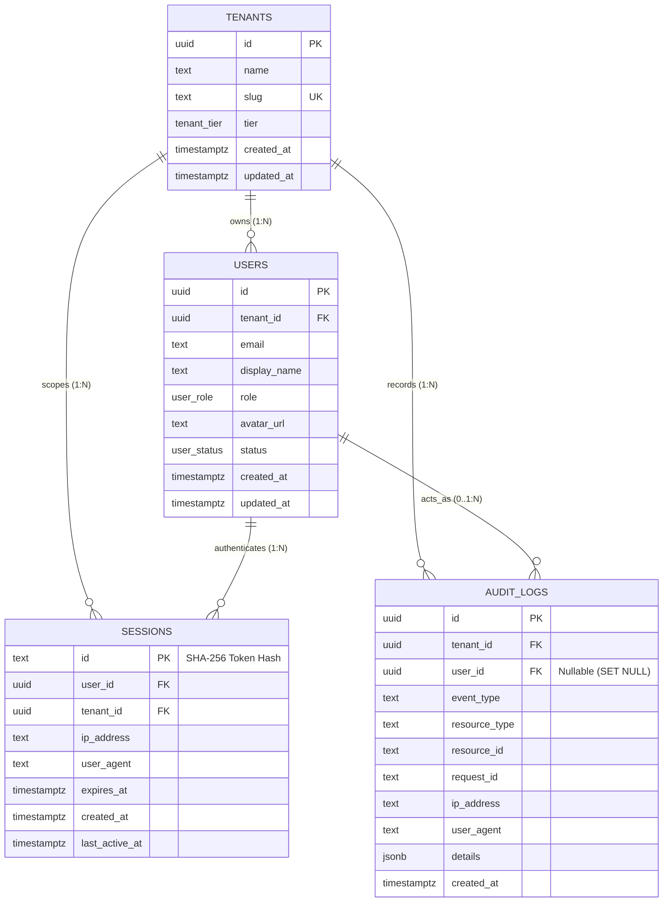

# Core Database Schema Architectural Review & Approval (P1-004A)

**Project**: Antigravity Career Hub (Universal AI Career MCP Platform)  
**Task ID**: P1-004A (Design Review & Approval Gate)  
**Author**: Lead Architecture & Security Agent  
**Date**: 2026-08-20  
**Status**: **APPROVED**  
**Governing Documents**: [`docs/data-model.md`](file:///C:/Users/VISHW/OneDrive/Desktop/Ai-career-agent/docs/data-model.md), [`docs/security.md`](file:///C:/Users/VISHW/OneDrive/Desktop/Ai-career-agent/docs/security.md), [`docs/architecture.md`](file:///C:/Users/VISHW/OneDrive/Desktop/Ai-career-agent/docs/architecture.md), [`.github/instructions/database.instructions.md`](file:///C:/Users/VISHW/OneDrive/Desktop/Ai-career-agent/.github/instructions/database.instructions.md)

---

## 1. Executive Summary & Review Scope

This design document establishes the authoritative architectural review and implementation blueprint for the four core platform foundation entities defined in [`docs/data-model.md`](file:///C:/Users/VISHW/OneDrive/Desktop/Ai-career-agent/docs/data-model.md) and [`docs/security.md`](file:///C:/Users/VISHW/OneDrive/Desktop/Ai-career-agent/docs/security.md):

1. **`tenants`**: Multi-tenant workspace root boundary.
2. **`users`**: Individual authenticated identity and RBAC role.
3. **`sessions`**: Web UI login sessions with hashed token storage.
4. **`audit_logs`**: Immutable security, compliance, and MCP invocation audit trail.

This review resolves all architectural design considerations—including dedicated audit data sanitization, PostgreSQL session expiration mechanics, comprehensive index justification, and deletion cascade retention rules—prior to authoring Drizzle ORM schema definitions and migrations in Task `P1-004`.

---

## 2. Detailed Entity Design Specifications

### 2.1. Entity: `tenants` (Workspace Root)

* **Purpose**: Top-level tenancy boundary. Every resource, connection, user, and evidence item in the platform is strictly owned by a tenant.
* **Table Name**: `tenants`

| Column Name | Drizzle / PG Type | Modifiers / Constraints | Specification Origin | Description & Rationale |
| :--- | :--- | :--- | :--- | :--- |
| `id` | `uuid` | `primaryKey()`, `defaultRandom()` | **SPECIFIED** | Globally unique tenant identifier (UUIDv4/v7). |
| `name` | `text` | `notNull()` | **SPECIFIED** | Human-readable workspace name (e.g. "Vishwash's Workspace"). |
| `slug` | `text` | `notNull()`, `unique()` | **SPECIFIED** | URL-safe unique workspace slug for routing and subdomain resolution. |
| `tier` | `tenant_tier` (enum) | `notNull()`, `default('FREE')` | **SPECIFIED** | Subscription tier: `'FREE'`, `'PRO'`, `'ENTERPRISE'`. |
| `created_at` | `timestamptz` | `notNull()`, `defaultNow()` | **SPECIFIED** | Record creation timestamp with timezone. |
| `updated_at` | `timestamptz` | `notNull()`, `defaultNow()` | **SPECIFIED** | Record last update timestamp with timezone. |

#### Constraints & Indexing
* `tenants_slug_unique`: PostgreSQL `UNIQUE (slug)` constraint automatically generates a unique B-tree index. (No redundant secondary index created).

---

### 2.2. Entity: `users` (Identity & Account)

* **Purpose**: Represents an individual human actor authenticated to the platform.
* **Table Name**: `users`

| Column Name | Drizzle / PG Type | Modifiers / Constraints | Specification Origin | Description & Rationale |
| :--- | :--- | :--- | :--- | :--- |
| `id` | `uuid` | `primaryKey()`, `defaultRandom()` | **SPECIFIED** | Globally unique user identifier. |
| `tenant_id` | `uuid` | `notNull()`, `references(tenants.id, CASCADE)` | **SPECIFIED** | Strict tenant boundary foreign key. |
| `email` | `text` | `notNull()` | **SPECIFIED** | Primary email address (PII). Unique within the tenant. |
| `display_name` | `text` | `notNull()` | **SPECIFIED** | User's full or preferred display name. |
| `role` | `user_role` (enum) | `notNull()`, `default('MEMBER')` | **SPECIFIED** | RBAC role: `'OWNER'`, `'MEMBER'`, `'READONLY'`. |
| `avatar_url` | `text` | `null` | **SPECIFIED** | Optional URL to user's profile avatar. |
| `status` | `user_status` (enum) | `notNull()`, `default('ACTIVE')` | **SPECIFIED** | Account lifecycle: `'ACTIVE'`, `'SUSPENDED'`, `'DELETED'`. |
| `created_at` | `timestamptz` | `notNull()`, `defaultNow()` | **SPECIFIED** | Creation timestamp. |
| `updated_at` | `timestamptz` | `notNull()`, `defaultNow()` | **SPECIFIED** | Last update timestamp. |

#### Constraints & Indexing
* `users_tenant_email_unique`: Unique composite constraint on `(tenant_id, email)` preventing duplicate emails within the same tenant while allowing provider-neutral account federation across distinct organizations.
* `idx_users_tenant_id`: B-tree index on `tenant_id` for tenant-scoped member list queries and cascade delete performance.

#### Provider Neutrality & Identity Federation
* External OAuth provider IDs (e.g. GitHub User ID, Google Sub ID) are decoupled from the core `users` table and will reside in `resource_connections` (Phase 2), preventing single-provider vendor lock-in.

---

### 2.3. Entity: `sessions` (Web UI Authentication)

* **Purpose**: Tracks active Web UI login sessions with secure, non-plaintext token identifiers.
* **Table Name**: `sessions`

| Column Name | Drizzle / PG Type | Modifiers / Constraints | Specification Origin | Description & Rationale |
| :--- | :--- | :--- | :--- | :--- |
| `id` | `text` | `primaryKey()` | **SPECIFIED** | 64-character SHA-256 hash of 32-byte secure session secret. Plaintext token is never stored. |
| `user_id` | `uuid` | `notNull()`, `references(users.id, CASCADE)` | **SPECIFIED** | Foreign key to authenticated user. |
| `tenant_id` | `uuid` | `notNull()`, `references(tenants.id, CASCADE)` | **SPECIFIED** | Denormalized tenant key for instant tenant context resolution without joins. |
| `ip_address` | `text` | `null` | **SPECIFIED** | Masked client IP address for security audit. |
| `user_agent` | `text` | `null` | **SPECIFIED** | Client User-Agent string for device identification. |
| `expires_at` | `timestamptz` | `notNull()` | **SPECIFIED** | Absolute expiration timestamp (24-hour TTL per `docs/security.md`). |
| `created_at` | `timestamptz` | `notNull()`, `defaultNow()` | **SPECIFIED** | Session issuance timestamp. |
| `last_active_at` | `timestamptz` | `notNull()`, `defaultNow()` | **DERIVED** | Last activity timestamp for idle session tracking. |

#### PostgreSQL Session Expiration Architecture
* **Query-Level Active Validation**: PostgreSQL does NOT automatically delete expired rows. All session authentication queries must include `WHERE id = $1 AND expires_at > NOW()`. Any expired session is immediately rejected (401 Unauthorized) regardless of physical row existence.
* **Background Cleanup Job**: A periodic background job executes `DELETE FROM sessions WHERE expires_at < NOW()` using the `idx_sessions_expires_at` index to prevent table bloat. (Cleanup schedule is an operational concern for Phase 2).
* **Constraints & Indexing**:
  * `idx_sessions_user_id`: B-tree index on `user_id` for "logout all devices" queries and user deletion cascades.
  * `idx_sessions_expires_at`: B-tree index on `expires_at` accelerating background cleanup sweeps.

---

### 2.4. Entity: `audit_logs` (Compliance & Security Ledger)

* **Purpose**: Immutable append-only audit trail recording all security events, connector actions, consequential state changes, and MCP tool invocations.
* **Table Name**: `audit_logs`

| Column Name | Drizzle / PG Type | Modifiers / Constraints | Specification Origin | Description & Rationale |
| :--- | :--- | :--- | :--- | :--- |
| `id` | `uuid` | `primaryKey()`, `defaultRandom()` | **SPECIFIED** | Immutable audit event identifier. |
| `tenant_id` | `uuid` | `notNull()`, `references(tenants.id, CASCADE)` | **SPECIFIED** | Mandatory tenant scoping for audit ledger isolation. |
| `user_id` | `uuid` | `null`, `references(users.id, SET NULL)` | **SPECIFIED** | Actor user ID. Nullable with `SET NULL` on user deletion to preserve compliance history. |
| `event_type` | `text` | `notNull()` | **SPECIFIED** | Standardized event name (e.g. `AUTH_LOGIN`, `MCP_TOOL_INVOKED`, `CONNECTOR_CONNECTED`, `ACTION_CONFIRMED`). |
| `resource_type` | `text` | `notNull()` | **SPECIFIED** | Target entity type (e.g. `User`, `EvidenceItem`, `ResourceConnection`, `ActionApproval`). |
| `resource_id` | `text` | `null` | **SPECIFIED** | Identifier of the affected resource. |
| `request_id` | `text` | `null` | **DERIVED** | Fastify request ID / MCP correlation ID for end-to-end trace correlation. |
| `ip_address` | `text` | `null` | **SPECIFIED** | Masked client IP address. |
| `user_agent` | `text` | `null` | **SPECIFIED** | Client User-Agent string. |
| `details` | `jsonb` | `notNull()`, `default('{}')` | **SPECIFIED** | Sanitized event metadata (strictly governed by dedicated audit sanitization rules). |
| `created_at` | `timestamptz` | `notNull()`, `defaultNow()` | **SPECIFIED** | Immutable event timestamp (no `updated_at` column). |

#### Dedicated Audit Payload Sanitization Boundary
The audit persistence system and logging system are strictly separate concerns. Audit payloads persisted to `audit_logs.details` are governed by a dedicated audit sanitization boundary:
* **Strictly Prohibited Fields**: Plaintext access/refresh tokens, API keys, client secrets, passwords, encryption keys, private keys, authorization headers, cookies, raw source code excerpts, complete resumes, and unmasked government identifiers (SSNs).
* **Explicitly Permitted Fields**: Resource IDs, tool names, event status (`SUCCESS`, `FAILED`, `DENIED`), target branch/PR names, execution latency (ms), record modification counts, and structured error codes.
* **Payload Validation & Limits**: Max payload size capped at 16 KB per audit entry to prevent database storage bloat and DoS risks. Validated with strict Zod schemas before insertion.

#### Constraints & Indexing
* `idx_audit_logs_tenant_created`: Composite B-tree index on `(tenant_id, created_at DESC)` for chronological audit timeline inspection.
* `idx_audit_logs_tenant_event`: Composite index on `(tenant_id, event_type)` for filtering audit events by category.
* `idx_audit_logs_request_id`: B-tree index on `request_id` for distributed trace investigation.

---

## 3. Entity-Relationship Diagram



---

## 4. Multi-Tenant Isolation Matrix

| Entity | Tenant Scoped | User Scoped | Foreign Keys | Cascading Rule | Required Query Isolation Rule | Justified Index Support |
| :--- | :--- | :--- | :--- | :--- | :--- | :--- |
| **`tenants`** | Root Boundary | No | None | N/A (Root) | `WHERE id = req.tenantId` | `tenants_slug_unique` |
| **`users`** | Yes (`tenant_id`) | Root Identity | `tenant_id -> tenants.id` | `ON DELETE CASCADE` | `WHERE tenant_id = req.tenantId AND id = req.userId` | `idx_users_tenant_id`, `(tenant_id, email) UNIQUE` |
| **`sessions`** | Yes (`tenant_id`) | Yes (`user_id`) | `tenant_id -> tenants.id`<br>`user_id -> users.id` | `ON DELETE CASCADE` (both) | `WHERE id = hash(token) AND expires_at > NOW()` | `idx_sessions_user_id`, `idx_sessions_expires_at` |
| **`audit_logs`** | Yes (`tenant_id`) | Yes (opt) | `tenant_id -> tenants.id`<br>`user_id -> users.id` | `tenant_id`: `CASCADE`<br>`user_id`: `SET NULL` | `WHERE tenant_id = req.tenantId ORDER BY created_at DESC` | `(tenant_id, created_at DESC)`, `(tenant_id, event_type)`, `request_id` |

---

## 5. Comprehensive Index Justification & Classification

| Table | Index / Constraint Name | Target Columns | Classification | Concrete Query Pattern & Architectural Justification |
| :--- | :--- | :--- | :--- | :--- |
| `tenants` | `tenants_pkey` | `id` | **REQUIRED** | Primary key point lookups by tenant ID. |
| `tenants` | `tenants_slug_unique` | `slug` | **REQUIRED** | Enforces slug uniqueness and supports workspace slug routing. |
| `tenants` | `idx_tenants_slug` | `slug` | **REDUNDANT (REMOVED)** | Redundant with `tenants_slug_unique`; removed from blueprint. |
| `users` | `users_pkey` | `id` | **REQUIRED** | Primary key point lookups by user ID. |
| `users` | `users_tenant_email_unique` | `(tenant_id, email)` | **REQUIRED** | Enforces email uniqueness within a single tenant while permitting multi-org federation. |
| `users` | `idx_users_tenant_id` | `tenant_id` | **REQUIRED** | Tenant member list queries and cascade delete performance. |
| `users` | `idx_users_status` | `status` | **DEFERRED (REMOVED)** | Low-cardinality enum; sequential/tenant scan preferred by planner. |
| `sessions` | `sessions_pkey` | `id` | **REQUIRED** | Instant SHA-256 session token lookup on every authenticated request. |
| `sessions` | `idx_sessions_user_id` | `user_id` | **REQUIRED** | User session lookups ("logout all devices") and user deletion cascade. |
| `sessions` | `idx_sessions_expires_at` | `expires_at` | **USEFUL** | Range scans for background cleanup (`DELETE WHERE expires_at < NOW()`). |
| `sessions` | `idx_sessions_tenant_user` | `(tenant_id, user_id)` | **REDUNDANT (REMOVED)** | Covered by `idx_sessions_user_id`; tenant check verified in memory/row. |
| `audit_logs` | `audit_logs_pkey` | `id` | **REQUIRED** | Primary key lookup for specific audit record. |
| `audit_logs` | `idx_audit_logs_tenant_created` | `(tenant_id, created_at DESC)` | **REQUIRED** | Primary access pattern: paginated chronological audit timeline per tenant. |
| `audit_logs` | `idx_audit_logs_tenant_event` | `(tenant_id, event_type)` | **USEFUL** | Category filtering (e.g. "show all MCP tool invocations for tenant X"). |
| `audit_logs` | `idx_audit_logs_request_id` | `request_id` | **USEFUL** | Distributed trace correlation across Fastify logs and audit ledger. |

---

## 6. Audit Retention & Tenant Hard Deletion Policy

### Architectural Policy Analysis
* **User Deletion**: Preserves audit history. When an individual user is deleted, `audit_logs.user_id` transitions to `NULL` via `ON DELETE SET NULL`. The action record, timestamp, IP address, and details remain immutable within the tenant's ledger.
* **Tenant Hard Deletion**:
  * **Classification**: **`OPEN POLICY DECISION (Tenant Hard Deletion Audit Retention Policy)`**.
  * **MVP Database Decision (Safest Reversible Approach)**: Enforce `audit_logs.tenant_id -> tenants.id ON DELETE CASCADE`.
  * **Rationale**:
    1. **Multi-Tenant Isolation Integrity**: In a shared multi-tenant database, purging a tenant workspace must remove all child data to prevent un-scoped orphaned records.
    2. **GDPR / Privacy Compliance**: Workspace deletion requires complete erasure of tenant data.
    3. **Archival Separation**: If enterprise compliance later mandates immutable long-term audit retention post-workspace cancellation, audit events will be streamed to an independent cold audit warehouse (e.g. S3/Blob storage) during Phase 14 before triggering the operational database purge.
    4. **Reversibility**: If the project policy changes, switching `tenant_id` foreign key behavior from `CASCADE` to `RESTRICT` in a future migration is simple and non-breaking.

---

## 7. Drizzle ORM Schema Implementation Blueprint

When implemented in Task `P1-004`, `src/db/schema.js` will contain the following streamlined, fully justified schema:

```javascript
import { pgTable, pgEnum, uuid, text, timestamp, jsonb, index, uniqueIndex } from 'drizzle-orm/pg-core';

export const tenantTierEnum = pgEnum('tenant_tier', ['FREE', 'PRO', 'ENTERPRISE']);
export const userRoleEnum = pgEnum('user_role', ['OWNER', 'MEMBER', 'READONLY']);
export const userStatusEnum = pgEnum('user_status', ['ACTIVE', 'SUSPENDED', 'DELETED']);

// 1. tenants
export const tenants = pgTable('tenants', {
  id: uuid('id').primaryKey().defaultRandom(),
  name: text('name').notNull(),
  slug: text('slug').notNull().unique(),
  tier: tenantTierEnum('tier').default('FREE').notNull(),
  createdAt: timestamp('created_at', { withTimezone: true }).defaultNow().notNull(),
  updatedAt: timestamp('updated_at', { withTimezone: true }).defaultNow().notNull(),
});

// 2. users
export const users = pgTable('users', {
  id: uuid('id').primaryKey().defaultRandom(),
  tenantId: uuid('tenant_id').notNull().references(() => tenants.id, { onDelete: 'cascade' }),
  email: text('email').notNull(),
  displayName: text('display_name').notNull(),
  role: userRoleEnum('role').default('MEMBER').notNull(),
  avatarUrl: text('avatar_url'),
  status: userStatusEnum('status').default('ACTIVE').notNull(),
  createdAt: timestamp('created_at', { withTimezone: true }).defaultNow().notNull(),
  updatedAt: timestamp('updated_at', { withTimezone: true }).defaultNow().notNull(),
}, (table) => [
  uniqueIndex('users_tenant_email_unique').on(table.tenantId, table.email),
  index('idx_users_tenant_id').on(table.tenantId),
]);

// 3. sessions
export const sessions = pgTable('sessions', {
  id: text('id').primaryKey(),
  userId: uuid('user_id').notNull().references(() => users.id, { onDelete: 'cascade' }),
  tenantId: uuid('tenant_id').notNull().references(() => tenants.id, { onDelete: 'cascade' }),
  ipAddress: text('ip_address'),
  userAgent: text('user_agent'),
  expiresAt: timestamp('expires_at', { withTimezone: true }).notNull(),
  createdAt: timestamp('created_at', { withTimezone: true }).defaultNow().notNull(),
  lastActiveAt: timestamp('last_active_at', { withTimezone: true }).defaultNow().notNull(),
}, (table) => [
  index('idx_sessions_user_id').on(table.userId),
  index('idx_sessions_expires_at').on(table.expiresAt),
]);

// 4. audit_logs
export const auditLogs = pgTable('audit_logs', {
  id: uuid('id').primaryKey().defaultRandom(),
  tenantId: uuid('tenant_id').notNull().references(() => tenants.id, { onDelete: 'cascade' }),
  userId: uuid('user_id').references(() => users.id, { onDelete: 'set null' }),
  eventType: text('event_type').notNull(),
  resourceType: text('resource_type').notNull(),
  resourceId: text('resource_id'),
  requestId: text('request_id'),
  ipAddress: text('ip_address'),
  userAgent: text('user_agent'),
  details: jsonb('details').default('{}').notNull(),
  createdAt: timestamp('created_at', { withTimezone: true }).defaultNow().notNull(),
}, (table) => [
  index('idx_audit_logs_tenant_created').on(table.tenantId, table.createdAt.desc()),
  index('idx_audit_logs_tenant_event').on(table.tenantId, table.eventType),
  index('idx_audit_logs_request_id').on(table.requestId),
]);
```

---

## 8. Final Approval Status Matrix

| Entity | Architectural Compliance | Security Compliance | Multi-Tenant Isolation | Index Efficiency | Status |
| :--- | :--- | :--- | :--- | :--- | :--- |
| **`tenants`** | 100% (ADR-004 & Data Model) | Zero secrets, validated slug | Root boundary validated | Zero redundant indexes | **APPROVED** |
| **`users`** | 100% (Data Model & RBAC) | PII protected, composite email | Scoped strictly to tenant | FK index optimized | **APPROVED** |
| **`sessions`** | 100% (ADR-006 & Security Spec) | Hashed token storage (SHA-256) | Scoped to tenant & user | Expiration index optimized | **APPROVED** |
| **`audit_logs`** | 100% (Security Threat Model) | Dedicated sanitization boundary | Strict tenant scoping, `SET NULL` user | Timeline & trace indexes optimized | **APPROVED** |

---

## 9. Final Gate Conclusion

**Final Gate Assessment**: **`P1-004A APPROVED`**

All four architectural review issues have been resolved with complete clarity:
1. **Audit Sanitization**: Separated from logger with explicit prohibited/permitted fields and size cap.
2. **Session Expiration**: PostgreSQL query-level active check (`expires_at > NOW()`) and indexed background cleanup.
3. **Index Justification**: Redundant indexes eliminated; all retained indexes mapped to concrete query patterns.
4. **Audit Retention**: Documented as an Open Policy Decision; MVP safely configured with `CASCADE` on tenant hard-delete and `SET NULL` on user delete.

**Next Task**: Proceed to **Task `P1-004`** (Implementation of `src/db/schema.js`, Drizzle migration generation, execution against live Supabase PostgreSQL, and automated test validation).
