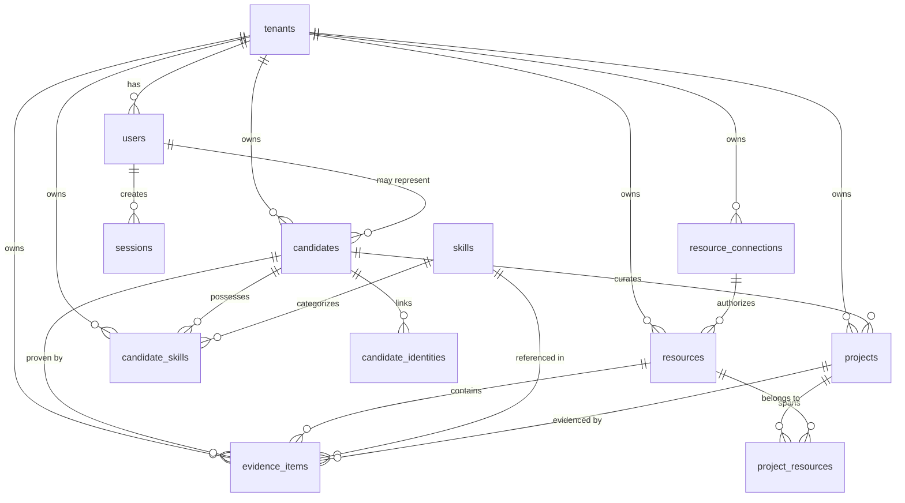

# Unified Candidate and Resource Domain Model Architecture Specification

**Project**: Antigravity Career Hub (Universal AI Career MCP Platform)  
**Phase**: Phase 4 — Unified Candidate / Resource Model  
**Document ID**: `ARCH-007`  
**Task ID**: `P4-001A`  
**Status**: Authoritative Architectural Design  
**Date**: 2026-08-22  

---

## 1. Executive Summary & Goals

### 1.1 Objective
This document defines the canonical domain model for **Antigravity Career Hub**, establishing a provider-neutral, evidence-backed representation of professional capabilities. The architecture unifies:
1. **Candidate Identity**: The canonical human persona within an isolated workspace.
2. **External Identities**: Linked third-party accounts (GitHub, GitLab, LinkedIn, Google).
3. **Resources**: Normalized representations of external artifacts (repositories, documents, profile exports).
4. **Projects**: Domain-level engineering and portfolio initiatives (decoupled from individual repositories).
5. **Skills**: A normalized technology taxonomy.
6. **Evidence Items**: Verifiable, immutable proof nodes tying technical claims to exact code locations, commits, manifests, and documentation.
7. **Provenance**: End-to-end traceability detailing where, when, and from which source version every fact was derived.

### 1.2 Core Architectural Principles
* **Provider Neutrality**: The domain model is decoupled from GitHub-specific schemas. Future sources (GitLab, LinkedIn, Google Drive, uploaded resumes, portfolio websites) map into the identical unified model.
* **Strict Tenant Isolation**: All candidate, resource, project, and evidence records are strictly scoped by `tenant_id`. Cross-tenant querying or data sharing is prohibited by default.
* **Radical Evidence Provenance**: No skill or competency claim can exist as "verified" without an immutable `EvidenceItem` referencing a tangible source artifact (e.g., manifest dependency, AST code usage, commit SHA, README section).
* **Zero Fabrication**: The data model distinguishes between `VERIFIED`, `INFERRED`, `CLAIMED`, and `MISSING` capabilities.
* **Data Minimization & Ephemeral Source Code**: Full source code repositories are never cloned or dumped into PostgreSQL. Only high-signal structured evidence snippets ($\le 1\text{ KB}$) and exact location pointers (commit SHA + file path) are persisted.

---

## 2. Domain Vocabulary

| Term | Domain Definition |
| :--- | :--- |
| **Tenant** | The isolated organizational or personal workspace boundary in PostgreSQL. |
| **User** | An authenticated human actor who logs into the platform (via OAuth 2.1 / session). |
| **Candidate** | The canonical professional persona profile owned by a tenant for career intelligence. |
| **CandidateIdentity** | A verified external account link (e.g., GitHub user ID `97516061`, LinkedIn URN) bound to a Candidate. |
| **ResourceConnection** | An encrypted credential vault and authorization grant (AES-256-GCM) managing provider access. |
| **Resource** | A normalized external entity (e.g., Git repository, drive document, resume file) discovered through a connector. |
| **Project** | A curated professional initiative or product that may span one, many, or a subset of Resources. |
| **Skill** | A canonical technology, tool, language, or concept within the global platform taxonomy. |
| **CandidateSkill** | An assertion associating a Candidate with a Skill, carrying a confidence score and provenance status. |
| **EvidenceItem** | An immutable proof record containing an exact source pointer (provider, resource, commit SHA, file path, excerpt). |
| **Provenance** | The cryptographic and temporal audit trail establishing the origin, freshness, and authenticity of derived facts. |

---

## 3. Canonical Candidate Model

```
+-------------------------------------------------------------------------+
|                                CANDIDATE                                |
|  • id: UUID (PK)                                                        |
|  • tenantId: UUID (FK -> tenants.id, Cascade)                           |
|  • userId: UUID (FK -> users.id, Set Null / Optional)                   |
|  • displayName: String (e.g., "Vishw")                                  |
|  • headline: String (e.g., "Full-Stack Distributed Systems Engineer")   |
|  • summary: Text (Evidence-grounded professional narrative)             |
|  • canonicalEmail: String (Primary contact email, verified)             |
|  • profileMetadata: JSONB (Preferences, location, target roles)         |
|  • status: Enum (ACTIVE, ARCHIVED, SUSPENDED)                           |
|  • createdAt / updatedAt: Timestamps                                    |
+-------------------------------------------------------------------------+
```

### 3.1 Separation of Human Identity from Provider Identity
* A `Candidate` represents a **human professional persona**, not an external account.
* A GitHub username (e.g., `vishu1803`) is an **external identity attribute**, never the candidate's canonical primary key or identifier.
* A candidate may connect multiple GitHub accounts, a GitLab account, a LinkedIn profile, and uploaded PDF resumes over time. The `Candidate` entity remains stable and unified.

### 3.2 Canonical Email Strategy
* Candidates may possess multiple email addresses across external providers (e.g., commit emails, GitHub public profile email, platform login email).
* The `canonicalEmail` field stores the primary, authoritative email designated by the user or authenticated platform session.
* Secondary and historical commit author emails are recorded within `CandidateIdentity` or `EvidenceItem` metadata for matching without corrupting the canonical profile.

---

## 4. Tenant Ownership & Isolation Model

### 4.1 Single-Tenant vs. Multi-Tenant Evaluation

```
Option A: Strict Single-Tenant Ownership (CHOSEN)
+-------------------------------------------------------------+
| Tenant A (Personal Workspace)   | Tenant B (Company Inc)    |
|   └── Candidate: "Vishw"        |   └── Candidate: "Vishw"  |
|         ├── Identity: GitHub    |         ├── Identity: Resume|
|         ├── Skills: [Node.js]   |         ├── Notes: [Private]|
|         └── Evidence: [Repo 1]  |         └── Evidence: [...] |
+-------------------------------------------------------------+
* Complete cryptographic & relational boundary.
* Zero cross-tenant data leaks.
* Fully compliant with ADR-014, ADR-018, and GDPR/CCPA.

Option B: Global Shared Candidate Entity (REJECTED)
* Candidates shared across all tenants.
* Violates tenant isolation, leaks private recruiter notes/evidence across workspaces.
```

### 4.2 Architectural Decision
* **Every Candidate belongs to exactly ONE Tenant** (`tenant_id NOT NULL REFERENCES tenants(id) ON DELETE CASCADE`).
* If the same human exists across multiple workspaces (e.g., personal portfolio vs. an employer workspace), each tenant maintains an **isolated, sovereign Candidate record**.
* This preserves the fundamental platform invariant: **No user or organization can ever query, infer, or modify another tenant's candidate data**.

---

## 5. External Identity Model (`CandidateIdentity`)

```
+-------------------------------------------------------------------------+
|                           CANDIDATE_IDENTITY                            |
|  • id: UUID (PK)                                                        |
|  • tenantId: UUID (FK -> tenants.id, Cascade)                           |
|  • candidateId: UUID (FK -> candidates.id, Cascade)                     |
|  • provider: Enum (GITHUB_APP, GITLAB, LINKEDIN, GOOGLE, MANUAL)        |
|  • externalAccountId: String (e.g., "97516061")                         |
|  • externalUsername: String (e.g., "vishu1803")                         |
|  • externalEmail: String (e.g., "vishw@example.com", Optional)          |
|  • profileUrl: String (e.g., "https://github.com/vishu1803")            |
|  • avatarUrl: String (Optional)                                         |
|  • verified: Boolean (True if bound via OAuth/App installation)         |
|  • verifiedAt: Timestamp                                                |
|  • metadata: JSONB (Public repos count, follower count, bio)            |
|  • createdAt / updatedAt: Timestamps                                    |
+-------------------------------------------------------------------------+
  UNIQUE CONSTRAINT (tenant_id, provider, external_account_id)
```

### 5.1 Distinction: User vs. Candidate vs. External Identity
1. **`User`**: The platform account actor holding credentials/sessions to log into Antigravity Career Hub.
2. **`Candidate`**: The domain persona representing the career profile being built, analyzed, or adapted.
   * In a personal workspace, `Candidate.userId == User.id` (1:1 self-representation).
   * In an enterprise workspace, a recruiter `User` may manage multiple `Candidate` profiles (`Candidate.userId == NULL`).
3. **`CandidateIdentity`**: External third-party identity claims bound to the `Candidate`.
4. **`ResourceConnection`**: The authenticated OAuth/App installation credentials permitting API access to fetch data for that identity.

---

## 6. Provider-Neutral Resource Model (`Resource`)

```
+-------------------------------------------------------------------------+
|                                RESOURCE                                 |
|  • id: UUID (PK)                                                        |
|  • tenantId: UUID (FK -> tenants.id, Cascade)                           |
|  • connectionId: UUID (FK -> resource_connections.id, Set Null)         |
|  • candidateId: UUID (FK -> candidates.id, Set Null)                    |
|  • provider: Enum (GITHUB_APP, GITLAB, GOOGLE_DRIVE, ONEDRIVE, NOTION)  |
|  • resourceType: Enum (REPOSITORY, DOCUMENT, PROFILE, PORTFOLIO_SITE)   |
|  • externalResourceId: String (Canonical ID, e.g. "1338724502")         |
|  • name: String (e.g., "Ai-job-mcp")                                    |
|  • displayName: String (e.g., "vishu1803/Ai-job-mcp")                  |
|  • url: String (e.g., "https://github.com/vishu1803/Ai-job-mcp")        |
|  • isPrivate: Boolean (Default false)                                   |
|  • status: Enum (ACTIVE, DISCONNECTED, DELETED, ERROR)                  |
|  • lastSyncedAt: Timestamp                                              |
|  • metadata: JSONB (defaultBranch, languageBreakdown, starCount, etc.)  |
|  • createdAt / updatedAt: Timestamps                                    |
+-------------------------------------------------------------------------+
  UNIQUE CONSTRAINT (tenant_id, provider, external_resource_id)
```

### 6.1 Strict Decoupling from `ResourceConnection`
* **`ResourceConnection`** stores **credentials**, encryption IV/tags, and OAuth token lifecycles.
* **`Resource`** stores **metadata about the external entity** (repository, file, document).
* Credentials and tokens are **never duplicated** into `Resource`. If a connection is deleted or rotated, the metadata in `Resource` remains clean.

### 6.2 Mapping from GitHub Connector to Unified Resource
When `GitHubAppConnector.listResources()` or `getResource()` returns a `NormalizedResource`:
* `provider` $\rightarrow$ `'GITHUB_APP'`
* `resourceType` $\rightarrow$ `'REPOSITORY'`
* `externalResourceId` $\rightarrow$ `String(metadata.numericId)` (e.g., `"1338724502"`)
* `name` $\rightarrow$ `repo.name`
* `displayName` $\rightarrow$ `repo.fullName`
* `url` $\rightarrow$ `repo.url`
* `isPrivate` $\rightarrow$ `repo.isPrivate`
* `metadata` $\rightarrow$ `{ defaultBranch, description, archived, fork, visibility, stargazersCount, forksCount, openIssuesCount, size, license, languages }`

### 6.3 Why GitHub Repositories Must Be Persisted in Phase 4
In Phase 4, the platform generates **Projects, Skills, and Evidence Items**.
* Each `EvidenceItem` must possess a durable relational Foreign Key (`resource_id REFERENCES resources(id)`) to prove which repository supplied the evidence.
* If repositories were purely ephemeral in memory, evidence links would be orphaned and impossible to audit or revalidate against PostgreSQL relational constraints.
* Therefore, the **resource catalog metadata** is persisted in `resources`, while **raw source code files remain ephemeral**.

---

## 7. Project Model vs. Repository Model

```
+-------------------------------------------------------------------------+
|                                 PROJECT                                 |
|  • id: UUID (PK)                                                        |
|  • tenantId: UUID (FK -> tenants.id, Cascade)                           |
|  • candidateId: UUID (FK -> candidates.id, Cascade)                     |
|  • name: String (e.g., "Antigravity Career Hub")                        |
|  • slug: String (e.g., "antigravity-career-hub")                        |
|  • headline: String (e.g., "Universal AI Career MCP Platform")          |
|  • summary: Text (Technical architecture summary)                       |
|  • role: String (e.g., "Lead Architect & Developer")                   |
|  • isHighlighted: Boolean (Default false)                               |
|  • startDate / endDate: Dates                                           |
|  • metadata: JSONB (Architecture tags, demo URLs, achievements)         |
|  • createdAt / updatedAt: Timestamps                                    |
+-------------------------------------------------------------------------+

+-------------------------------------------------------------------------+
|                            PROJECT_RESOURCE                             |
|  • id: UUID (PK)                                                        |
|  • tenantId: UUID (FK -> tenants.id, Cascade)                           |
|  • projectId: UUID (FK -> projects.id, Cascade)                         |
|  • resourceId: UUID (FK -> resources.id, Cascade)                       |
|  • roleInProject: String (e.g., "Backend API", "Frontend SPA", "Docs")  |
|  • createdAt: Timestamp                                                 |
+-------------------------------------------------------------------------+
  UNIQUE CONSTRAINT (project_id, resource_id)
```

### 7.1 Key Architectural Invariant: $1\text{ Repository} \ne 1\text{ Project}$
* A **Repository** is a version control storage container (`Resource`).
* A **Project** is a professional engineering endeavor.
* **Many-to-Many Relationship**:
  * A full-stack Project may span 3 repositories: `frontend-web`, `backend-api`, and `infrastructure-iac`.
  * A monorepo `Resource` may contain multiple independent `Projects`: `auth-service`, `billing-engine`, and `mcp-gateway`.
  * The `project_resources` join table cleanly decouples the software repository container from the human-curated portfolio project.

---

## 8. Canonical Skill Model

```
+-------------------------------------------------------------------------+
|                                  SKILL                                  |
|  • id: UUID (PK)                                                        |
|  • slug: String (e.g., "fastapi", "postgresql", "react")                |
|  • name: String (e.g., "FastAPI", "PostgreSQL", "React")                |
|  • category: Enum (LANGUAGE, FRAMEWORK, DATABASE, CLOUD_DEVOPS, TOOL,   |
|                    ARCHITECTURE, CONCEPT)                               |
|  • aliases: JSONB / Array (e.g., ["postgres", "pgsql", "postgres-db"])  |
|  • description: Text (Optional taxonomy summary)                        |
|  • createdAt / updatedAt: Timestamps                                    |
+-------------------------------------------------------------------------+
  UNIQUE CONSTRAINT (slug)

+-------------------------------------------------------------------------+
|                             CANDIDATE_SKILL                             |
|  • id: UUID (PK)                                                        |
|  • tenantId: UUID (FK -> tenants.id, Cascade)                           |
|  • candidateId: UUID (FK -> candidates.id, Cascade)                     |
|  • skillId: UUID (FK -> skills.id, Restrict)                            |
|  • category: Enum (LANGUAGE, FRAMEWORK, DATABASE, CLOUD_DEVOPS, TOOL,   |
|                    ARCHITECTURE, CONCEPT)                               |
|  • provenanceStatus: Enum (VERIFIED, INFERRED, CLAIMED, MISSING)        |
|  • confidenceScore: Float (0.00 to 1.00)                                |
|  • evidenceCount: Integer (Default 0)                                   |
|  • primaryEvidenceId: UUID (FK -> evidence_items.id, Set Null)          |
|  • firstObservedAt: Timestamp                                           |
|  • lastObservedAt: Timestamp                                            |
|  • metadata: JSONB (Years of experience rollup, depth score)            |
|  • createdAt / updatedAt: Timestamps                                    |
+-------------------------------------------------------------------------+
  UNIQUE CONSTRAINT (tenant_id, candidate_id, skill_id)
```

### 8.1 Skill Taxonomy Design
* **`skills` Table**: Canonical platform dictionary maintaining normalized naming, categories, and alias mappings. Eliminates fragmentation (e.g., mapping `"NodeJS"`, `"node.js"`, `"node"` $\rightarrow$ `"Node.js"`).
* **`candidate_skills` Table**: Associates a Candidate with a canonical Skill.
  * `provenanceStatus`:
    * **`VERIFIED`**: Proven by at least one high-confidence `EvidenceItem` (manifest dependency, AST code usage).
    * **`INFERRED`**: Deduced from commit patterns, directory conventions, or related tools.
    * **`CLAIMED`**: Stated in a resume or bio without verified repository evidence.
    * **`MISSING`**: Required by a target job description but absent from candidate's profile.
  * `confidenceScore`: Range $0.00$ to $1.00$, derived mathematically from evidence count and recency.

---

## 9. Foundational Evidence Model (`EvidenceItem`)

```
+-------------------------------------------------------------------------+
|                              EVIDENCE_ITEM                              |
|  • id: UUID (PK)                                                        |
|  • tenantId: UUID (FK -> tenants.id, Cascade)                           |
|  • candidateId: UUID (FK -> candidates.id, Cascade)                     |
|  • resourceId: UUID (FK -> resources.id, Cascade)                       |
|  • projectId: UUID (FK -> projects.id, Set Null, Optional)              |
|  • skillId: UUID (FK -> skills.id, Set Null, Optional)                  |
|  • evidenceType: Enum (                                                 |
|      PACKAGE_MANIFEST_DEPENDENCY,                                       |
|      CODE_IMPORT_USAGE,                                                 |
|      FILE_PATTERN_MATCH,                                                |
|      COMMIT_CONTRIBUTION,                                               |
|      README_SPECIFICATION,                                              |
|      DIRECTORY_STRUCTURE,                                               |
|      DOCUMENT_CLAIM                                                     |
|    )                                                                    |
|  • sourceProvider: Enum (GITHUB_APP, GITLAB, GOOGLE_DRIVE, MANUAL)      |
|  • sourceLocation: JSONB (                                              |
|      filePath: String (e.g., "src/connectors/github/auth.js"),          |
|      commitSha: String (40-char hex, e.g., "5017539..."),               |
|      lineRange: { start: Int, end: Int } (Optional),                    |
|      astContext: { symbol: String, type: String } (Optional)            |
|    )                                                                    |
|  • excerpt: Text (Sanitized text excerpt, capped at 1,000 characters)   |
|  • confidenceScore: Float (0.00 to 1.00)                                |
|  • detectedAt: Timestamp                                                |
|  • metadata: JSONB (versionString, isDevDependency, commitDate)         |
|  • createdAt: Timestamp (Append-Only)                                   |
+-------------------------------------------------------------------------+
```

### 9.1 Evidence Types Catalog
1. **`PACKAGE_MANIFEST_DEPENDENCY`**: Explicit dependency in package manifests (`package.json`, `go.mod`, `Cargo.toml`, `requirements.txt`, `pom.xml`).
2. **`CODE_IMPORT_USAGE`**: Active symbol import and invocation verified via AST or pattern analysis (`import Fastify from 'fastify'`).
3. **`FILE_PATTERN_MATCH`**: Presence of technology-specific configuration or build files (`Dockerfile`, `drizzle.config.js`, `.github/workflows/ci.yml`).
4. **`COMMIT_CONTRIBUTION`**: Authorship of verified commits modifying the relevant subsystem.
5. **`README_SPECIFICATION`**: Documented architecture description in repository root README.
6. **`DIRECTORY_STRUCTURE`**: Architectural conventions (e.g., `src/connectors/base/` implying modular architecture).
7. **`DOCUMENT_CLAIM`**: Claim extracted from an uploaded resume or portfolio document.

---

## 10. Immutable Provenance Architecture

```
                    [ External Source of Truth ]
                  (GitHub API / Commit 5017539)
                                │
                                ▼
                         [ EvidenceItem ]
                 (Immutable Proof of Observation)
                 • Provider: GITHUB_APP
                 • Resource: vishu1803/Ai-job-mcp
                 • File: src/connectors/github/auth.js
                 • Commit: 5017539ddb5d8d616b5fbfa2682dba7d4910b039
                 • Type: CODE_IMPORT_USAGE
                 • Symbol: "jsonwebtoken"
                                │
            ┌───────────────────┴───────────────────┐
            ▼                                       ▼
    [ CandidateSkill ]                          [ Project ]
 • Skill: "JSON Web Tokens"             • Project: "Ai-job-mcp"
 • Status: VERIFIED (1.0)               • Uses: JWT Authentication
 • EvidenceCount: 1                     • Role: Lead Engineer
```

### 10.1 Provenance Principles
Every derived fact in the system must be capable of answering 5 fundamental questions:
1. **Where did this claim originate?** (Resource ID: `1338724502`, File: `src/connectors/github/auth.js`)
2. **When was it observed?** (Timestamp: `2026-08-22T01:00:00Z`)
3. **Which provider authorized the observation?** (`GITHUB_APP`)
4. **Which exact version/snapshot contained the proof?** (Commit SHA: `5017539ddb5d8d616b5fbfa2682dba7d4910b039`)
5. **What is the confidence level?** (`1.0` direct code usage vs `0.7` dev dependency vs `0.4` keyword inference)

---

## 11. Source of Truth Hierarchy

```
+-----------------------------------------------------------------------------+
| LAYER               | AUTHORITY       | ROLE & PURPOSE                      |
+---------------------+-----------------+-------------------------------------+
| 1. External Source  | GitHub / GitLab | Authoritative raw code & commits    |
| 2. Resource Layer   | Connector Model | Normalized view of external object  |
| 3. Evidence Layer   | Platform DB     | Immutable verifiable proof nodes    |
| 4. Skill Taxonomy   | Canonical DB    | Standardized technical vocabulary   |
| 5. Project Layer    | Domain DB       | Curated human engineering portfolio |
| 6. Candidate Layer  | Unified Domain  | Sovereign multi-source profile      |
+-----------------------------------------------------------------------------+
```

---

## 12. Temporal Model & Mutability

| Entity Type | Mutability Model | Justification |
| :--- | :--- | :--- |
| **Candidate** | **Mutable** | Profile headlines, summaries, and career preferences evolve continuously. |
| **Resource** | **Mutable** | Metadata (stars, forks, default branch, last sync time) updates with upstream syncs. |
| **Project** | **Mutable** | Highlights, roles, and project narratives are edited by the candidate or AI assistant. |
| **CandidateSkill** | **Mutable Rollup** | Aggregates evidence count, confidence scores, and `lastObservedAt` dates dynamically. |
| **Skill** | **Immutable Taxonomy** | Taxonomy definitions and aliases are version-controlled and stable. |
| **EvidenceItem** | **Append-Only / Immutable** | An observation at commit SHA $X$ is a permanent historical fact. If code is later deleted, the old evidence is flagged `is_superseded = true` or aged out, but never rewritten. |
| **AuditLog** | **Append-Only** | Security compliance ledger. |

---

## 13. Candidate Matching & Merging Policies

### 13.1 Deduplication Safety
* **No Silent Name Merging**: Candidates with the same display name (e.g., "Vishw") are **never automatically merged**.
* **Identity Linking Invariants**:
  1. An external identity (`CandidateIdentity`) is linked to a `Candidate` **only** when authenticated via OAuth or a verified installation token for that tenant.
  2. If a GitHub username changes, the installation ID (`externalAccountId = '97516061'`) remains the immutable foreign key.
  3. If a candidate connects both GitHub and LinkedIn, both `CandidateIdentity` rows attach to the single `Candidate` profile under that tenant.

---

## 14. Entity-Relationship Diagram



---

## 15. Proposed PostgreSQL Database Schema (Phase 4)

```sql
-- ---------------------------------------------------------------------------
-- 1. Enumerations
-- ---------------------------------------------------------------------------

CREATE TYPE candidate_status AS ENUM ('ACTIVE', 'ARCHIVED', 'SUSPENDED');

CREATE TYPE resource_type AS ENUM (
  'REPOSITORY',
  'DOCUMENT',
  'PROFILE',
  'PORTFOLIO_SITE'
);

CREATE TYPE resource_status AS ENUM (
  'ACTIVE',
  'DISCONNECTED',
  'DELETED',
  'ERROR'
);

CREATE TYPE skill_category AS ENUM (
  'LANGUAGE',
  'FRAMEWORK',
  'DATABASE',
  'CLOUD_DEVOPS',
  'TOOL',
  'ARCHITECTURE',
  'CONCEPT'
);

CREATE TYPE provenance_status AS ENUM (
  'VERIFIED',
  'INFERRED',
  'CLAIMED',
  'MISSING'
);

CREATE TYPE evidence_type AS ENUM (
  'PACKAGE_MANIFEST_DEPENDENCY',
  'CODE_IMPORT_USAGE',
  'FILE_PATTERN_MATCH',
  'COMMIT_CONTRIBUTION',
  'README_SPECIFICATION',
  'DIRECTORY_STRUCTURE',
  'DOCUMENT_CLAIM'
);

-- ---------------------------------------------------------------------------
-- 2. Candidates Table
-- ---------------------------------------------------------------------------

CREATE TABLE candidates (
  id UUID PRIMARY KEY DEFAULT gen_random_uuid(),
  tenant_id UUID NOT NULL REFERENCES tenants(id) ON DELETE CASCADE,
  user_id UUID REFERENCES users(id) ON DELETE SET NULL,
  display_name TEXT NOT NULL,
  headline TEXT,
  summary TEXT,
  canonical_email TEXT,
  profile_metadata JSONB DEFAULT '{}'::jsonb NOT NULL,
  status candidate_status DEFAULT 'ACTIVE' NOT NULL,
  created_at TIMESTAMPTZ DEFAULT NOW() NOT NULL,
  updated_at TIMESTAMPTZ DEFAULT NOW() NOT NULL
);

-- ---------------------------------------------------------------------------
-- 3. Candidate Identities Table
-- ---------------------------------------------------------------------------

CREATE TABLE candidate_identities (
  id UUID PRIMARY KEY DEFAULT gen_random_uuid(),
  tenant_id UUID NOT NULL REFERENCES tenants(id) ON DELETE CASCADE,
  candidate_id UUID NOT NULL REFERENCES candidates(id) ON DELETE CASCADE,
  provider resource_provider NOT NULL,
  external_account_id TEXT NOT NULL,
  external_username TEXT NOT NULL,
  external_email TEXT,
  profile_url TEXT,
  avatar_url TEXT,
  verified BOOLEAN DEFAULT FALSE NOT NULL,
  verified_at TIMESTAMPTZ,
  metadata JSONB DEFAULT '{}'::jsonb NOT NULL,
  created_at TIMESTAMPTZ DEFAULT NOW() NOT NULL,
  updated_at TIMESTAMPTZ DEFAULT NOW() NOT NULL,
  CONSTRAINT uq_candidate_identities UNIQUE (tenant_id, provider, external_account_id)
);

-- ---------------------------------------------------------------------------
-- 4. Resources Table (Provider-Neutral External Resource Catalog)
-- ---------------------------------------------------------------------------

CREATE TABLE resources (
  id UUID PRIMARY KEY DEFAULT gen_random_uuid(),
  tenant_id UUID NOT NULL REFERENCES tenants(id) ON DELETE CASCADE,
  connection_id UUID REFERENCES resource_connections(id) ON DELETE SET NULL,
  candidate_id UUID REFERENCES candidates(id) ON DELETE SET NULL,
  provider resource_provider NOT NULL,
  resource_type resource_type DEFAULT 'REPOSITORY' NOT NULL,
  external_resource_id TEXT NOT NULL,
  name TEXT NOT NULL,
  display_name TEXT NOT NULL,
  url TEXT,
  is_private BOOLEAN DEFAULT FALSE NOT NULL,
  status resource_status DEFAULT 'ACTIVE' NOT NULL,
  last_synced_at TIMESTAMPTZ,
  metadata JSONB DEFAULT '{}'::jsonb NOT NULL,
  created_at TIMESTAMPTZ DEFAULT NOW() NOT NULL,
  updated_at TIMESTAMPTZ DEFAULT NOW() NOT NULL,
  CONSTRAINT uq_resources UNIQUE (tenant_id, provider, external_resource_id)
);

-- ---------------------------------------------------------------------------
-- 5. Projects Table
-- ---------------------------------------------------------------------------

CREATE TABLE projects (
  id UUID PRIMARY KEY DEFAULT gen_random_uuid(),
  tenant_id UUID NOT NULL REFERENCES tenants(id) ON DELETE CASCADE,
  candidate_id UUID NOT NULL REFERENCES candidates(id) ON DELETE CASCADE,
  name TEXT NOT NULL,
  slug TEXT NOT NULL,
  headline TEXT,
  summary TEXT,
  role TEXT,
  is_highlighted BOOLEAN DEFAULT FALSE NOT NULL,
  start_date DATE,
  end_date DATE,
  metadata JSONB DEFAULT '{}'::jsonb NOT NULL,
  created_at TIMESTAMPTZ DEFAULT NOW() NOT NULL,
  updated_at TIMESTAMPTZ DEFAULT NOW() NOT NULL,
  CONSTRAINT uq_projects_tenant_slug UNIQUE (tenant_id, candidate_id, slug)
);

-- ---------------------------------------------------------------------------
-- 6. Project Resources Join Table
-- ---------------------------------------------------------------------------

CREATE TABLE project_resources (
  id UUID PRIMARY KEY DEFAULT gen_random_uuid(),
  tenant_id UUID NOT NULL REFERENCES tenants(id) ON DELETE CASCADE,
  project_id UUID NOT NULL REFERENCES projects(id) ON DELETE CASCADE,
  resource_id UUID NOT NULL REFERENCES resources(id) ON DELETE CASCADE,
  role_in_project TEXT,
  created_at TIMESTAMPTZ DEFAULT NOW() NOT NULL,
  CONSTRAINT uq_project_resources UNIQUE (project_id, resource_id)
);

-- ---------------------------------------------------------------------------
-- 7. Skills Table (Canonical Global Taxonomy)
-- ---------------------------------------------------------------------------

CREATE TABLE skills (
  id UUID PRIMARY KEY DEFAULT gen_random_uuid(),
  slug TEXT NOT NULL UNIQUE,
  name TEXT NOT NULL,
  category skill_category NOT NULL,
  aliases JSONB DEFAULT '[]'::jsonb NOT NULL,
  description TEXT,
  created_at TIMESTAMPTZ DEFAULT NOW() NOT NULL,
  updated_at TIMESTAMPTZ DEFAULT NOW() NOT NULL
);

-- ---------------------------------------------------------------------------
-- 8. Candidate Skills Table (Candidate-to-Skill Link & Rollup Metrics)
-- ---------------------------------------------------------------------------

CREATE TABLE candidate_skills (
  id UUID PRIMARY KEY DEFAULT gen_random_uuid(),
  tenant_id UUID NOT NULL REFERENCES tenants(id) ON DELETE CASCADE,
  candidate_id UUID NOT NULL REFERENCES candidates(id) ON DELETE CASCADE,
  skill_id UUID NOT NULL REFERENCES skills(id) ON DELETE RESTRICT,
  category skill_category NOT NULL,
  provenance_status provenance_status DEFAULT 'CLAIMED' NOT NULL,
  confidence_score REAL DEFAULT 0.0 NOT NULL,
  evidence_count INTEGER DEFAULT 0 NOT NULL,
  primary_evidence_id UUID,
  first_observed_at TIMESTAMPTZ,
  last_observed_at TIMESTAMPTZ,
  metadata JSONB DEFAULT '{}'::jsonb NOT NULL,
  created_at TIMESTAMPTZ DEFAULT NOW() NOT NULL,
  updated_at TIMESTAMPTZ DEFAULT NOW() NOT NULL,
  CONSTRAINT uq_candidate_skills UNIQUE (tenant_id, candidate_id, skill_id)
);

-- ---------------------------------------------------------------------------
-- 9. Evidence Items Table (Immutable Provenance Nodes)
-- ---------------------------------------------------------------------------

CREATE TABLE evidence_items (
  id UUID PRIMARY KEY DEFAULT gen_random_uuid(),
  tenant_id UUID NOT NULL REFERENCES tenants(id) ON DELETE CASCADE,
  candidate_id UUID NOT NULL REFERENCES candidates(id) ON DELETE CASCADE,
  resource_id UUID NOT NULL REFERENCES resources(id) ON DELETE CASCADE,
  project_id UUID REFERENCES projects(id) ON DELETE SET NULL,
  skill_id UUID REFERENCES skills(id) ON DELETE SET NULL,
  evidence_type evidence_type NOT NULL,
  source_provider resource_provider NOT NULL,
  source_location JSONB NOT NULL,
  excerpt TEXT,
  confidence_score REAL DEFAULT 1.0 NOT NULL,
  detected_at TIMESTAMPTZ DEFAULT NOW() NOT NULL,
  metadata JSONB DEFAULT '{}'::jsonb NOT NULL,
  created_at TIMESTAMPTZ DEFAULT NOW() NOT NULL
);
```

---

## 16. Database Indexing Strategy

```sql
-- Multi-Tenant & Candidate Query Indexes
CREATE INDEX idx_candidates_tenant ON candidates (tenant_id);
CREATE INDEX idx_candidate_identities_lookup ON candidate_identities (tenant_id, candidate_id);
CREATE INDEX idx_candidate_identities_ext ON candidate_identities (tenant_id, provider, external_account_id);

-- Resource Indexes
CREATE INDEX idx_resources_tenant ON resources (tenant_id);
CREATE INDEX idx_resources_candidate ON resources (tenant_id, candidate_id);
CREATE INDEX idx_resources_ext_lookup ON resources (tenant_id, provider, external_resource_id);

-- Project Indexes
CREATE INDEX idx_projects_candidate ON projects (tenant_id, candidate_id);
CREATE INDEX idx_project_resources_lookup ON project_resources (tenant_id, project_id, resource_id);

-- Skill Taxonomy & Candidate Skill Indexes
CREATE INDEX idx_skills_slug ON skills (slug);
CREATE INDEX idx_skills_category ON skills (category);
CREATE INDEX idx_skills_aliases_gin ON skills USING GIN (aliases);
CREATE INDEX idx_candidate_skills_candidate ON candidate_skills (tenant_id, candidate_id);
CREATE INDEX idx_candidate_skills_status ON candidate_skills (tenant_id, candidate_id, provenance_status);

-- Evidence Provenance Query Indexes
CREATE INDEX idx_evidence_tenant ON evidence_items (tenant_id);
CREATE INDEX idx_evidence_candidate_skill ON evidence_items (tenant_id, candidate_id, skill_id);
CREATE INDEX idx_evidence_resource ON evidence_items (tenant_id, resource_id);
CREATE INDEX idx_evidence_project ON evidence_items (tenant_id, project_id);
CREATE INDEX idx_evidence_location_gin ON evidence_items USING GIN (source_location);
```

---

## 17. Security, Privacy & Data Minimization

1. **PII Protection**:
   * Email addresses and personal candidate contact info are restricted to `candidates.canonicalEmail` and `candidate_identities.externalEmail`.
   * Unnecessary author personal emails extracted from commit logs are scrubbed prior to storage.
2. **Secret Scrubber & Redaction**:
   * Any code snippet or excerpt stored in `evidence_items.excerpt` passes through secret-redaction filters (P1-002) to ensure API keys, passwords, or OAuth tokens in code are never persisted in PostgreSQL.
   * `excerpt` is strictly capped at **1,000 characters**.
3. **No Full Source Code Cloning**:
   * Full source files, AST trees, and binary blobs are scanned in memory and discarded. Only structured evidence pointers (`filePath`, `commitSha`, `lineRange`, `excerpt`) are persisted.

---

## 18. Retention & Deletion Semantics

| Event | Database Action | Business Outcome |
| :--- | :--- | :--- |
| **Tenant Deleted** | `CASCADE DELETE` on `tenants.id` | Complete, immediate purge of all candidates, connections, resources, projects, and evidence items. |
| **Candidate Deleted** | `CASCADE DELETE` on `candidates.id` | Purges candidate identities, candidate skills, projects, and evidence items. `resources` have `candidate_id` set to `NULL`. |
| **Resource Disconnected** | Update `resources.status = 'DISCONNECTED'` | Preserves historical evidence records unless explicitly purged by the user. |
| **Resource Deleted** | `CASCADE DELETE` on `resources.id` | Removes resource catalog row and all associated `evidence_items`. Recomputes `candidate_skills.evidence_count`. |
| **Skill Deleted from Global Taxonomy** | `RESTRICT` on `skills.id` | Prevents deleting a canonical skill if active candidate skill claims or evidence records reference it. |

---

## 19. Future Service Boundaries (Phase 4+)

```
                          [ Fastify Routes / MCP Tools ]
                                       │
                                       ▼
                   ┌───────────────────────────────────────┐
                   │           CandidateService            │
                   │   (Profile CRUD, Identities, Status)  │
                   └──────────────────┬────────────────────┘
                                      │
       ┌──────────────────────────────┼──────────────────────────────┐
       ▼                              ▼                              ▼
┌──────────────┐              ┌──────────────┐              ┌─────────────────┐
│ResourceService│              │ProjectService│              │ EvidenceService │
│(Catalog, Sync│              │ (Portfolio,  │              │ (Ingest, Verify,│
│ Decoupling)  │              │  Resources)  │              │  Provenance)    │
└──────────────┘              └──────────────┘              └────────┬────────┘
                                                                     │
                                                                     ▼
                                                            ┌─────────────────┐
                                                            │  SkillService   │
                                                            │ (Taxonomy, Gap, │
                                                            │  Normalization) │
                                                            └─────────────────┘
```

1. **`CandidateService`**: Manages candidate profile lifecycle, settings, and external identity bindings.
2. **`ResourceService`**: Catalogs and normalizes resources fetched across third-party connectors (`GitHubAppConnector`, `GitLabConnector`, etc.).
3. **`ProjectService`**: Curates domain projects, descriptions, and associates resources via `project_resources`.
4. **`SkillService`**: Normalizes skill strings against canonical `skills` taxonomy and computes confidence scores.
5. **`EvidenceService`**: Ingests, indexes, queries, and audits immutable evidence provenance records.

---

## 20. Future Provider Extensibility Matrix

| Provider | `resource_provider` | `resourceType` | Resource Name Mapping | Primary Evidence Extracted |
| :--- | :--- | :--- | :--- | :--- |
| **GitHub App** | `GITHUB_APP` | `REPOSITORY` | `owner/repo` (e.g. `vishu1803/Ai-job-mcp`) | `package.json`, imports, commit SHAs, README |
| **GitLab** | `GITLAB` | `REPOSITORY` | `group/project` | CI/CD pipelines, manifests, commits |
| **LinkedIn** | `LINKEDIN` | `PROFILE` | `urn:li:person:...` | Employment history, claimed certifications |
| **Google Drive** | `GOOGLE_DRIVE` | `DOCUMENT` | Document title (e.g. `Architecture.pdf`) | Design specifications, published whitepapers |
| **Resume Upload** | `MANUAL` | `DOCUMENT` | File name (e.g. `Resume_2026.pdf`) | Chronological work history, degree claims |
| **Portfolio Site** | `CUSTOM_API` | `PORTFOLIO_SITE`| URL (e.g. `https://vishw.dev`) | Live web applications, visual artifacts |

---

## 21. Testing Strategy (For Phase 4 Implementation)

1. **Zod Domain Validation Unit Tests**:
   * Validate all incoming and outgoing candidate, identity, resource, project, skill, and evidence schemas.
   * Reject invalid UUIDs, negative confidence scores ($< 0.0$ or $> 1.0$), and malformed source locations.
2. **Database Relational Integrity Tests**:
   * Test multi-tenant foreign key cascade deletes.
   * Test unique constraints (`uq_candidate_identities`, `uq_resources`, `uq_candidate_skills`, `uq_project_resources`).
   * Verify `RESTRICT` constraint on deleting referenced canonical `skills`.
3. **Multi-Tenant Isolation Hardening Tests**:
   * Verify cross-tenant default-deny: Tenant A cannot query, update, or link Tenant B's candidates, resources, projects, or evidence items (returns 404).
   * Verify repository runtime guards (`assertTenantId`).
4. **Evidence Provenance & Verification Tests**:
   * Test evidence insertion and rollback computation on `candidate_skills`.
   * Verify provenance status transition (`MISSING` $\rightarrow$ `CLAIMED` $\rightarrow$ `VERIFIED` when evidence is attached).
   * Verify 1,000-character excerpt ceiling and PII/secret scrubbing.

---

## 22. Open Decisions & Recommendations

1. **Global vs. Tenant-Scoped Skills Table**:
   * *Recommendation*: Make `skills` a global canonical taxonomy catalog (managed by migrations/seeds), while `candidate_skills` is strictly tenant-scoped. This standardizes taxonomy across all users while keeping candidate data 100% isolated.
2. **Monorepo Sub-project Extraction**:
   * *Recommendation*: Support multiple `projects` referencing the same `resource_id` via `project_resources` with sub-path identifiers in metadata.
3. **Evidence Excerpt Storage**:
   * *Recommendation*: Strictly limit `evidence_items.excerpt` to $\le 1\text{ KB}$ of sanitized text. Full file trees and repository ASTs remain ephemeral in memory.

---

## 23. Approval Status

$$\mathbf{P4\text{-}001A \quad APPROVED}$$

* The canonical Candidate is strictly provider-neutral and tenant-isolated.
* The Resource model is completely decoupled from `ResourceConnection` credentials.
* The Project model is cleanly separated from individual git repositories.
* The Skill model provides canonical normalization and evidence-backed confidence scoring.
* The Evidence model enforces immutable provenance and data minimization.
* Multi-tenant security is built on verified repository runtime guards and foreign key cascades.
* Ready for Task **P4-001** (Zod Schema Implementation).
